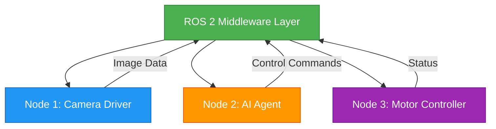
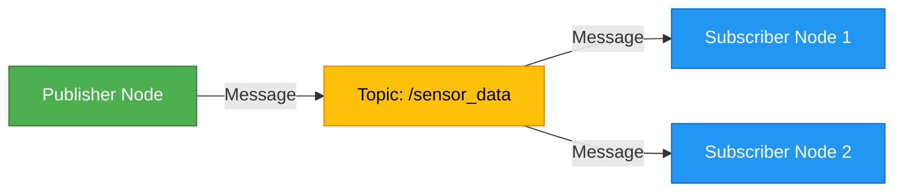
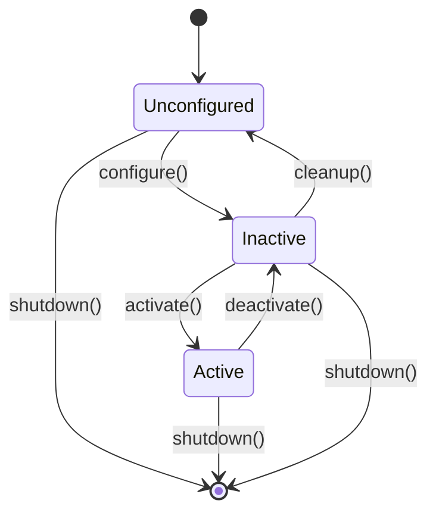

# Chapter 1: ROS 2 Fundamentals

**Estimated Reading Time**: 60 minutes

In this chapter, you'll learn the foundational concepts of ROS 2 (Robot Operating System 2), the middleware that powers modern robotic systems. By the end, you'll understand how independent processes (nodes) communicate through topics and services, and how to manage their lifecycles for robust robot control.

## Learning Outcomes

After completing this chapter, you will be able to:

- Explain what a ROS 2 node is and its role in robot systems
- Create publisher and subscriber nodes for topic-based communication
- Differentiate between topics, services, and actions
- Apply lifecycle management to robot components

---

## What is ROS 2?

ROS 2 (Robot Operating System 2) is an open-source middleware framework designed for building robot applications. Think of it as the "nervous system" of a robot - it handles communication between different parts of the robot, just like your nervous system coordinates signals between your brain, sensors, and muscles.

**Why ROS 2 matters for Physical AI:**

- **Distributed Architecture**: Different components (sensors, AI agents, motors) can run as independent processes and communicate seamlessly
- **Language Flexibility**: Write nodes in Python, C++, or other supported languages
- **Real-Time Capable**: Built for industrial and safety-critical applications
- **Hardware Abstraction**: Same code works in simulation and on real robots



**Core Insight**: ROS 2 isn't an operating system - it's a collection of tools, libraries, and conventions that make it easier to create complex, robust robot behavior across a team of developers.

---

## Nodes and Communication Patterns

A **node** is a single, modular purpose-specific program that performs computation. Nodes are the fundamental building blocks of a ROS 2 system. Each node should do ONE thing well - this is the Unix philosophy applied to robotics.

**Examples of nodes:**
- Camera driver node (captures images from hardware)
- Object detection node (processes images with AI)
- Path planner node (decides where robot should move)
- Motor controller node (sends commands to actuators)

Nodes communicate by passing **messages** through topics, services, or actions. This decoupling means you can:

- Replace a simulated camera with a real one without changing other nodes
- Develop and test components independently
- Run nodes on different machines across a network



:::info Node Naming Conventions
Node names should be descriptive and use underscores (e.g., `camera_driver`, `obstacle_detector`). Avoid generic names like `node1` or `my_node` - future you will thank you for clarity.
:::

---

## Topics: Publish-Subscribe Communication

Topics enable **asynchronous, many-to-many** communication between nodes. Think of a topic as a named message bus:

- **Publishers** send messages to a topic
- **Subscribers** receive messages from a topic
- Multiple publishers and subscribers can connect to the same topic
- Messages are delivered without blocking the publisher

**When to use topics:**
- Continuous data streams (sensor readings, camera frames)
- Broadcasting information to multiple listeners
- Fire-and-forget communication (publisher doesn't wait for response)

### Simple Publisher Example

Here's a minimal publisher that sends string messages at 1 Hz:

```python title="simple_publisher.py"
"""
Simple Publisher Node - Chapter 1 Example

This example demonstrates creating a basic ROS 2 publisher node that
sends string messages to a topic at 1 Hz.

Expected output:
[INFO] [timestamp] [minimal_publisher]: Publishing: "Hello World: 0"
[INFO] [timestamp] [minimal_publisher]: Publishing: "Hello World: 1"
"""

import rclpy
from rclpy.node import Node
from std_msgs.msg import String


class MinimalPublisher(Node):
    """Publishes string messages to 'topic' at 1 Hz."""

    def __init__(self):
        super().__init__('minimal_publisher')
        self.publisher_ = self.create_publisher(String, 'topic', 10)
        self.timer = self.create_timer(1.0, self.timer_callback)
        self.i = 0

    def timer_callback(self):
        """Called every 1 second to publish a message."""
        msg = String()
        msg.data = f'Hello World: {self.i}'
        self.publisher_.publish(msg)
        self.get_logger().info(f'Publishing: "{msg.data}"')
        self.i += 1


def main(args=None):
    rclpy.init(args=args)
    minimal_publisher = MinimalPublisher()
    rclpy.spin(minimal_publisher)
    minimal_publisher.destroy_node()
    rclpy.shutdown()


if __name__ == '__main__':
    main()
```

**Key Components:**
- `create_publisher(msg_type, topic_name, queue_size)`: Creates publisher
- `create_timer(period_sec, callback)`: Triggers function at regular intervals
- `publish(msg)`: Sends message to topic
- `get_logger().info()`: Logs message to console

### Simple Subscriber Example

Now let's create a subscriber to receive those messages:

```python title="simple_subscriber.py"
"""
Simple Subscriber Node - Chapter 1 Example

This example demonstrates creating a basic ROS 2 subscriber node that
receives and logs string messages from a topic.

Expected output:
[INFO] [timestamp] [minimal_subscriber]: I heard: "Hello World: 0"
[INFO] [timestamp] [minimal_subscriber]: I heard: "Hello World: 1"
"""

import rclpy
from rclpy.node import Node
from std_msgs.msg import String


class MinimalSubscriber(Node):
    """Subscribes to 'topic' and logs received messages."""

    def __init__(self):
        super().__init__('minimal_subscriber')
        self.subscription = self.create_subscription(
            String,
            'topic',
            self.listener_callback,
            10
        )
        self.subscription  # prevent unused variable warning

    def listener_callback(self, msg):
        """Called whenever a message is received on the topic."""
        self.get_logger().info(f'I heard: "{msg.data}"')


def main(args=None):
    rclpy.init(args=args)
    minimal_subscriber = MinimalSubscriber()
    rclpy.spin(minimal_subscriber)
    minimal_subscriber.destroy_node()
    rclpy.shutdown()


if __name__ == '__main__':
    main()
```

**Key Components:**
- `create_subscription(msg_type, topic_name, callback, queue_size)`: Creates subscriber
- `listener_callback(msg)`: Called automatically when message arrives
- `spin(node)`: Keeps node running and processing callbacks

:::tip Topic Naming Conventions
Use descriptive, hierarchical names with forward slashes: `/camera/image_raw`, `/robot/sensors/imu`, `/ai_agent/decisions`. This makes complex systems easier to understand and debug.
:::

---

## Services: Request-Response Communication

Services provide **synchronous, one-to-one** request-response communication. Unlike topics, service calls wait for a response before continuing.

**When to use services:**
- On-demand computations (inverse kinematics, path planning)
- Configuration changes (set motor speed, calibrate sensor)
- Queries (get robot state, check if task completed)

**Service structure:**
- **Request**: Data sent from client to server
- **Response**: Data sent back from server to client
- Blocking call: Client waits for server to finish processing

### Topics vs Services Comparison

| Feature | Topics | Services |
|---------|--------|----------|
| **Pattern** | Publish-Subscribe | Request-Response |
| **Direction** | One-to-many or many-to-many | One-to-one |
| **Timing** | Asynchronous (non-blocking) | Synchronous (blocking) |
| **Use Case** | Continuous data streams | On-demand operations |
| **Example** | Camera publishing images at 30 Hz | Calculate path from A to B |
| **Reliability** | Fire-and-forget | Guaranteed response or timeout |

:::info When to Use Actions
For long-running tasks that need progress feedback (e.g., navigating to a waypoint), use **actions** - a third communication pattern combining topics and services. We'll cover actions in advanced modules.
:::

---

## Lifecycle Management

ROS 2 introduces **managed nodes** with explicit lifecycle states. This allows for controlled initialization, activation, and shutdown - critical for safety in physical robots.

### Lifecycle States

A managed node transitions through these states:



**State Descriptions:**

- **Unconfigured**: Node created but not ready (no resources allocated)
- **Inactive**: Resources allocated, ready to activate (e.g., camera initialized but not capturing)
- **Active**: Fully operational (camera capturing and publishing frames)
- **Finalized**: Clean shutdown (resources released)

**Why lifecycle matters:**

- **Safety**: Don't activate motors until sensors confirm safety checks
- **Debugging**: Manually step through initialization to diagnose issues
- **Graceful Shutdown**: Clean up resources (close files, disconnect hardware)

### Lifecycle Node Example

Here's a simplified lifecycle node:

```python title="lifecycle_node.py"
"""
Lifecycle Node Example - Chapter 1

Demonstrates managed node lifecycle with state transitions.
This is a simplified example - production code would use LifecycleNode base class.
"""

import rclpy
from rclpy.node import Node
from rclpy.lifecycle import LifecycleNode, TransitionCallbackReturn


class MyLifecycleNode(LifecycleNode):
    """Example lifecycle node with state transition handlers."""

    def __init__(self):
        super().__init__('my_lifecycle_node')

    def on_configure(self, state):
        """Called when transitioning from Unconfigured to Inactive."""
        self.get_logger().info('Configuring node - allocating resources')
        # Initialize hardware, open files, etc.
        return TransitionCallbackReturn.SUCCESS

    def on_activate(self, state):
        """Called when transitioning from Inactive to Active."""
        self.get_logger().info('Activating node - starting operations')
        # Start publishing, enable actuators, etc.
        return TransitionCallbackReturn.SUCCESS

    def on_deactivate(self, state):
        """Called when transitioning from Active to Inactive."""
        self.get_logger().info('Deactivating node - pausing operations')
        # Stop publishing, disable actuators, keep resources
        return TransitionCallbackReturn.SUCCESS

    def on_cleanup(self, state):
        """Called when transitioning from Inactive to Unconfigured."""
        self.get_logger().info('Cleaning up - releasing resources')
        # Close hardware connections, free memory, etc.
        return TransitionCallbackReturn.SUCCESS

    def on_shutdown(self, state):
        """Called when shutting down from any state."""
        self.get_logger().info('Shutting down node')
        # Emergency cleanup if needed
        return TransitionCallbackReturn.SUCCESS


def main(args=None):
    rclpy.init(args=args)
    node = MyLifecycleNode()
    rclpy.spin(node)
    node.destroy_node()
    rclpy.shutdown()


if __name__ == '__main__':
    main()
```

**Lifecycle Control:**

Use `ros2 lifecycle` command-line tool to control managed nodes:

```bash
# Check current state
ros2 lifecycle get /my_lifecycle_node

# Trigger transitions
ros2 lifecycle set /my_lifecycle_node configure
ros2 lifecycle set /my_lifecycle_node activate
```

---

## Hands-On: Publisher-Subscriber System

Let's build a complete, runnable publisher-subscriber system. These examples include full ROS 2 package structure.

### Complete Publisher Node

```python title="publisher_node_complete.py"
"""
Complete Publisher Node - Chapter 1 Hands-On

Full example with proper ROS 2 package structure.
Publishes sensor-like data at 10 Hz.

Run with:
  ros2 run chapter_1_fundamentals publisher_node_complete

Expected output:
[INFO] [timestamp] [sensor_publisher]: Publishing sensor value: 42.13
[INFO] [timestamp] [sensor_publisher]: Publishing sensor value: 42.87
"""

import rclpy
from rclpy.node import Node
from std_msgs.msg import Float32
import random


class SensorPublisher(Node):
    """Simulates a sensor publishing float values."""

    def __init__(self):
        super().__init__('sensor_publisher')

        # Declare parameters
        self.declare_parameter('publish_frequency', 10.0)
        self.declare_parameter('sensor_name', 'temperature')

        # Get parameter values
        freq = self.get_parameter('publish_frequency').value
        sensor_name = self.get_parameter('sensor_name').value

        # Create publisher
        self.publisher_ = self.create_publisher(
            Float32,
            f'/sensors/{sensor_name}',
            10
        )

        # Create timer
        self.timer = self.create_timer(1.0 / freq, self.timer_callback)

        self.get_logger().info(
            f'Publishing {sensor_name} readings at {freq} Hz'
        )

    def timer_callback(self):
        """Generate and publish simulated sensor reading."""
        msg = Float32()
        msg.data = 40.0 + random.uniform(-2.0, 2.0)  # Simulate sensor noise
        self.publisher_.publish(msg)
        self.get_logger().info(f'Publishing sensor value: {msg.data:.2f}')


def main(args=None):
    rclpy.init(args=args)
    publisher = SensorPublisher()

    try:
        rclpy.spin(publisher)
    except KeyboardInterrupt:
        pass
    finally:
        publisher.destroy_node()
        rclpy.shutdown()


if __name__ == '__main__':
    main()
```

### Complete Subscriber Node

```python title="subscriber_node_complete.py"
"""
Complete Subscriber Node - Chapter 1 Hands-On

Full example with proper ROS 2 package structure.
Subscribes to sensor data and processes it.

Run with:
  ros2 run chapter_1_fundamentals subscriber_node_complete

Expected output (when publisher is running):
[INFO] [timestamp] [sensor_monitor]: Received: 42.13°C (Status: NORMAL)
[INFO] [timestamp] [sensor_monitor]: Received: 38.45°C (Status: NORMAL)
[WARN] [timestamp] [sensor_monitor]: Received: 37.21°C (Status: LOW)
"""

import rclpy
from rclpy.node import Node
from std_msgs.msg import Float32


class SensorMonitor(Node):
    """Monitors sensor values and logs alerts."""

    def __init__(self):
        super().__init__('sensor_monitor')

        # Declare parameters
        self.declare_parameter('sensor_topic', '/sensors/temperature')
        self.declare_parameter('high_threshold', 43.0)
        self.declare_parameter('low_threshold', 38.0)

        # Get parameters
        topic = self.get_parameter('sensor_topic').value
        self.high_thresh = self.get_parameter('high_threshold').value
        self.low_thresh = self.get_parameter('low_threshold').value

        # Create subscription
        self.subscription = self.create_subscription(
            Float32,
            topic,
            self.sensor_callback,
            10
        )

        self.get_logger().info(f'Monitoring {topic}')

    def sensor_callback(self, msg):
        """Process received sensor value."""
        value = msg.data

        # Determine status
        if value > self.high_thresh:
            status = 'HIGH'
            self.get_logger().warn(f'Received: {value:.2f}°C (Status: {status})')
        elif value < self.low_thresh:
            status = 'LOW'
            self.get_logger().warn(f'Received: {value:.2f}°C (Status: {status})')
        else:
            status = 'NORMAL'
            self.get_logger().info(f'Received: {value:.2f}°C (Status: {status})')


def main(args=None):
    rclpy.init(args=args)
    monitor = SensorMonitor()

    try:
        rclpy.spin(monitor)
    except KeyboardInterrupt:
        pass
    finally:
        monitor.destroy_node()
        rclpy.shutdown()


if __name__ == '__main__':
    main()
```

:::success Expected Output
When running both nodes in separate terminals, you should see:

**Terminal 1 (Publisher):**
```
[INFO] [...] [sensor_publisher]: Publishing temperature readings at 10.0 Hz
[INFO] [...] [sensor_publisher]: Publishing sensor value: 42.13
[INFO] [...] [sensor_publisher]: Publishing sensor value: 38.87
```

**Terminal 2 (Subscriber):**
```
[INFO] [...] [sensor_monitor]: Monitoring /sensors/temperature
[INFO] [...] [sensor_monitor]: Received: 42.13°C (Status: NORMAL)
[INFO] [...] [sensor_monitor]: Received: 38.87°C (Status: NORMAL)
```

Press `Ctrl+C` in each terminal to stop the nodes.
:::

---

## Chapter Summary

You've learned the core concepts of ROS 2:

- **ROS 2 is middleware** that enables distributed robot systems with language flexibility and hardware abstraction
- **Nodes** are independent processes that each perform a specific function
- **Topics** provide asynchronous publish-subscribe communication for continuous data streams
- **Services** provide synchronous request-response communication for on-demand operations
- **Lifecycle management** enables controlled initialization and safe shutdown of robot components

**Key Takeaways:**

1. Use topics for sensor data and continuous streams
2. Use services for on-demand computations and configuration
3. Lifecycle nodes add safety and debugging capabilities for production robots
4. Descriptive naming (nodes, topics) makes systems maintainable

---

## Additional Resources

- [ROS 2 Humble Documentation](https://docs.ros.org/en/humble/) - Official ROS 2 Humble documentation with API reference
- [Managed Nodes (Lifecycle) Tutorial](https://docs.ros.org/en/humble/Tutorials/Intermediate/Lifecycle.html) - Official tutorial on lifecycle management with detailed examples

---

## What's Next?

In [Chapter 2: Python Agents & ROS 2 Integration](./chapter-2-python-integration.md), you'll learn how to bridge Python-based AI agents with ROS 2 controllers using rclpy, enabling intelligent decision-making in robotic systems.

**Coming Up:**
- Initializing ROS 2 nodes within Python AI code
- Subscribing to sensor topics and processing data
- Publishing control commands to actuators
- Complete sensor-to-actuator AI agent workflow
