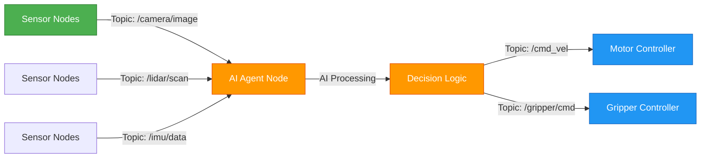

# Chapter 2: Python Agents & ROS 2 Integration

**Estimated Reading Time**: 50 minutes

In this chapter, you'll learn how to integrate Python-based AI agents with ROS 2 robot controllers using `rclpy`, the Python client library for ROS 2. This enables intelligent decision-making in robotic systems by connecting perception (sensors) with action (actuators) through AI-driven logic.

## Learning Outcomes

After completing this chapter, you will be able to:

- Initialize ROS 2 nodes within Python AI agent code
- Subscribe to sensor topics and process data in Python
- Publish control commands to robot actuators
- Implement complete sensor-to-actuator workflow

---

## Introduction to rclpy

**rclpy** (ROS Client Library for Python) is the official Python library for interacting with ROS 2. It provides a Pythonic API for all ROS 2 functionality - nodes, topics, services, parameters, and more.

**Why rclpy for AI agents:**

- **Python-first AI ecosystem**: TensorFlow, PyTorch, scikit-learn, NumPy all work seamlessly
- **Rapid prototyping**: Iterate on AI logic without recompiling (unlike C++)
- **Rich libraries**: Computer vision (OpenCV), NLP, reinforcement learning frameworks
- **Easy debugging**: Print statements, interactive notebooks, familiar Python tools

**Core rclpy concepts:**

- `rclpy.init()`: Initialize ROS 2 runtime (call once at program start)
- `Node`: Base class for creating ROS 2 nodes in Python
- `rclpy.spin()`: Process callbacks and keep node alive
- `rclpy.shutdown()`: Clean shutdown of ROS 2 runtime

### Basic rclpy Node Example

Here's the minimal structure for a Python ROS 2 node:

```python title="rclpy_basic_node.py"
"""
Basic rclpy Node - Chapter 2 Example

Demonstrates the minimal structure for a Python ROS 2 node using rclpy.

Run with:
  python3 rclpy_basic_node.py

Expected output:
[INFO] [timestamp] [basic_node]: Node initialized - ready for AI processing
"""

import rclpy
from rclpy.node import Node


class BasicAINode(Node):
    """Minimal ROS 2 node for AI agent integration."""

    def __init__(self):
        super().__init__('basic_node')
        self.get_logger().info('Node initialized - ready for AI processing')

        # AI model initialization would go here
        # self.model = load_my_ai_model()

        # Periodic tasks can be set up with timers
        self.timer = self.create_timer(1.0, self.process_callback)

    def process_callback(self):
        """Called every 1 second for periodic AI processing."""
        # AI inference or decision-making logic would go here
        self.get_logger().info('Processing AI logic...')


def main(args=None):
    rclpy.init(args=args)
    node = BasicAINode()

    try:
        rclpy.spin(node)  # Keep node running
    except KeyboardInterrupt:
        pass
    finally:
        node.destroy_node()
        rclpy.shutdown()


if __name__ == '__main__':
    main()
```

**Key Components:**

- `Node.__init__('node_name')`: Creates ROS 2 node with specified name
- `create_timer(period, callback)`: Schedules periodic function calls
- `try/except/finally`: Ensures clean shutdown on Ctrl+C

---

## AI Agent Architecture with ROS 2

An AI agent in a robotic system follows the **perception-decision-action loop**:

1. **Perception**: Receive sensor data (camera images, lidar scans, IMU readings)
2. **Decision**: Process data with AI models (object detection, path planning, control policies)
3. **Action**: Send commands to actuators (motor speeds, gripper positions)

ROS 2 enables this loop through:

- **Subscribers**: Receive sensor data from perception nodes
- **AI Processing**: Your Python code processes data and makes decisions
- **Publishers**: Send commands to control nodes



**Design Principles:**

- **Separation of Concerns**: Sensor drivers don't know about AI, AI doesn't know about hardware
- **Modularity**: Swap sensors, AI models, or controllers independently
- **Testability**: Run AI agent with simulated or recorded sensor data

---

## Subscribing to Sensor Topics

Subscribers allow your AI agent to receive real-time sensor data. The callback function is triggered automatically whenever a message arrives.

**Common sensor message types:**

- `sensor_msgs/Image`: Camera images (RGB, depth)
- `sensor_msgs/LaserScan`: Lidar/laser range data
- `sensor_msgs/Imu`: Inertial measurement unit (acceleration, orientation)
- `sensor_msgs/PointCloud2`: 3D point clouds

### Sensor Subscriber Example

```python title="sensor_subscriber.py"
"""
Sensor Subscriber - Chapter 2 Example

Demonstrates subscribing to sensor topics and processing data in Python AI agent.

Run with:
  ros2 run chapter_2_python_integration sensor_subscriber

Expected output:
[INFO] [timestamp] [obstacle_detector]: Detected obstacle at 1.23m
[INFO] [timestamp] [obstacle_detector]: Clear path ahead (5.67m)
"""

import rclpy
from rclpy.node import Node
from sensor_msgs.msg import LaserScan


class ObstacleDetector(Node):
    """AI agent that processes lidar data to detect obstacles."""

    def __init__(self):
        super().__init__('obstacle_detector')

        # Subscribe to lidar topic
        self.subscription = self.create_subscription(
            LaserScan,
            '/scan',
            self.lidar_callback,
            10  # QoS queue size
        )

        # AI parameters
        self.obstacle_threshold = 2.0  # meters
        self.get_logger().info('Obstacle detector initialized')

    def lidar_callback(self, msg: LaserScan):
        """
        Process lidar scan data.

        Args:
            msg: LaserScan message with range measurements
        """
        # Extract minimum distance from scan
        # Note: filter out invalid readings (inf, nan)
        valid_ranges = [r for r in msg.ranges if msg.range_min < r < msg.range_max]

        if not valid_ranges:
            self.get_logger().warn('No valid lidar readings')
            return

        min_distance = min(valid_ranges)

        # AI decision logic
        if min_distance < self.obstacle_threshold:
            self.get_logger().info(f'Detected obstacle at {min_distance:.2f}m')
            # Trigger avoidance behavior (would publish command here)
        else:
            self.get_logger().info(f'Clear path ahead ({min_distance:.2f}m)')


def main(args=None):
    rclpy.init(args=args)
    detector = ObstacleDetector()

    try:
        rclpy.spin(detector)
    except KeyboardInterrupt:
        pass
    finally:
        detector.destroy_node()
        rclpy.shutdown()


if __name__ == '__main__':
    main()
```

**Callback Best Practices:**

- **Keep callbacks fast**: Avoid long computations (use timers for heavy AI processing)
- **Handle different frequencies**: Sensors publish at different rates (camera 30Hz, lidar 10Hz)
- **Validate data**: Check for `inf`, `nan`, out-of-range values

:::warning Handling Topic Frequencies
Different sensors publish at different rates. If your AI processing is slow, messages may queue up. Use `QoS` (Quality of Service) settings to control behavior:

- `queue_size=10`: Keep last 10 messages (default)
- `BEST_EFFORT`: Drop messages if subscriber can't keep up (good for high-frequency sensors)
- `RELIABLE`: Guarantee delivery (good for critical commands)
:::

---

## Publishing Control Commands

Publishers allow your AI agent to send commands to robot actuators. Common command types:

- `geometry_msgs/Twist`: Linear and angular velocity commands (mobile robots)
- `std_msgs/Float64MultiArray`: Joint position/velocity commands (robot arms)
- `std_msgs/Bool`: Simple on/off commands (grippers, lights)

### Controller Publisher Example

```python title="controller_publisher.py"
"""
Controller Publisher - Chapter 2 Example

Demonstrates publishing control commands from AI agent to robot controllers.

Run with:
  ros2 run chapter_2_python_integration controller_publisher

Expected output:
[INFO] [timestamp] [navigation_agent]: Moving forward at 0.50 m/s
[INFO] [timestamp] [navigation_agent]: Turning left at 0.30 rad/s
"""

import rclpy
from rclpy.node import Node
from geometry_msgs.msg import Twist


class NavigationAgent(Node):
    """AI agent that publishes movement commands."""

    def __init__(self):
        super().__init__('navigation_agent')

        # Publisher for velocity commands
        self.publisher_ = self.create_publisher(
            Twist,
            '/cmd_vel',
            10
        )

        # Periodic command generation (2 Hz)
        self.timer = self.create_timer(0.5, self.command_callback)

        # AI state
        self.state = 'forward'
        self.counter = 0

        self.get_logger().info('Navigation agent initialized')

    def command_callback(self):
        """Generate and publish movement commands based on AI decision."""
        msg = Twist()

        # Simple state machine (real AI would use sensor data)
        if self.state == 'forward':
            msg.linear.x = 0.5  # m/s forward
            msg.angular.z = 0.0
            self.get_logger().info(f'Moving forward at {msg.linear.x:.2f} m/s')

            self.counter += 1
            if self.counter > 4:  # Switch state after 2 seconds
                self.state = 'turn'
                self.counter = 0

        elif self.state == 'turn':
            msg.linear.x = 0.0
            msg.angular.z = 0.3  # rad/s counter-clockwise
            self.get_logger().info(f'Turning left at {msg.angular.z:.2f} rad/s')

            self.counter += 1
            if self.counter > 4:
                self.state = 'forward'
                self.counter = 0

        # Publish command
        self.publisher_.publish(msg)


def main(args=None):
    rclpy.init(args=args)
    agent = NavigationAgent()

    try:
        rclpy.spin(agent)
    except KeyboardInterrupt:
        pass
    finally:
        agent.destroy_node()
        rclpy.shutdown()


if __name__ == '__main__':
    main()
```

**Publishing Best Practices:**

- **Consistent rates**: Publish commands at regular intervals (controllers expect this)
- **Safety limits**: Validate commands before publishing (check max velocity, acceleration)
- **Stop on shutdown**: Publish zero velocity before node exits

---

## Complete AI Agent Workflow

Let's combine everything: subscribe to sensors, process with AI logic, and publish commands. This example shows a complete perception-decision-action loop.

```python title="ai_agent_node_complete.py"
"""
Complete AI Agent Node - Chapter 2 Hands-On

Full sensor-to-actuator workflow: lidar → AI decision → motor commands.

Run with:
  ros2 run chapter_2_python_integration ai_agent_node_complete

Expected behavior:
- Subscribes to /scan topic (lidar data)
- Detects obstacles within 2.0m threshold
- Publishes /cmd_vel commands (stop if obstacle, move forward if clear)

Console output:
[INFO] [timestamp] [autonomous_agent]: AI agent initialized
[INFO] [timestamp] [autonomous_agent]: Decision: CLEAR - Moving forward
[INFO] [timestamp] [autonomous_agent]: Decision: OBSTACLE - Stopping
"""

import rclpy
from rclpy.node import Node
from sensor_msgs.msg import LaserScan
from geometry_msgs.msg import Twist


class AutonomousAgent(Node):
    """
    Complete AI agent integrating perception and control.

    Perception: Lidar data (LaserScan)
    Decision: Simple obstacle avoidance AI
    Action: Velocity commands (Twist)
    """

    def __init__(self):
        super().__init__('autonomous_agent')

        # Parameters
        self.declare_parameter('obstacle_threshold', 2.0)
        self.declare_parameter('forward_speed', 0.3)
        self.declare_parameter('turn_speed', 0.5)

        self.obstacle_threshold = self.get_parameter('obstacle_threshold').value
        self.forward_speed = self.get_parameter('forward_speed').value
        self.turn_speed = self.get_parameter('turn_speed').value

        # Subscriber: Lidar sensor data
        self.lidar_sub = self.create_subscription(
            LaserScan,
            '/scan',
            self.lidar_callback,
            10
        )

        # Publisher: Motor velocity commands
        self.cmd_pub = self.create_publisher(
            Twist,
            '/cmd_vel',
            10
        )

        # AI state
        self.obstacle_detected = False
        self.min_obstacle_distance = float('inf')

        # Command timer (publish at 10 Hz)
        self.timer = self.create_timer(0.1, self.command_callback)

        self.get_logger().info('AI agent initialized')

    def lidar_callback(self, msg: LaserScan):
        """
        Process lidar data to detect obstacles.

        Updates AI state based on sensor input.
        """
        # Filter valid ranges
        valid_ranges = [
            r for r in msg.ranges
            if msg.range_min < r < msg.range_max
        ]

        if not valid_ranges:
            return

        # Find closest obstacle
        self.min_obstacle_distance = min(valid_ranges)

        # Update AI decision state
        self.obstacle_detected = self.min_obstacle_distance < self.obstacle_threshold

    def command_callback(self):
        """
        AI decision logic: Generate commands based on sensor state.

        Published at 10 Hz for smooth control.
        """
        cmd = Twist()

        if self.obstacle_detected:
            # Decision: Obstacle nearby - turn in place
            cmd.linear.x = 0.0
            cmd.angular.z = self.turn_speed
            decision = f'OBSTACLE - Turning (obstacle at {self.min_obstacle_distance:.2f}m)'

        else:
            # Decision: Path clear - move forward
            cmd.linear.x = self.forward_speed
            cmd.angular.z = 0.0
            decision = f'CLEAR - Moving forward ({self.min_obstacle_distance:.2f}m to nearest obstacle)'

        # Publish command
        self.cmd_pub.publish(cmd)
        self.get_logger().info(f'Decision: {decision}')


def main(args=None):
    rclpy.init(args=args)
    agent = AutonomousAgent()

    try:
        rclpy.spin(agent)
    except KeyboardInterrupt:
        # Send stop command before shutting down
        stop_cmd = Twist()  # All zeros
        agent.cmd_pub.publish(stop_cmd)
        agent.get_logger().info('Stopping robot before shutdown')

    finally:
        agent.destroy_node()
        rclpy.shutdown()


if __name__ == '__main__':
    main()
```

**Architecture Breakdown:**

1. **Perception Layer**: `lidar_callback` processes sensor data and updates AI state (`obstacle_detected`, `min_obstacle_distance`)
2. **Decision Layer**: `command_callback` uses AI state to make decisions (turn vs. move forward)
3. **Action Layer**: `cmd_pub.publish(cmd)` sends commands to robot motors

**Key Features:**

- **Decoupled callbacks**: Sensor processing and command generation run independently
- **Parameterized AI**: Thresholds and speeds configurable without code changes
- **Safe shutdown**: Publishes stop command on exit

:::success Expected Behavior

**When running with simulated or real lidar:**

1. Robot moves forward when path is clear
2. Robot stops and turns when obstacle detected within 2.0m
3. Console logs show decision reasoning in real-time

**To test without hardware:**
- Use `ros2 bag` to replay recorded sensor data
- Run in Gazebo simulator with robot model
- Publish test messages: `ros2 topic pub /scan sensor_msgs/LaserScan "{ranges: [5.0, 5.0, 1.5, 5.0]}"`

**Parameters can be changed at runtime:**
```bash
ros2 param set /autonomous_agent obstacle_threshold 3.0
ros2 param set /autonomous_agent forward_speed 0.5
```
:::

---

## Chapter Summary

You've learned how to integrate Python AI agents with ROS 2:

- **rclpy** provides Pythonic API for ROS 2 functionality (nodes, topics, timers)
- **AI agent architecture** follows perception-decision-action loop
- **Subscribers** receive sensor data from topics and trigger callback functions
- **Publishers** send control commands to actuators at regular intervals
- **Complete workflow** combines sensors, AI logic, and commands in one node

**Key Takeaways:**

1. Keep sensor callbacks fast - do heavy AI processing in separate timers
2. Publish commands at consistent rates (controllers expect regular updates)
3. Use parameters for AI thresholds and settings (enables tuning without code changes)
4. Always send stop commands before shutting down for safety

**Integration Checklist:**

- ✅ AI model initialization in `__init__`
- ✅ Sensor subscribers with fast callbacks
- ✅ Decision logic processes AI state
- ✅ Command publisher sends actions to actuators
- ✅ Safe shutdown with stop commands

---

## Additional Resources

- [rclpy API Documentation](https://docs.ros2.org/humble/api/rclpy/) - Complete API reference for rclpy Python library
- [Writing a Simple Publisher and Subscriber (Python)](https://docs.ros.org/en/humble/Tutorials/Beginner-Client-Libraries/Writing-A-Simple-Py-Publisher-And-Subscriber.html) - Official beginner tutorial for Python ROS 2 programming

---

## What's Next?

In [Chapter 3: Humanoid Robot Description with URDF](./chapter-3-urdf-modeling.md), you'll learn how to model the physical structure of humanoid robots using URDF (Unified Robot Description Format), enabling simulation and visualization in RViz.

**Coming Up:**
- Understanding URDF XML structure for robot modeling
- Defining links (rigid bodies) and joints (connections)
- Creating complete humanoid robot models
- Adding sensors to URDF descriptions
- Visualizing and testing robots in RViz simulator
