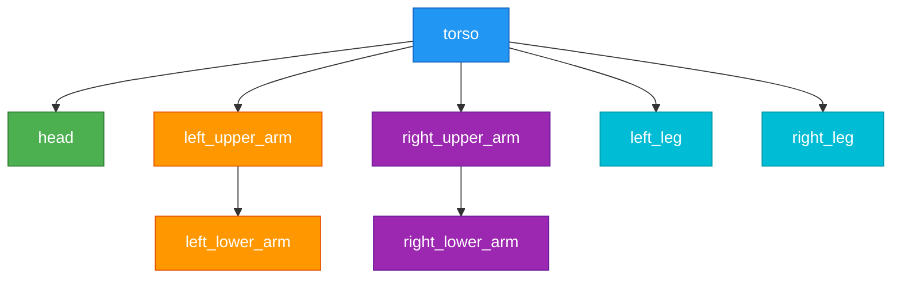

# Chapter 3: Humanoid Robot Description with URDF

**Estimated Reading Time**: 55 minutes

In this chapter, you'll learn how to describe the physical structure of humanoid robots using URDF (Unified Robot Description Format). URDF files define the robot's geometry, joints, sensors, and visual appearance, enabling simulation in RViz and deployment on real hardware.

## Learning Outcomes

After completing this chapter, you will be able to:

- Understand URDF XML structure (links, joints, sensors)
- Create URDF file for simple humanoid robot
- Load URDF into RViz for visualization
- Modify joint properties and see effects in simulator

---

## What is URDF?

**URDF (Unified Robot Description Format)** is an XML-based format for describing robot models in ROS. Think of it as a blueprint that specifies:

- **Geometry**: Shape and size of robot parts (links)
- **Kinematics**: How parts connect and move (joints)
- **Dynamics**: Mass, inertia, friction (for physics simulation)
- **Sensors**: Cameras, lidar, IMUs attached to robot
- **Visualization**: Colors, textures, 3D meshes

**Why URDF matters for Physical AI:**

- **Simulation-to-Reality**: Test AI controllers in simulation before deploying to hardware
- **Visualization**: See robot state in RViz while debugging
- **Hardware Abstraction**: Same URDF works in Gazebo, Isaac Sim, and on real robots
- **Standardization**: Industry-standard format supported by many tools

**URDF Structure Overview:**

```xml
<robot name="humanoid">
  <!-- Links: Rigid bodies -->
  <link name="torso">...</link>
  <link name="head">...</link>

  <!-- Joints: Connections between links -->
  <joint name="neck" type="revolute">...</joint>
</robot>
```

:::info URDF Structure Diagram
A visual diagram showing URDF structure (links as boxes, joints as connections) would be displayed here. For now, refer to the XML examples below to understand the hierarchy.
:::

:::info URDF vs XACRO
For complex robots, you'll often use **Xacro** (XML Macros) - a preprocessor that adds variables, macros, and includes to URDF. This chapter focuses on pure URDF for clarity, but production robots typically use Xacro for maintainability.
:::

---

## Links and Joints

### Links: Rigid Bodies

A **link** represents a rigid body in the robot - a part that doesn't deform. Each link has:

- **Visual**: How it looks (shape, color, mesh)
- **Collision**: Simplified geometry for collision detection
- **Inertial**: Mass and inertia properties for physics simulation

#### Simple Link Definition

```xml title="simple_link_definition.urdf"
<!-- Simple link representing a robot torso -->
<link name="torso">
  <!-- Visual appearance -->
  <visual>
    <geometry>
      <box size="0.3 0.2 0.5"/>  <!-- width, depth, height in meters -->
    </geometry>
    <material name="blue">
      <color rgba="0.2 0.4 0.8 1.0"/>  <!-- RGB + Alpha -->
    </material>
  </visual>

  <!-- Collision geometry (often simplified) -->
  <collision>
    <geometry>
      <box size="0.3 0.2 0.5"/>
    </geometry>
  </collision>

  <!-- Inertial properties for physics simulation -->
  <inertial>
    <mass value="10.0"/>  <!-- kg -->
    <inertia ixx="0.4" ixy="0.0" ixz="0.0"
             iyy="0.5" iyz="0.0"
             izz="0.3"/>
  </inertial>
</link>
```

**Common Geometries:**

- `<box size="x y z"/>`: Rectangular box
- `<cylinder radius="r" length="l"/>`: Cylinder
- `<sphere radius="r"/>`: Sphere
- `<mesh filename="path/to/model.stl"/>`: Custom 3D mesh

### Joints: Connections Between Links

A **joint** defines how two links are connected and how they can move relative to each other. Joints specify:

- **Parent link**: The link this joint is attached to
- **Child link**: The link that moves when joint actuates
- **Type**: How the joint moves (revolute, prismatic, fixed)
- **Limits**: Range of motion, velocity, effort constraints

#### Revolute Joint Definition

```xml title="revolute_joint_definition.urdf"
<!-- Revolute joint connecting head to torso (neck) -->
<joint name="neck" type="revolute">
  <parent link="torso"/>
  <child link="head"/>

  <!-- Joint origin relative to parent link -->
  <origin xyz="0.0 0.0 0.25" rpy="0 0 0"/>
  <!-- xyz: position offset (meters)
       rpy: roll, pitch, yaw rotation (radians) -->

  <!-- Axis of rotation -->
  <axis xyz="0 0 1"/>  <!-- Rotate around Z-axis (yaw) -->

  <!-- Joint limits -->
  <limit lower="-1.57" upper="1.57"   <!-- -90° to +90° in radians -->
         effort="10.0"                <!-- Max torque (Nm) -->
         velocity="1.0"/>              <!-- Max angular velocity (rad/s) -->

  <!-- Joint dynamics -->
  <dynamics damping="0.5" friction="0.1"/>
</joint>
```

### Joint Types Comparison

| Joint Type | Motion | Degrees of Freedom | Example |
|------------|--------|-------------------|---------|
| **revolute** | Rotation around axis | 1 (angular) | Elbow, knee, neck |
| **continuous** | Unlimited rotation | 1 (angular, no limits) | Wheels, propellers |
| **prismatic** | Linear sliding | 1 (linear) | Telescoping antenna, elevator |
| **fixed** | No motion | 0 | Sensor mount, rigidly attached parts |
| **planar** | Sliding in plane | 2 (linear x, y) | Rarely used |
| **floating** | Free motion in 3D space | 6 (position + orientation) | Base of mobile robot |

:::tip Joint Naming Conventions
Use descriptive names that indicate function: `left_shoulder_pitch`, `right_knee`, `head_yaw`. Avoid generic names like `joint_1` - future debugging will thank you.
:::

---

## Humanoid Robot URDF Example

Let's create a complete (simplified) humanoid robot URDF with torso, head, arms, and legs.

```xml title="simple_humanoid.urdf"
<?xml version="1.0"?>
<robot name="simple_humanoid">

  <!-- ====== TORSO ====== -->
  <link name="torso">
    <visual>
      <geometry>
        <box size="0.3 0.2 0.5"/>
      </geometry>
      <material name="blue">
        <color rgba="0.2 0.4 0.8 1.0"/>
      </material>
    </visual>
    <collision>
      <geometry>
        <box size="0.3 0.2 0.5"/>
      </geometry>
    </collision>
    <inertial>
      <mass value="10.0"/>
      <inertia ixx="0.4" ixy="0.0" ixz="0.0" iyy="0.5" iyz="0.0" izz="0.3"/>
    </inertial>
  </link>

  <!-- ====== HEAD ====== -->
  <link name="head">
    <visual>
      <geometry>
        <sphere radius="0.12"/>
      </geometry>
      <material name="skin">
        <color rgba="0.9 0.8 0.7 1.0"/>
      </material>
    </visual>
    <collision>
      <geometry>
        <sphere radius="0.12"/>
      </geometry>
    </collision>
    <inertial>
      <mass value="2.0"/>
      <inertia ixx="0.01" ixy="0.0" ixz="0.0" iyy="0.01" iyz="0.0" izz="0.01"/>
    </inertial>
  </link>

  <joint name="neck" type="revolute">
    <parent link="torso"/>
    <child link="head"/>
    <origin xyz="0.0 0.0 0.25" rpy="0 0 0"/>
    <axis xyz="0 0 1"/>
    <limit lower="-1.57" upper="1.57" effort="5.0" velocity="1.0"/>
  </joint>

  <!-- ====== LEFT ARM ====== -->
  <link name="left_upper_arm">
    <visual>
      <geometry>
        <cylinder radius="0.04" length="0.3"/>
      </geometry>
      <material name="red">
        <color rgba="0.8 0.2 0.2 1.0"/>
      </material>
    </visual>
    <collision>
      <geometry>
        <cylinder radius="0.04" length="0.3"/>
      </geometry>
    </collision>
    <inertial>
      <mass value="1.5"/>
      <inertia ixx="0.02" ixy="0.0" ixz="0.0" iyy="0.02" iyz="0.0" izz="0.001"/>
    </inertial>
  </link>

  <joint name="left_shoulder" type="revolute">
    <parent link="torso"/>
    <child link="left_upper_arm"/>
    <origin xyz="0.0 0.15 0.2" rpy="0 0 0"/>
    <axis xyz="1 0 0"/>  <!-- Pitch rotation -->
    <limit lower="-3.14" upper="3.14" effort="10.0" velocity="2.0"/>
  </joint>

  <link name="left_lower_arm">
    <visual>
      <geometry>
        <cylinder radius="0.03" length="0.25"/>
      </geometry>
      <material name="red"/>
    </visual>
    <collision>
      <geometry>
        <cylinder radius="0.03" length="0.25"/>
      </geometry>
    </collision>
    <inertial>
      <mass value="1.0"/>
      <inertia ixx="0.01" ixy="0.0" ixz="0.0" iyy="0.01" iyz="0.0" izz="0.001"/>
    </inertial>
  </link>

  <joint name="left_elbow" type="revolute">
    <parent link="left_upper_arm"/>
    <child link="left_lower_arm"/>
    <origin xyz="0.0 0.0 -0.15" rpy="0 0 0"/>
    <axis xyz="1 0 0"/>
    <limit lower="0" upper="2.5" effort="8.0" velocity="2.0"/>
  </joint>

  <!-- ====== RIGHT ARM (mirrored) ====== -->
  <link name="right_upper_arm">
    <visual>
      <geometry>
        <cylinder radius="0.04" length="0.3"/>
      </geometry>
      <material name="red"/>
    </visual>
    <collision>
      <geometry>
        <cylinder radius="0.04" length="0.3"/>
      </geometry>
    </collision>
    <inertial>
      <mass value="1.5"/>
      <inertia ixx="0.02" ixy="0.0" ixz="0.0" iyy="0.02" iyz="0.0" izz="0.001"/>
    </inertial>
  </link>

  <joint name="right_shoulder" type="revolute">
    <parent link="torso"/>
    <child link="right_upper_arm"/>
    <origin xyz="0.0 -0.15 0.2" rpy="0 0 0"/>  <!-- Negative Y for right side -->
    <axis xyz="1 0 0"/>
    <limit lower="-3.14" upper="3.14" effort="10.0" velocity="2.0"/>
  </joint>

  <link name="right_lower_arm">
    <visual>
      <geometry>
        <cylinder radius="0.03" length="0.25"/>
      </geometry>
      <material name="red"/>
    </visual>
    <collision>
      <geometry>
        <cylinder radius="0.03" length="0.25"/>
      </geometry>
    </collision>
    <inertial>
      <mass value="1.0"/>
      <inertia ixx="0.01" ixy="0.0" ixz="0.0" iyy="0.01" iyz="0.0" izz="0.001"/>
    </inertial>
  </link>

  <joint name="right_elbow" type="revolute">
    <parent link="right_upper_arm"/>
    <child link="right_lower_arm"/>
    <origin xyz="0.0 0.0 -0.15" rpy="0 0 0"/>
    <axis xyz="1 0 0"/>
    <limit lower="0" upper="2.5" effort="8.0" velocity="2.0"/>
  </joint>

  <!-- ====== LEGS (simplified - single link per leg) ====== -->
  <link name="left_leg">
    <visual>
      <geometry>
        <cylinder radius="0.05" length="0.6"/>
      </geometry>
      <material name="green">
        <color rgba="0.2 0.8 0.2 1.0"/>
      </material>
    </visual>
    <collision>
      <geometry>
        <cylinder radius="0.05" length="0.6"/>
      </geometry>
    </collision>
    <inertial>
      <mass value="3.0"/>
      <inertia ixx="0.1" ixy="0.0" ixz="0.0" iyy="0.1" iyz="0.0" izz="0.002"/>
    </inertial>
  </link>

  <joint name="left_hip" type="revolute">
    <parent link="torso"/>
    <child link="left_leg"/>
    <origin xyz="0.0 0.1 -0.25" rpy="0 0 0"/>
    <axis xyz="1 0 0"/>
    <limit lower="-1.57" upper="1.57" effort="15.0" velocity="1.5"/>
  </joint>

  <link name="right_leg">
    <visual>
      <geometry>
        <cylinder radius="0.05" length="0.6"/>
      </geometry>
      <material name="green"/>
    </visual>
    <collision>
      <geometry>
        <cylinder radius="0.05" length="0.6"/>
      </geometry>
    </collision>
    <inertial>
      <mass value="3.0"/>
      <inertia ixx="0.1" ixy="0.0" ixz="0.0" iyy="0.1" iyz="0.0" izz="0.002"/>
    </inertial>
  </link>

  <joint name="right_hip" type="revolute">
    <parent link="torso"/>
    <child link="right_leg"/>
    <origin xyz="0.0 -0.1 -0.25" rpy="0 0 0"/>
    <axis xyz="1 0 0"/>
    <limit lower="-1.57" upper="1.57" effort="15.0" velocity="1.5"/>
  </joint>

</robot>
```

### Humanoid Kinematic Chain

The robot structure forms a **kinematic tree** with the torso as the root:



**Key Relationships:**

- **Parent-Child**: Each joint connects exactly one parent and one child link
- **Tree Structure**: No loops (DAG - Directed Acyclic Graph)
- **Root Link**: Torso is the base - all other links descend from it

---

## Adding Sensors to URDF

Sensors are added as **Gazebo plugins** attached to specific links. Common sensors for humanoid robots:

- **Camera**: RGB, depth, stereo vision
- **IMU**: Inertial Measurement Unit (acceleration, gyroscope, orientation)
- **Lidar**: 2D/3D laser range scanning

### URDF with Sensors Example

```xml title="humanoid_with_sensors.urdf"
<?xml version="1.0"?>
<robot name="humanoid_with_sensors">

  <!-- ... (previous humanoid URDF links and joints) ... -->

  <!-- ====== CAMERA SENSOR ====== -->
  <link name="camera_link">
    <visual>
      <geometry>
        <box size="0.05 0.05 0.03"/>
      </geometry>
      <material name="black">
        <color rgba="0.1 0.1 0.1 1.0"/>
      </material>
    </visual>
    <collision>
      <geometry>
        <box size="0.05 0.05 0.03"/>
      </geometry>
    </collision>
    <inertial>
      <mass value="0.1"/>
      <inertia ixx="0.0001" ixy="0.0" ixz="0.0" iyy="0.0001" iyz="0.0" izz="0.0001"/>
    </inertial>
  </link>

  <joint name="camera_joint" type="fixed">
    <parent link="head"/>
    <child link="camera_link"/>
    <origin xyz="0.1 0.0 0.05" rpy="0 0 0"/>  <!-- Front of head -->
  </joint>

  <!-- Gazebo camera plugin -->
  <gazebo reference="camera_link">
    <sensor type="camera" name="head_camera">
      <update_rate>30.0</update_rate>
      <camera name="head">
        <horizontal_fov>1.3962634</horizontal_fov>  <!-- 80 degrees -->
        <image>
          <width>640</width>
          <height>480</height>
          <format>R8G8B8</format>
        </image>
        <clip>
          <near>0.02</near>
          <far>300</far>
        </clip>
      </camera>
      <plugin name="camera_controller" filename="libgazebo_ros_camera.so">
        <alwaysOn>true</alwaysOn>
        <updateRate>30.0</updateRate>
        <cameraName>head_camera</cameraName>
        <imageTopicName>/head_camera/image_raw</imageTopicName>
        <cameraInfoTopicName>/head_camera/camera_info</cameraInfoTopicName>
        <frameName>camera_link</frameName>
      </plugin>
    </sensor>
  </gazebo>

  <!-- ====== IMU SENSOR ====== -->
  <link name="imu_link">
    <visual>
      <geometry>
        <box size="0.02 0.02 0.01"/>
      </geometry>
      <material name="black"/>
    </visual>
    <inertial>
      <mass value="0.01"/>
      <inertia ixx="0.00001" ixy="0.0" ixz="0.0" iyy="0.00001" iyz="0.0" izz="0.00001"/>
    </inertial>
  </link>

  <joint name="imu_joint" type="fixed">
    <parent link="torso"/>
    <child link="imu_link"/>
    <origin xyz="0.0 0.0 0.0" rpy="0 0 0"/>  <!-- Center of torso -->
  </joint>

  <!-- Gazebo IMU plugin -->
  <gazebo reference="imu_link">
    <sensor type="imu" name="torso_imu">
      <always_on>true</always_on>
      <update_rate>100.0</update_rate>
      <plugin name="imu_controller" filename="libgazebo_ros_imu_sensor.so">
        <ros>
          <namespace>/</namespace>
          <remapping>~/out:=/imu/data</remapping>
        </ros>
        <initial_orientation_as_reference>false</initial_orientation_as_reference>
      </plugin>
    </sensor>
  </gazebo>

</robot>
```

**Sensor Integration Notes:**

- **Fixed joints**: Sensors typically use `type="fixed"` (no motion relative to parent)
- **Gazebo plugins**: Required for sensor simulation (libgazebo_ros_camera.so, libgazebo_ros_imu_sensor.so)
- **Topic names**: Customize where sensor data is published (`/head_camera/image_raw`, `/imu/data`)

---

## Visualizing in RViz

**RViz** (ROS Visualization) is a 3D visualization tool for inspecting robot models and sensor data.

### RViz Launch File

To visualize your URDF in RViz, create a launch file:

```python title="launch/visualize_urdf.launch.py"
"""
RViz URDF Visualization Launch File

Launches robot_state_publisher, joint_state_publisher_gui, and RViz
to visualize and interact with URDF model.

Run with:
  ros2 launch chapter_3_urdf_modeling visualize_urdf.launch.py

Expected behavior:
- RViz opens with robot model displayed
- GUI window allows manual joint control
"""

from launch import LaunchDescription
from launch.actions import DeclareLaunchArgument
from launch.substitutions import LaunchConfiguration, PathJoinSubstitution
from launch_ros.actions import Node
from launch_ros.substitutions import FindPackageShare


def generate_launch_description():
    # Declare launch arguments
    urdf_file_arg = DeclareLaunchArgument(
        'urdf_file',
        default_value='simple_humanoid.urdf',
        description='URDF file name (in urdf/ directory)'
    )

    # Get package path and URDF file path
    pkg_share = FindPackageShare('chapter_3_urdf_modeling')
    urdf_path = PathJoinSubstitution([
        pkg_share, 'urdf', LaunchConfiguration('urdf_file')
    ])

    # Read URDF file
    with open(urdf_path.perform(None), 'r') as f:
        robot_description = f.read()

    # robot_state_publisher: Publishes robot TF transforms
    robot_state_publisher = Node(
        package='robot_state_publisher',
        executable='robot_state_publisher',
        name='robot_state_publisher',
        output='screen',
        parameters=[{'robot_description': robot_description}]
    )

    # joint_state_publisher_gui: Interactive joint control
    joint_state_publisher_gui = Node(
        package='joint_state_publisher_gui',
        executable='joint_state_publisher_gui',
        name='joint_state_publisher_gui',
        output='screen'
    )

    # RViz: 3D visualization
    rviz_config_file = PathJoinSubstitution([
        pkg_share, 'rviz', 'humanoid_config.rviz'
    ])

    rviz = Node(
        package='rviz2',
        executable='rviz2',
        name='rviz2',
        output='screen',
        arguments=['-d', rviz_config_file]
    )

    return LaunchDescription([
        urdf_file_arg,
        robot_state_publisher,
        joint_state_publisher_gui,
        rviz
    ])
```

**Launch File Components:**

1. **robot_state_publisher**: Publishes TF (transform) tree based on URDF and joint states
2. **joint_state_publisher_gui**: Provides sliders to manually move joints
3. **rviz2**: Visualizes robot model in 3D

### Running the Visualization

```bash
# Build the package
cd ~/ros2_ws
colcon build --packages-select chapter_3_urdf_modeling

# Source the workspace
source install/setup.bash

# Launch visualization
ros2 launch chapter_3_urdf_modeling visualize_urdf.launch.py
```

**What You'll See:**

- **RViz window**: 3D view of humanoid robot
- **Joint State Publisher GUI**: Sliders for each joint
- Move sliders → Robot animates in real-time

:::info RViz Visualization Screenshot
A screenshot of the humanoid robot displayed in RViz would appear here. When you run the example, you'll see the 3D robot model with interactive joint controls.
:::

:::tip Interactive Joint Movement
The `joint_state_publisher_gui` tool creates sliders for all non-fixed joints. Drag sliders to see how joints affect robot pose. This is invaluable for:

- **Debugging**: Check if joint limits make sense
- **Validation**: Ensure kinematic chain behaves as expected
- **Testing**: Verify collision geometry is correct
:::

---

## Hands-On: Create and Visualize Your URDF

Let's put everything together in a step-by-step exercise.

### Step 1: Create Package Structure

```bash
cd ~/ros2_ws/src
ros2 pkg create chapter_3_urdf_modeling --build-type ament_python

cd chapter_3_urdf_modeling
mkdir -p urdf launch rviz
```

### Step 2: Save URDF File

Create `urdf/simple_humanoid.urdf` with the humanoid URDF from the previous section.

### Step 3: Create RViz Config

Create `rviz/humanoid_config.rviz`:

```yaml
Panels:
  - Class: rviz_common/Displays
    Name: Displays
  - Class: rviz_common/Views
    Name: Views

Visualization Manager:
  Displays:
    - Class: rviz_default_plugins/Grid
      Name: Grid
      Enabled: true

    - Class: rviz_default_plugins/RobotModel
      Name: RobotModel
      Enabled: true
      Robot Description: robot_description
      Visual Enabled: true
      Collision Enabled: false

    - Class: rviz_default_plugins/TF
      Name: TF
      Enabled: true
      Show Names: true
      Show Axes: true
      Show Arrows: false

  Global Options:
    Fixed Frame: torso

  Views:
    Current:
      Class: rviz_default_plugins/Orbit
      Distance: 2.5
      Focal Point:
        X: 0.0
        Y: 0.0
        Z: 0.0
```

### Step 4: Create Launch File

Save the `visualize_urdf.launch.py` from the previous section to `launch/`.

### Step 5: Update package.xml

Add dependencies to `package.xml`:

```xml
<depend>rclpy</depend>
<depend>robot_state_publisher</depend>
<depend>joint_state_publisher_gui</depend>
<depend>rviz2</depend>
<depend>xacro</depend>
```

### Step 6: Update setup.py

Add data files to `setup.py`:

```python
import os
from glob import glob
from setuptools import setup

package_name = 'chapter_3_urdf_modeling'

setup(
    name=package_name,
    version='1.0.0',
    packages=[package_name],
    data_files=[
        ('share/ament_index/resource_index/packages',
            ['resource/' + package_name]),
        ('share/' + package_name, ['package.xml']),
        (os.path.join('share', package_name, 'urdf'),
            glob('urdf/*.urdf')),
        (os.path.join('share', package_name, 'launch'),
            glob('launch/*.launch.py')),
        (os.path.join('share', package_name, 'rviz'),
            glob('rviz/*.rviz')),
    ],
    install_requires=['setuptools'],
    zip_safe=True,
    maintainer='Your Name',
    maintainer_email='your.email@example.com',
    description='URDF modeling examples for humanoid robots',
    license='MIT',
    entry_points={
        'console_scripts': [],
    },
)
```

### Step 7: Build and Run

```bash
cd ~/ros2_ws
colcon build --packages-select chapter_3_urdf_modeling
source install/setup.bash

ros2 launch chapter_3_urdf_modeling visualize_urdf.launch.py
```

:::success What You Should See in RViz

**RViz Window:**
- Blue rectangular torso (center)
- Skin-colored spherical head above torso
- Red cylindrical arms on left and right
- Green cylindrical legs below torso
- Grid floor for reference

**Joint State Publisher GUI:**
- Sliders for: neck, left_shoulder, left_elbow, right_shoulder, right_elbow, left_hip, right_hip
- Moving sliders updates robot pose in real-time

**Try This:**
1. Move `left_elbow` slider → Left forearm rotates
2. Move `neck` slider → Head rotates left/right
3. Move `left_shoulder` slider → Left arm swings forward/backward

If joints don't move as expected, check:
- Joint axis directions (`<axis xyz="..."/>`)
- Joint limits (`<limit lower="..." upper="..."/>`)
- Parent-child link connections
:::

---

## Chapter Summary

You've learned how to model humanoid robots with URDF:

- **URDF** is an XML format describing robot geometry, kinematics, dynamics, and sensors
- **Links** represent rigid bodies with visual, collision, and inertial properties
- **Joints** connect links and define motion constraints (revolute, prismatic, fixed)
- **Kinematic chains** form tree structures with parent-child relationships
- **Sensors** are added as Gazebo plugins attached to specific links
- **RViz** visualizes URDF models and allows interactive joint manipulation

**Key Takeaways:**

1. Start with simple geometries (boxes, cylinders, spheres) before adding complex meshes
2. Joint limits should match real robot hardware constraints
3. Use fixed joints for sensors and rigidly attached parts
4. Test in RViz before running in Gazebo or on real hardware
5. Kinematic tree must be acyclic (no loops)

**URDF Best Practices:**

- ✅ Descriptive link and joint names (`left_elbow`, not `joint_3`)
- ✅ Consistent units (meters, kilograms, radians)
- ✅ Realistic inertial properties (affects simulation accuracy)
- ✅ Simplified collision geometry (performance)
- ✅ Version control URDF files (track changes)

---

## Additional Resources

- [URDF Tutorials](http://wiki.ros.org/urdf/Tutorials) - Comprehensive URDF tutorials from basic to advanced
- [URDF XML Specification](http://wiki.ros.org/urdf/XML) - Complete XML tag reference for URDF files
- [RViz User Guide](https://docs.ros.org/en/humble/Tutorials/Intermediate/RViz/RViz-User-Guide/RViz-User-Guide.html) - Official guide to using RViz for robot visualization

---

## Module 1 Complete!

Congratulations on completing Module 1: The Robotic Nervous System (ROS 2)! You now have the foundational knowledge to:

- Create ROS 2 publisher and subscriber nodes for robot communication
- Integrate Python AI agents with ROS 2 using rclpy
- Model humanoid robots using URDF and visualize them in RViz

**What You've Accomplished:**

- ✅ Mastered ROS 2 fundamentals (nodes, topics, services, lifecycle)
- ✅ Built complete AI agent workflows (sensor → decision → actuator)
- ✅ Created URDF models for humanoid robots

**Next Steps:**

- **Module 2** (Coming Soon): Advanced ROS 2 - Actions, parameters, launch files, multi-robot systems
- **Practice**: Modify the humanoid URDF to add more joints (fingers, toes, spine segments)
- **Explore**: Try the [ROS 2 Navigation Stack](https://navigation.ros.org/) for autonomous mobile robots
- **Companion Repository**: Check out runnable code examples (link in [Module Overview](./index.md))

:::info Questions or Issues?
- Official ROS 2 documentation: [docs.ros.org/en/humble](https://docs.ros.org/en/humble/)
- Community support: [ROS Discourse](https://discourse.ros.org/)
- URDF validation tool: `check_urdf <file>.urdf`
:::

---

Happy robot building! 🤖
