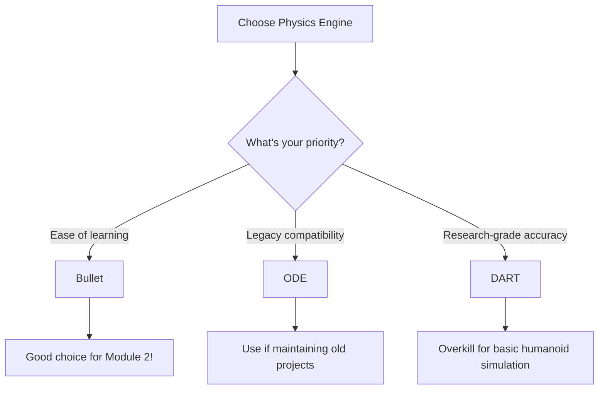

# Chapter 1: Gazebo Physics Simulation

Learn how Gazebo's physics engines simulate gravity, collisions, and rigid-body dynamics for realistic humanoid robot behavior.

## Introduction: Physics Simulation in Robotics

Before deploying a humanoid robot in the real world, you need to understand how it will move, fall, and interact with its environment. **Physics simulation** allows you to test robot designs in virtual worlds with realistic dynamics - without the risk of damaging expensive hardware.

### Why Physics Engines Matter for Digital Twins

A **digital twin** is a virtual replica of a physical robot that behaves identically to its real-world counterpart. For the digital twin to be useful, it must accurately simulate:

- **Gravity**: How the robot falls and maintains balance
- **Collisions**: How robot limbs interact with each other and obstacles
- **Inertia**: How mass distribution affects movement and stability
- **Friction**: How surfaces resist sliding motion

Gazebo provides three physics engines to choose from, each with different trade-offs for accuracy, performance, and ease of use.

---

## Gazebo Physics Engine Architecture

Gazebo supports three physics engines: **ODE** (Open Dynamics Engine), **Bullet**, and **DART** (Dynamic Animation and Robotics Toolkit). Each engine simulates rigid-body dynamics but uses different numerical methods.

### Engine Comparison

| Criterion | ODE | Bullet ✓ Recommended | DART |
|-----------|-----|---------------------|------|
| **Ease of Setup** | Moderate | **Easy** | Moderate |
| **Default Stability** | Requires tuning | **Good defaults** | Very good |
| **Performance (Humanoid)** | 10-50 Hz | **50-200 Hz** | 50-300 Hz |
| **Beginner Documentation** | Fair | **Good** | Minimal |
| **Gazebo 11+ Default** | No | **Yes** | No |
| **Joint Constraints** | Excellent | Good | Excellent |
| **Learning Complexity** | Medium | **Low** | High |
| **Best For** | Legacy projects | **Education & Prototyping** | Research |



### Recommendation for Educational Use

**Use Bullet as your primary physics engine** for these reasons:

1. **Default in Gazebo 11+**: No extra configuration needed - it just works
2. **Predictable behavior**: Stable with reasonable default parameters
3. **Real-time performance**: Simulates single humanoid robot at 50-200 Hz on a GTX 1060 GPU
4. **Growing documentation**: More tutorials and community examples than ODE

:::tip When to Use Other Engines
- **ODE**: If you're working with legacy projects or need highly constrained joints (e.g., four-bar linkages)
- **DART**: If you're doing research requiring sub-millisecond timestep accuracy or complex contact models
:::

---

## Bullet Physics Configuration

Let's configure a Gazebo world file to use Bullet physics with optimal settings for humanoid simulation.

### Default World File Setup

A Gazebo world file (`.world` extension) defines the simulation environment, physics engine, and objects. Here's a minimal world with Bullet physics:

```xml
<?xml version="1.0" ?>
<sdf version="1.6">
  <world name="humanoid_world">

    <!-- Physics Engine: Bullet -->
    <physics name="default_physics" default="true" type="bullet">
      <max_step_size>0.001</max_step_size>        <!-- 1ms timestep = 1000 Hz simulation -->
      <real_time_factor>1.0</real_time_factor>   <!-- Target 1x real-time speed -->
      <real_time_update_rate>1000</real_time_update_rate>
    </physics>

    <!-- Gravity: Earth standard -->
    <gravity>0 0 -9.81</gravity>

    <!-- Ground Plane with Friction -->
    <model name="ground_plane">
      <static>true</static>
      <link name="link">
        <collision name="collision">
          <geometry>
            <plane>
              <normal>0 0 1</normal>
              <size>100 100</size>
            </plane>
          </geometry>
          <surface>
            <friction>
              <ode>
                <mu>0.8</mu>   <!-- Friction coefficient (0.8 = wood on wood) -->
                <mu2>0.8</mu2>
              </ode>
            </friction>
          </surface>
        </collision>
      </link>
    </model>

    <!-- Lighting -->
    <light type="directional" name="sun">
      <cast_shadows>true</cast_shadows>
      <pose>0 0 10 0 0 0</pose>
      <diffuse>0.8 0.8 0.8 1</diffuse>
      <specular>0.2 0.2 0.2 1</specular>
      <attenuation>
        <range>1000</range>
        <constant>0.9</constant>
        <linear>0.01</linear>
        <quadratic>0.001</quadratic>
      </attenuation>
      <direction>-0.5 0.1 -0.9</direction>
    </light>

  </world>
</sdf>
```

### Understanding the Parameters

**`<max_step_size>0.001</max_step_size>`**
- Physics timestep in seconds (1ms = 0.001s)
- Smaller = more accurate but slower simulation
- **Guideline**: 1-2ms for humanoid robots, 5ms for wheeled robots

**`<real_time_factor>1.0</real_time_factor>`**
- Target simulation speed relative to real time
- 1.0 = simulated time matches real time
- Actual achieved factor depends on hardware (see status bar in Gazebo)

**`<real_time_update_rate>1000</real_time_update_rate>`**
- How often Gazebo updates the simulation (Hz)
- Should match `1 / max_step_size` for best performance

**`<gravity>0 0 -9.81</gravity>`**
- Gravity vector in m/s² (x, y, z)
- Earth standard: -9.81 in z-direction
- Try `-4.9` for Mars, `-1.62` for Moon!

---

## Gravity and World Configuration

The gravity vector determines how objects accelerate when dropped. On Earth, gravity pulls objects downward at 9.81 m/s².

### Gravity Configuration Examples

```xml
<!-- Earth (default) -->
<gravity>0 0 -9.81</gravity>

<!-- Mars (38% of Earth) -->
<gravity>0 0 -3.71</gravity>

<!-- Moon (16% of Earth) -->
<gravity>0 0 -1.62</gravity>

<!-- No gravity (space simulation) -->
<gravity>0 0 0</gravity>
```

### Physics Timestep Trade-offs

The `max_step_size` parameter controls accuracy vs performance:

| Timestep | Simulation Accuracy | Performance | Use Case |
|----------|-------------------|-------------|----------|
| **0.001s (1ms)** | Excellent | 50-200 Hz | Humanoid robots, complex contacts |
| 0.002s (2ms) | Good | 100-400 Hz | Humanoid robots (less demanding) |
| 0.005s (5ms) | Fair | 200-1000 Hz | Wheeled robots, simple objects |
| 0.01s (10ms) | Poor (unstable) | Fast | Not recommended for robots |

:::warning Common Pitfall: Timestep Too Large
If your timestep is >5ms, you'll see:
- **Collision penetration**: Robot limbs pass through each other
- **Joint oscillation**: Joints vibrate unrealistically
- **Numerical instability**: Robot "explodes" or flies away

**Solution**: Use 1-2ms for humanoid robots, no larger than 5ms for any robot.
:::

---

## Collision Detection Configuration

Collision detection determines when robot parts touch each other or the environment. Without proper collision geometry, limbs will pass through each other like ghosts.

### Visual vs Collision Geometry

Every robot link has two types of geometry:

1. **Visual**: What you see in the Gazebo GUI (can be detailed mesh)
2. **Collision**: What the physics engine uses (should be simple shapes for speed)

```xml
<link name="left_shin">
  <!-- Visual geometry: detailed mesh -->
  <visual name="visual">
    <geometry>
      <mesh>
        <uri>model://humanoid/meshes/shin.dae</uri>
        <scale>1 1 1</scale>
      </mesh>
    </geometry>
  </visual>

  <!-- Collision geometry: simple cylinder (faster) -->
  <collision name="collision">
    <geometry>
      <cylinder>
        <radius>0.05</radius>   <!-- 5cm radius -->
        <length>0.4</length>    <!-- 40cm length -->
      </cylinder>
    </geometry>
  </collision>
</link>
```

### Collision Geometry Best Practices

**Use simple shapes for collision**:
- **Box**: For torso, feet, rectangular links
- **Cylinder**: For arms, legs, rounded links
- **Sphere**: For shoulder/hip joints, ball-like objects
- **Mesh**: Only if absolutely necessary (slow!)

**Why simple shapes?**
- 10-100x faster collision detection than meshes
- Good enough approximation for most robots
- Reduces "jittering" from complex contact points

:::tip Collision Geometry Rule
Your collision geometry should be **slightly smaller** than visual geometry to avoid visual penetration when physics is working correctly.
:::

### Surface Friction Configuration

Friction prevents surfaces from sliding. Configure it in the `<collision>` element:

```xml
<collision name="foot_collision">
  <geometry>
    <box><size>0.15 0.08 0.03</size></box>
  </geometry>
  <surface>
    <friction>
      <ode>
        <mu>1.0</mu>    <!-- Primary friction coefficient -->
        <mu2>1.0</mu2>  <!-- Secondary friction (perpendicular) -->
      </ode>
    </friction>
  </surface>
</collision>
```

**Friction coefficient values**:
- **0.0**: Frictionless (ice-like)
- **0.5**: Low friction (metal on metal)
- **0.8**: Medium friction (wood on wood) - ground plane default
- **1.0**: High friction (rubber on concrete) - robot feet
- **2.0+**: Very high friction (adhesive)

:::warning Friction Confusion
Even though we're using Bullet physics, Gazebo still uses `<ode>` tags for friction configuration. This is a legacy naming convention - it works for all engines.
:::

---

## Understanding Inertia Tensors

**Inertia** describes how mass is distributed in a link. Incorrect inertia causes unrealistic movement - robots that spin uncontrollably or collapse instantly.

### What is an Inertia Tensor?

The **inertia tensor** is a 3x3 matrix describing resistance to rotation around x, y, z axes. For symmetrical shapes, most off-diagonal elements are zero:

```xml
<inertial>
  <mass>5.0</mass>  <!-- Mass in kg -->
  <pose>0 0 0 0 0 0</pose>  <!-- Center of mass relative to link origin -->
  <inertia>
    <ixx>0.083</ixx>  <!-- Moment of inertia around x-axis -->
    <iyy>0.083</iyy>  <!-- Moment of inertia around y-axis -->
    <izz>0.083</izz>  <!-- Moment of inertia around z-axis -->
    <ixy>0</ixy>      <!-- Product of inertia (usually 0 for simple shapes) -->
    <ixz>0</ixz>
    <iyz>0</iyz>
  </inertia>
</inertial>
```

### Calculating Inertia for Common Shapes

**Box (rectangular prism)**:
- I_xx = (1/12) * mass * (height² + depth²)
- I_yy = (1/12) * mass * (width² + depth²)
- I_zz = (1/12) * mass * (width² + height²)

**Cylinder (aligned with z-axis)**:
- I_xx = I_yy = (1/12) * mass * (3*radius² + length²)
- I_zz = (1/2) * mass * radius²

**Sphere**:
- I_xx = I_yy = I_zz = (2/5) * mass * radius²

### Example: Humanoid Torso Inertia

```xml
<!-- Torso: Box shape (width=0.3m, height=0.5m, depth=0.2m, mass=20kg) -->
<link name="torso">
  <inertial>
    <mass>20.0</mass>
    <inertia>
      <!-- I_xx = (1/12) * 20 * (0.5² + 0.2²) = 0.483 -->
      <ixx>0.483</ixx>
      <!-- I_yy = (1/12) * 20 * (0.3² + 0.2²) = 0.217 -->
      <iyy>0.217</iyy>
      <!-- I_zz = (1/12) * 20 * (0.3² + 0.5²) = 0.567 -->
      <izz>0.567</izz>
      <ixy>0</ixy>
      <ixz>0</ixz>
      <iyz>0</iyz>
    </inertia>
  </inertial>

  <collision name="collision">
    <geometry>
      <box><size>0.3 0.2 0.5</size></box>
    </geometry>
  </collision>

  <visual name="visual">
    <geometry>
      <box><size>0.3 0.2 0.5</size></box>
    </geometry>
  </visual>
</link>
```

:::info Inertia Calculator Tool
Use the companion repository's `inertia_calculator.py` tool to compute correct inertia values from your collision geometry. Manual calculation is error-prone!

```bash
# Companion repo: module-2-digital-twin/chapter-1-gazebo-physics/
python3 inertia_calculator.py --shape box --mass 20 --dimensions 0.3 0.2 0.5
```
:::

---

## Complete Humanoid URDF Example

Now let's integrate everything: Bullet physics, collision geometry, and correct inertia into a simple humanoid robot.

### Simple Humanoid URDF

This example creates a 6-DOF humanoid with proper physics configuration:

```xml
<?xml version="1.0"?>
<robot name="simple_humanoid">

  <!-- Base Link: Torso -->
  <link name="torso">
    <inertial>
      <mass>20.0</mass>
      <origin xyz="0 0 0" rpy="0 0 0"/>
      <inertia ixx="0.483" iyy="0.217" izz="0.567" ixy="0" ixz="0" iyz="0"/>
    </inertial>
    <collision>
      <geometry><box size="0.3 0.2 0.5"/></geometry>
    </collision>
    <visual>
      <geometry><box size="0.3 0.2 0.5"/></geometry>
      <material name="blue"><color rgba="0 0 0.8 1"/></material>
    </visual>
  </link>

  <!-- Left Leg Links and Joints -->
  <link name="left_thigh">
    <inertial>
      <mass>5.0</mass>
      <inertia ixx="0.083" iyy="0.083" izz="0.0125" ixy="0" ixz="0" iyz="0"/>
    </inertial>
    <collision>
      <geometry><cylinder radius="0.05" length="0.4"/></geometry>
    </collision>
    <visual>
      <geometry><cylinder radius="0.05" length="0.4"/></geometry>
      <material name="grey"><color rgba="0.5 0.5 0.5 1"/></material>
    </visual>
  </link>

  <joint name="left_hip" type="revolute">
    <parent link="torso"/>
    <child link="left_thigh"/>
    <origin xyz="0 0.1 -0.25" rpy="0 0 0"/>  <!-- Left side of torso -->
    <axis xyz="0 1 0"/>  <!-- Rotation around y-axis -->
    <limit lower="-1.57" upper="1.57" effort="100" velocity="2.0"/>
    <dynamics damping="5.0" friction="1.0"/>  <!-- KEY: Damping prevents oscillation -->
  </joint>

  <link name="left_shin">
    <inertial>
      <mass>3.0</mass>
      <inertia ixx="0.050" iyy="0.050" izz="0.0075" ixy="0" ixz="0" iyz="0"/>
    </inertial>
    <collision>
      <geometry><cylinder radius="0.04" length="0.4"/></geometry>
    </collision>
    <visual>
      <geometry><cylinder radius="0.04" length="0.4"/></geometry>
      <material name="grey"><color rgba="0.5 0.5 0.5 1"/></material>
    </visual>
  </link>

  <joint name="left_knee" type="revolute">
    <parent link="left_thigh"/>
    <child link="left_shin"/>
    <origin xyz="0 0 -0.4" rpy="0 0 0"/>  <!-- Below thigh -->
    <axis xyz="0 1 0"/>
    <limit lower="-2.0" upper="0" effort="100" velocity="4.0"/>  <!-- Knee only bends backward -->
    <dynamics damping="5.0" friction="1.0"/>
  </joint>

  <!-- Right Leg: Mirror of left leg -->
  <link name="right_thigh">
    <inertial>
      <mass>5.0</mass>
      <inertia ixx="0.083" iyy="0.083" izz="0.0125" ixy="0" ixz="0" iyz="0"/>
    </inertial>
    <collision>
      <geometry><cylinder radius="0.05" length="0.4"/></geometry>
    </collision>
    <visual>
      <geometry><cylinder radius="0.05" length="0.4"/></geometry>
      <material name="grey"><color rgba="0.5 0.5 0.5 1"/></material>
    </visual>
  </link>

  <joint name="right_hip" type="revolute">
    <parent link="torso"/>
    <child link="right_thigh"/>
    <origin xyz="0 -0.1 -0.25" rpy="0 0 0"/>  <!-- Right side of torso -->
    <axis xyz="0 1 0"/>
    <limit lower="-1.57" upper="1.57" effort="100" velocity="2.0"/>
    <dynamics damping="5.0" friction="1.0"/>
  </joint>

  <link name="right_shin">
    <inertial>
      <mass>3.0</mass>
      <inertia ixx="0.050" iyy="0.050" izz="0.0075" ixy="0" ixz="0" iyz="0"/>
    </inertial>
    <collision>
      <geometry><cylinder radius="0.04" length="0.4"/></geometry>
    </collision>
    <visual>
      <geometry><cylinder radius="0.04" length="0.4"/></geometry>
      <material name="grey"><color rgba="0.5 0.5 0.5 1"/></material>
    </visual>
  </link>

  <joint name="right_knee" type="revolute">
    <parent link="right_thigh"/>
    <child link="right_shin"/>
    <origin xyz="0 0 -0.4" rpy="0 0 0"/>
    <axis xyz="0 1 0"/>
    <limit lower="-2.0" upper="0" effort="100" velocity="4.0"/>
    <dynamics damping="5.0" friction="1.0"/>
  </joint>

</robot>
```

### Key Bullet-Tuned Parameters

1. **Joint Damping**: `<dynamics damping="5.0" .../>`
   - Dissipates energy to prevent unrealistic oscillation
   - Range: 3-8 for humanoid joints
   - Too low = joints vibrate, too high = sluggish movement

2. **Joint Friction**: `<dynamics ... friction="1.0"/>`
   - Static friction when joint is not moving
   - Helps joints "settle" after movement

3. **Correct Inertia**: Match collision geometry shape
   - Cylinder for legs/arms: I_xx = I_yy = (1/12)*m*(3r² + h²)
   - Box for torso: I_xx = (1/12)*m*(h² + d²)

---

## Common Physics Pitfalls

Learn from these typical mistakes to save debugging time:

### Pitfall 1: Timestep Too Large

**Symptom**: Robot limbs penetrate each other, joints oscillate wildly, simulation becomes unstable

**Cause**: `<max_step_size>0.01</max_step_size>` (10ms) is too large for collision detection

**Solution**: Use 1-2ms timestep for humanoid robots

```xml
<!-- BAD -->
<max_step_size>0.01</max_step_size>

<!-- GOOD -->
<max_step_size>0.001</max_step_size>
```

---

### Pitfall 2: Missing Collision Geometry

**Symptom**: Robot limbs pass through each other like ghosts

**Cause**: Links have `<visual>` but no `<collision>` element

**Solution**: Every link needs collision geometry

```xml
<!-- BAD: Only visual, no collision -->
<link name="arm">
  <visual>
    <geometry><cylinder radius="0.03" length="0.3"/></geometry>
  </visual>
</link>

<!-- GOOD: Both visual and collision -->
<link name="arm">
  <visual>
    <geometry><cylinder radius="0.03" length="0.3"/></geometry>
  </visual>
  <collision>
    <geometry><cylinder radius="0.03" length="0.3"/></geometry>
  </collision>
</link>
```

---

### Pitfall 3: Unrealistic Inertia

**Symptom**: Robot spins uncontrollably, collapses instantly, or flies away

**Cause**: Inertia values don't match link geometry (copy-pasted default values)

**Solution**: Calculate inertia from actual collision geometry mass and dimensions

```xml
<!-- BAD: Default inertia (all 1.0) -->
<inertial>
  <mass>5.0</mass>
  <inertia ixx="1.0" iyy="1.0" izz="1.0" .../>
</inertial>

<!-- GOOD: Calculated for cylinder (r=0.05m, h=0.4m, mass=5kg) -->
<inertial>
  <mass>5.0</mass>
  <inertia ixx="0.083" iyy="0.083" izz="0.0125" .../>
</inertial>
```

---

### Pitfall 4: Damping Confusion

**Symptom**: Joints vibrate rapidly or robot shakes uncontrollably

**Cause**: Missing or zero damping in joint `<dynamics>` element

**Solution**: Add damping 3-8 for humanoid joints

```xml
<!-- BAD: No damping -->
<joint name="knee" type="revolute">
  <dynamics friction="1.0"/>  <!-- Missing damping -->
</joint>

<!-- GOOD: Damping prevents oscillation -->
<joint name="knee" type="revolute">
  <dynamics damping="5.0" friction="1.0"/>
</joint>
```

---

### Troubleshooting Table

| Pitfall | Symptom | Solution |
|---------|---------|----------|
| **Timestep >5ms** | Collision penetration, joint oscillation | Use `max_step_size=0.001` (1ms) |
| **Missing collision geometry** | Limbs pass through each other | Add collision element to all links |
| **Unrealistic inertia** | Robot spins/flies/collapses | Calculate inertia from geometry (use calculator tool) |
| **No damping** | Joints vibrate rapidly | Add `dynamics damping="5.0"` |
| **Complex collision mesh** | Simulation slower than 10 Hz | Replace mesh with simple shapes (box/cylinder/sphere) |
| **High ground friction (>2.0)** | Robot sticks to ground | Use 0.8-1.0 for ground, 1.0 for feet |

---

## Hands-On Exercise: Falling Humanoid Robot

Let's apply everything you've learned by simulating a humanoid robot falling under gravity.

### Exercise Steps

1. **Create the world file** (`humanoid_physics.world`):
   - Copy the Bullet world configuration from earlier
   - Save to `~/gazebo_ws/worlds/humanoid_physics.world`

2. **Create the URDF** (`simple_humanoid.urdf`):
   - Copy the complete humanoid URDF example from earlier
   - Save to `~/gazebo_ws/urdf/simple_humanoid.urdf`

3. **Add robot to world**:
   - Open `humanoid_physics.world` in a text editor
   - Add this inside `<world>` element before the closing `</world>` tag:

```xml
<!-- Spawn humanoid robot 1 meter above ground -->
<include>
  <uri>file:///home/YOUR_USERNAME/gazebo_ws/urdf/simple_humanoid.urdf</uri>
  <pose>0 0 1.0 0 0 0</pose>  <!-- x y z roll pitch yaw -->
</include>
```

4. **Launch Gazebo**:

```bash
cd ~/gazebo_ws/worlds
gazebo humanoid_physics.world
```

5. **Observe the simulation**:
   - Robot should fall from 1m height
   - Legs should collide with ground realistically (no penetration)
   - Robot should settle after bouncing 1-2 times
   - Check real-time factor in bottom-left corner of Gazebo window

### Expected Output

- **Initial state**: Robot floating 1m above ground, static
- **Falling**: Robot accelerates at -9.81 m/s² (gravity)
- **Impact**: Legs hit ground, collision forces prevent penetration
- **Settling**: Damping dissipates energy, robot comes to rest
- **Performance**: Real-time factor ~1.0 on GTX 1060 equivalent GPU (50-200 Hz)

### Verification Checklist

- [ ] Gazebo loads without errors
- [ ] Robot falls smoothly (not jittering)
- [ ] Legs collide with ground (no penetration through ground plane)
- [ ] Robot settles within 2-3 seconds
- [ ] Real-time factor >= 0.9x (shown in bottom-left corner)
- [ ] No console warnings about "collision" or "inertia"

### Experiment: Modify Parameters

Try changing these parameters and observe the effects:

1. **Gravity**: Change `<gravity>0 0 -9.81</gravity>` to `-4.9` (Mars gravity)
   - Robot falls slower, bounces higher

2. **Timestep**: Change `<max_step_size>0.001</max_step_size>` to `0.01`
   - Collision penetration, unstable simulation (demonstrates pitfall!)

3. **Damping**: Change `<dynamics damping="5.0" .../>` to `0.1`
   - Joints oscillate wildly (demonstrates pitfall!)

4. **Friction**: Change ground `<mu>0.8</mu>` to `0.0`
   - Robot slides across ground when it lands

---

## External Resources

Continue learning with these official resources:

- **[Gazebo Tutorials](http://gazebosim.org/tutorials)**: Comprehensive guides on sensors, plugins, and physics configuration
- **[Bullet Physics Documentation](https://pybullet.org/)**: Deep dive into Bullet's solver algorithms and parameters
- **[URDF Inertia Specification](http://wiki.ros.org/urdf/XML/inertia)**: Official documentation on inertia tensor format

:::success You're Ready for Unity!
You now understand how physics engines simulate realistic robot dynamics. In the next chapter, we'll create photorealistic environments in Unity and integrate them with ROS 2 for sensor data export.

**Next**: [Chapter 2: Unity Environments →](./chapter-2-unity-environments.md)
:::

---

## Summary

In this chapter, you learned:

- ✅ **Physics engine comparison**: Bullet (recommended), ODE (legacy), DART (research)
- ✅ **Bullet configuration**: 1ms timestep, gravity -9.81 m/s², ground friction 0.8
- ✅ **Collision geometry**: Use simple shapes (box/cylinder/sphere) for speed
- ✅ **Inertia tensors**: Calculate from collision geometry mass and dimensions
- ✅ **Common pitfalls**: Timestep too large, missing collision, unrealistic inertia, no damping
- ✅ **Hands-on experience**: Simulated falling humanoid robot with realistic physics

**Key Takeaways**:
1. Always use 1-2ms timestep for humanoid robots (never >5ms)
2. Every link needs collision geometry matching visual shape
3. Calculate inertia from collision geometry (use calculator tool)
4. Add damping 3-8 to all joints to prevent oscillation

Ready to create photorealistic environments? Continue to Chapter 2!
