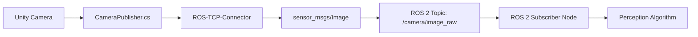

# Chapter 2: High-Fidelity Environments with Unity

Create photorealistic indoor environments in Unity with interactive objects, realistic lighting, and seamless ROS 2 integration for human-robot interaction scenarios.

## Introduction: Unity for Robot Simulation

While Gazebo excels at physics simulation, **Unity** brings photorealistic rendering and powerful environment design tools to robotics. Unity is the world's leading game engine, and it's increasingly used for robot simulation where visual realism matters.

### Unity vs Gazebo: Complementary Strengths

| Aspect | Gazebo | Unity |
|--------|--------|-------|
| **Physics Accuracy** | Excellent (Bullet/ODE/DART) | Good (PhysX/Havok) |
| **Visual Realism** | Basic (functional graphics) | **Excellent (AAA-game quality)** |
| **Lighting/Shadows** | Simple directional lights | **Advanced (ray tracing, global illumination)** |
| **Environment Design** | Manual SDF/XML editing | **Visual editor (drag-and-drop)** |
| **Interactive Objects** | Physics-based only | **Scriptable behaviors (C#)** |
| **ROS 2 Integration** | Native (ros_gz_bridge) | **Unity Robotics Hub package** |
| **Learning Curve** | Moderate (XML configuration) | **Moderate (C# scripting)** |
| **Best For** | **Physics fundamentals, sensor testing** | **HRI scenarios, data generation, visual perception** |

### When to Use Unity for Robot Simulation

Use Unity when you need:

- **Photorealistic environments** for camera/vision algorithm training
- **Human-robot interaction** scenarios with realistic avatars and behaviors
- **Large-scale data generation** (thousands of varied scenes for ML training)
- **Interactive objects** (doors that open, buttons that press, objects that break)
- **Advanced lighting** for testing vision robustness (shadows, reflections, time-of-day)

:::tip Unity + Gazebo Hybrid Approach
Many robotics teams use **both** tools:
- **Gazebo** for physics-critical tasks (manipulation, locomotion, force control)
- **Unity** for perception tasks (object detection, scene understanding, navigation)
- Same robot URDF/FBX works in both environments!
:::

---

## Unity Robotics Hub Setup

Unity Robotics Hub is Unity Technologies' official package for ROS 2 integration. It provides:

- **ROS2-For-Unity** package: WebSocket-based ROS 2 communication
- **URDF Importer**: Converts ROS URDFs to Unity GameObjects
- **Sensor publishers**: Camera, depth, and custom sensor data to ROS 2 topics

### Prerequisites

Before installing Unity, ensure you have:

- ✅ **Ubuntu 22.04 LTS** (Unity supports Linux!)
- ✅ **ROS 2 Humble** installed and sourced
- ✅ **GPU with 3GB+ VRAM** (GTX 1060 equivalent or better)
- ✅ **10GB free disk space** for Unity Editor

### Installation Steps

#### Step 1: Install Unity Hub on Ubuntu 22.04

Unity Hub is the launcher/manager for Unity Editor versions:

```bash
# Download Unity Hub AppImage (official method for Linux)
wget https://public-cdn.cloud.unity3d.com/hub/prod/UnityHub.AppImage
chmod +x UnityHub.AppImage

# Move to /opt for system-wide access
sudo mv UnityHub.AppImage /opt/UnityHub.AppImage

# Create desktop shortcut (optional)
cat > ~/Desktop/UnityHub.desktop <<EOF
[Desktop Entry]
Name=Unity Hub
Exec=/opt/UnityHub.AppImage
Icon=unityhub
Type=Application
Categories=Development;
EOF
chmod +x ~/Desktop/UnityHub.desktop

# Launch Unity Hub
/opt/UnityHub.AppImage
```

:::warning Common Pitfall: Unity Hub on Linux
If Unity Hub fails to launch, you may need to install FUSE:
```bash
sudo apt install libfuse2
```
This is required for AppImage execution on Ubuntu 22.04.
:::

#### Step 2: Install Unity 2022.3 LTS

1. **Sign in to Unity Hub** (create free Unity ID if you don't have one)
2. **Click "Installs"** tab in Unity Hub
3. **Click "Install Editor"** button
4. **Select "2022.3 LTS"** (Long Term Support - stable for robotics)
5. **Add modules** (during installation wizard):
   - ✅ **Linux Build Support** (required)
   - ✅ **Documentation** (helpful for C# learning)
   - ⬜ WebGL Build Support (optional - not needed for robotics)
   - ⬜ Android/iOS Build Support (optional)
6. **Wait for installation** (~15-20 minutes depending on internet speed)

**Verify installation**:
- Unity 2022.3.x should appear in "Installs" tab with green checkmark

#### Step 3: Add ROS2-For-Unity Package

Unity Robotics Hub is installed via Unity Package Manager:

1. **Create new Unity project** or open existing one
2. **Open Package Manager**: Window → Package Manager
3. **Click "+" dropdown** (top-left corner) → "Add package from git URL"
4. **Enter Git URL**:
   ```
   https://github.com/Unity-Technologies/ROS-TCP-Connector.git?path=/com.unity.robotics.ros-tcp-connector
   ```
5. **Wait for import** (~2-3 minutes)
6. **Verify installation**: Package Manager should show "ROS TCP Connector" package

**Alternative (for specific version)**:
```json
// Edit Packages/manifest.json in your Unity project
{
  "dependencies": {
    "com.unity.robotics.ros-tcp-connector": "https://github.com/Unity-Technologies/ROS-TCP-Connector.git?path=/com.unity.robotics.ros-tcp-connector#v0.7.0"
  }
}
```

:::info Python Version Compatibility
Unity Robotics Hub 0.7.0+ requires **Python 3.10** (Ubuntu 22.04 default). Do **NOT** install Python 3.11 - it breaks Unity's Python.NET bindings.

Verify your Python version:
```bash
python3 --version  # Should show 3.10.x
```
:::

---

## Importing Robot Models

Unity can import robot models in two formats: **URDF** (from ROS) and **FBX** (from 3D modeling software).

### URDF Import Workflow

Use the Unity Robotics Hub URDF Importer to convert ROS URDF files to Unity GameObjects:

1. **Install URDF Importer package** (if not already installed):
   - Package Manager → "+" → Add from git URL:
   ```
   https://github.com/Unity-Technologies/URDF-Importer.git?path=/com.unity.robotics.urdf-importer
   ```

2. **Import URDF**:
   - Assets → Import Robot from URDF
   - Select your `.urdf` file (e.g., `simple_humanoid.urdf` from Chapter 1)
   - Configure import settings:
     - ✅ **Mesh Decomposer**: Convex (for collision)
     - ✅ **Create Unity Joints**: Articulation Body (PhysX)
     - ⬜ Overwrite existing: Check if re-importing

3. **Result**: Unity creates a GameObject hierarchy matching URDF links/joints

:::warning URDF Import Limitations
- **Materials not preserved**: Unity imports geometry but loses ROS color/texture info
- **Collision geometry simplified**: Complex meshes are convex-decomposed (may differ from Gazebo)
- **Joint limits**: URDF revolute limits are converted to Unity ArticulationBody limits

**Solution**: Manually apply materials in Unity after import, verify joint behaviors match Gazebo.
:::

### FBX Import Workflow (For Visual-Only Models)

If you have a 3D model (`.fbx`, `.obj`, `.dae`) without physics, import directly:

1. **Drag FBX file** into Unity Project window (Assets folder)
2. **Configure import settings** (Inspector):
   - Scale Factor: 1 (if model is in meters)
   - Generate Colliders: Check if you want auto-collision
   - Animation: Import if FBX contains animations
3. **Drag into Scene**: Place imported model in your environment

**Example**: Humanoid Robot FBX
```
Assets/
└── RobotModels/
    └── HumanoidRobot.fbx  ← Drag this into Scene Hierarchy
```

---

## Environment Design Basics

Unity's visual editor makes it easy to create complex environments. Let's build an indoor HRI scenario.

### Creating a Simple Room

1. **Create Floor**:
   - Hierarchy → Right-click → 3D Object → Plane
   - Name it "Floor"
   - Transform: Position (0, 0, 0), Scale (5, 1, 5) for 50m × 50m floor

2. **Create Walls**:
   - Hierarchy → 3D Object → Cube
   - Name it "Wall_North"
   - Transform: Position (0, 2.5, 25), Scale (50, 5, 0.5)
   - Duplicate for other walls (Ctrl+D), adjust positions

3. **Add Furniture** (optional):
   - Unity Asset Store has free furniture packs
   - Or create simple cubes/cylinders as placeholders
   - Hierarchy → 3D Object → Cube for table (scale to table dimensions)

### Interactive Objects with C#

Make objects respond to robot interactions:

```csharp
// Assets/Scripts/InteractiveObject.cs
using UnityEngine;

public class InteractiveObject : MonoBehaviour
{
    public Color normalColor = Color.white;
    public Color touchedColor = Color.green;

    private Renderer objectRenderer;
    private bool isTouched = false;

    void Start()
    {
        objectRenderer = GetComponent<Renderer>();
        objectRenderer.material.color = normalColor;
    }

    void OnCollisionEnter(Collision collision)
    {
        // Check if robot touched this object
        if (collision.gameObject.CompareTag("Robot"))
        {
            isTouched = true;
            objectRenderer.material.color = touchedColor;
            Debug.Log($"Robot touched {gameObject.name}!");
        }
    }

    void OnCollisionExit(Collision collision)
    {
        if (collision.gameObject.CompareTag("Robot"))
        {
            isTouched = false;
            objectRenderer.material.color = normalColor;
        }
    }
}
```

**Usage**:
1. Create a Cube GameObject (e.g., "InteractiveButton")
2. Add Rigidbody component (for physics)
3. Attach `InteractiveObject.cs` script to the Cube
4. Tag your robot GameObject as "Robot" (Inspector → Tag dropdown)

---

## Lighting and Materials

Realistic lighting transforms a basic scene into a photorealistic environment.

### Lighting Setup for HRI Scenarios

Unity supports three lighting modes:

1. **Realtime Lighting**: Dynamic, performance-intensive, good for moving robots
2. **Baked Lighting**: Pre-calculated, fast, good for static environments
3. **Mixed Lighting**: Hybrid approach - recommended for robotics

**Recommended setup**:

```
Scene Hierarchy:
├── Directional Light (Sun)
│   └── Intensity: 1.0, Color: Warm White, Mode: Mixed
├── Point Lights (Room lights)
│   └── Intensity: 2-3, Range: 10m, Mode: Mixed
└── Reflection Probes (for realistic reflections)
    └── Box Projection, Bake on scene load
```

**Configure Mixed Lighting** (Window → Rendering → Lighting):
- ✅ Baked Global Illumination: Enabled
- ✅ Realtime Global Illumination: Disabled (for performance)
- Lightmap Resolution: 20-40 (higher = better quality, slower bake)

### Material Setup for Realism

Replace default materials with Unity's Standard Shader for realistic surfaces:

1. **Create Material**: Project → Right-click → Create → Material
2. **Configure Standard Shader**:
   - Albedo: Base color (e.g., wood texture for table)
   - Metallic: 0 for non-metals, 1 for metals
   - Smoothness: 0.2-0.4 for rough surfaces, 0.8-1.0 for polished
   - Normal Map: Add detail texture (optional but recommended)

**Example Materials**:
- **Floor**: Albedo = gray concrete texture, Metallic = 0, Smoothness = 0.3
- **Walls**: Albedo = white paint texture, Metallic = 0, Smoothness = 0.2
- **Robot**: Albedo = metallic blue, Metallic = 0.8, Smoothness = 0.7

:::tip Performance Target
Aim for **60+ FPS** on GTX 1060 at 1080p resolution. If FPS drops:
1. Reduce lightmap resolution (40 → 20)
2. Disable realtime shadows on Point Lights
3. Use simpler materials (less texture maps)
4. Lower camera rendering resolution (1920x1080 → 1280x720)
:::

---

## ROS 2 Integration Workflow

Now let's connect your Unity scene to ROS 2 for sensor data export.

### Unity-ROS 2 Communication Pipeline



### Step 1: Configure ROSConnection

1. **Create ROSConnection GameObject**:
   - Hierarchy → Right-click → Create Empty
   - Name it "ROSConnection"

2. **Attach ROSConnection script**:
   - Add Component → Robotics → ROS Connection
   - Configure in Inspector:
     - ROS IP Address: `127.0.0.1` (localhost)
     - ROS Port: `10000` (default WebSocket port)
     - Protocol: ROS 2

3. **Test connection**:
   - In ROS 2 terminal, launch the TCP endpoint:
   ```bash
   source /opt/ros/humble/setup.bash
   ros2 run ros_tcp_endpoint default_server_endpoint --ros-args -p ROS_IP:=0.0.0.0
   ```
   - Press Play in Unity Editor
   - Console should show: "ROS connection established"

:::warning ROS_DOMAIN_ID Configuration
Unity and ROS 2 must use the same `ROS_DOMAIN_ID` to communicate:

**Unity**: Set in ROSConnection component → Network Settings → Domain ID = 0

**ROS 2 Terminal**:
```bash
export ROS_DOMAIN_ID=0  # Add to ~/.bashrc for persistence
```

Mismatch causes "No topics found" errors.
:::

---

## Camera Sensor Export

Export Unity camera frames to ROS 2 for perception algorithm testing.

### CameraPublisher Script

```csharp
// Assets/Scripts/CameraPublisher.cs
using UnityEngine;
using Unity.Robotics.ROSTCPConnector;
using RosMessageTypes.Sensor;

public class CameraPublisher : MonoBehaviour
{
    public string topicName = "/camera/image_raw";
    public int publishRate = 30;  // Hz

    private ROSConnection ros;
    private Camera cam;
    private Texture2D texture;
    private float timer = 0f;

    void Start()
    {
        ros = ROSConnection.GetOrCreateInstance();
        ros.RegisterPublisher<ImageMsg>(topicName);

        cam = GetComponent<Camera>();
        texture = new Texture2D(cam.pixelWidth, cam.pixelHeight, TextureFormat.RGB24, false);
    }

    void Update()
    {
        timer += Time.deltaTime;

        if (timer >= 1.0f / publishRate)
        {
            timer = 0f;
            PublishCameraFrame();
        }
    }

    void PublishCameraFrame()
    {
        // Capture camera frame
        RenderTexture.active = cam.targetTexture;
        texture.ReadPixels(new Rect(0, 0, cam.pixelWidth, cam.pixelHeight), 0, 0);
        texture.Apply();

        // Convert to ROS message
        ImageMsg msg = new ImageMsg
        {
            header = new RosMessageTypes.Std.HeaderMsg
            {
                stamp = ROSConnection.GetRosTime(),
                frame_id = "camera_link"
            },
            height = (uint)texture.height,
            width = (uint)texture.width,
            encoding = "rgb8",
            is_bigendian = 0,
            step = (uint)texture.width * 3,  // 3 bytes per pixel (RGB)
            data = texture.GetRawTextureData()
        };

        ros.Publish(topicName, msg);
    }
}
```

### Using the CameraPublisher

1. **Attach to Camera**:
   - Select Main Camera in Hierarchy
   - Add Component → CameraPublisher (drag script)
   - Configure in Inspector:
     - Topic Name: `/camera/image_raw`
     - Publish Rate: 30 (30 Hz)

2. **Verify in ROS 2**:
   ```bash
   # Terminal 1: Launch TCP endpoint
   ros2 run ros_tcp_endpoint default_server_endpoint

   # Terminal 2: Check topic
   ros2 topic list  # Should show /camera/image_raw
   ros2 topic hz /camera/image_raw  # Should show ~30 Hz

   # Terminal 3: View images (requires ros-humble-rqt-image-view)
   rqt_image_view
   # Select /camera/image_raw from dropdown
   ```

**Expected Output**: Real-time Unity camera feed in rqt_image_view

---

## Hands-On Exercise: Indoor Environment

Let's create a complete HRI scenario with interactive objects and camera export.

### Exercise Steps

1. **Create the environment**:
   - Open Unity 2022.3 LTS
   - Create New Project: 3D Core template
   - Name: `HumanoidHRI_Scene`

2. **Build the room**:
   - Create Floor: Plane, Scale (5, 1, 5)
   - Create 4 Walls: Cubes, rotate/position to enclose room
   - Add Lighting: Directional Light + 2 Point Lights

3. **Add interactive objects** (5 required):
   - Table: Cube, Scale (1.5, 0.8, 0.8), Position (0, 0.4, 2)
   - Chair: Cube, Scale (0.5, 1.0, 0.5), Position (-0.7, 0.5, 2)
   - Button: Sphere, Scale (0.2, 0.2, 0.2), Position (2, 1.2, 0) on wall
   - Door: Cube, Scale (1.0, 2.5, 0.1), add Hinge Joint for opening
   - Box: Cube, Scale (0.4, 0.4, 0.4), add Rigidbody for grabbing

4. **Attach InteractiveObject script** to all 5 objects

5. **Import humanoid robot**:
   - Use URDF Importer for `simple_humanoid.urdf` from Chapter 1
   - OR use free Unity Asset Store humanoid model
   - Tag robot as "Robot"

6. **Configure camera and ROS 2**:
   - Create ROSConnection GameObject, configure endpoint
   - Attach CameraPublisher to Main Camera
   - Launch ROS 2 TCP endpoint

7. **Test the scene**:
   - Press Play in Unity
   - Move robot (use keyboard controls or script)
   - Touch interactive objects → they change color
   - Verify camera publishes to `/camera/image_raw`

### Expected Output

- **Visual**: Indoor room with furniture, humanoid robot, interactive objects
- **Performance**: 60+ FPS on GTX 1060 at 1080p
- **ROS 2 Integration**: Camera topic publishes at 30 Hz
- **Interactions**: Objects change color when robot touches them

### Verification Checklist

- [ ] Unity scene loads without errors
- [ ] All 5 interactive objects respond to robot touch
- [ ] Lighting creates realistic shadows and reflections
- [ ] Camera publishes to ROS 2 topic at 30 Hz
- [ ] rqt_image_view shows live Unity camera feed
- [ ] Frame rate >= 60 FPS (check Stats panel in Game view)
- [ ] No console errors related to ROS connection

---

## Troubleshooting

Common issues when setting up Unity with ROS 2 on Ubuntu 22.04:

### Issue 1: Unity Hub Won't Launch

**Symptom**: Double-clicking UnityHub.AppImage does nothing

**Cause**: Missing FUSE library for AppImage support

**Solution**:
```bash
sudo apt install libfuse2
```

### Issue 2: Python Version Conflicts

**Symptom**: Unity Robotics Hub import fails with Python.NET errors

**Cause**: Python 3.11 installed (incompatible with Unity 0.7.0)

**Solution**: Use system Python 3.10 (Ubuntu 22.04 default)
```bash
python3 --version  # Should be 3.10.x
# If 3.11, uninstall it and use 3.10
sudo apt install python3.10 python3.10-dev
```

### Issue 3: ROS 2 Topics Not Visible

**Symptom**: `ros2 topic list` doesn't show Unity topics

**Causes & Solutions**:
1. **ROS_DOMAIN_ID mismatch**:
   ```bash
   export ROS_DOMAIN_ID=0  # Match Unity setting
   ```

2. **TCP endpoint not running**:
   ```bash
   ros2 run ros_tcp_endpoint default_server_endpoint
   ```

3. **Firewall blocking port 10000**:
   ```bash
   sudo ufw allow 10000/tcp
   ```

### Issue 4: Low Frame Rate (Under 30 FPS)

**Symptom**: Unity scene runs slowly, robot movement is jerky

**Solutions** (in order of impact):
1. Lower lightmap resolution: Lighting Settings → 40 → 20
2. Disable realtime shadows: Lights → Shadow Type: None
3. Reduce camera resolution: CameraPublisher → 1280x720
4. Use simpler materials: Remove normal maps, reduce texture resolution

---

## External Resources

Continue learning with these official resources:

- **[Unity Robotics Hub GitHub](https://github.com/Unity-Technologies/Unity-Robotics-Hub)**: Official repository with tutorials and examples
- **[Unity Learn: 3D Environments](https://learn.unity.com/)**: Free tutorials on lighting, materials, and scene design
- **[ROS2-For-Unity Documentation](https://github.com/Unity-Technologies/ROS-TCP-Connector)**: API reference and integration patterns

:::success Ready for Multi-Sensor Simulation!
You now know how to create photorealistic environments in Unity and export sensor data to ROS 2. In the next chapter, we'll simulate LiDAR, depth cameras, and IMUs with realistic noise models.

**Next**: [Chapter 3: Sensor Simulation →](./chapter-3-sensor-simulation.md)
:::

---

## Summary

In this chapter, you learned:

- ✅ **Unity vs Gazebo**: Complementary tools for physics (Gazebo) and visual realism (Unity)
- ✅ **Unity Robotics Hub setup**: Unity 2022.3 LTS + ROS2-For-Unity package on Ubuntu 22.04
- ✅ **Robot model import**: URDF Importer for ROS robots, FBX for visual-only models
- ✅ **Environment design**: Visual editor for rooms, furniture, interactive objects with C# scripts
- ✅ **Photorealistic rendering**: Mixed lighting, Standard Shader materials, 60+ FPS target
- ✅ **ROS 2 integration**: ROSConnection + CameraPublisher for sensor data export
- ✅ **Hands-on experience**: Created indoor HRI scene with 5 interactive objects

**Key Takeaways**:
1. Unity excels at visual realism and environment design (use for perception/HRI)
2. Unity Robotics Hub enables seamless ROS 2 communication via WebSocket
3. Camera sensors export at 30 Hz to `sensor_msgs/Image` topics
4. Interactive objects use C# scripts for custom behaviors
5. Aim for 60 FPS on GTX 1060 with optimized lighting and materials

Ready to add LiDAR and depth cameras? Continue to Chapter 3!
