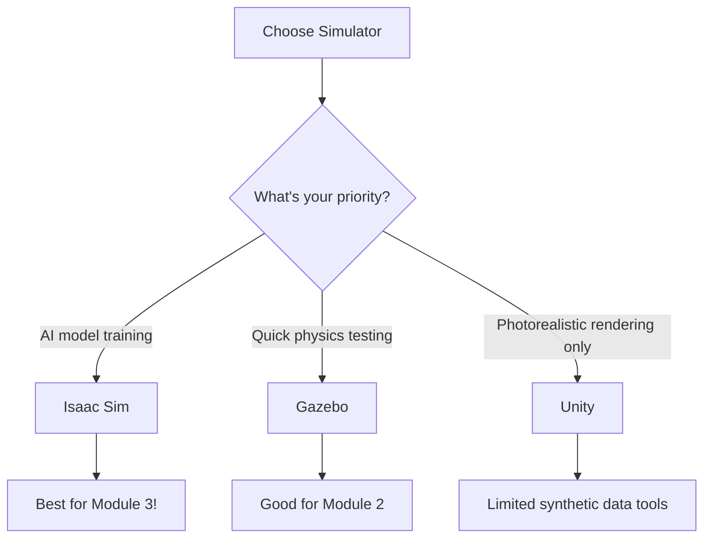
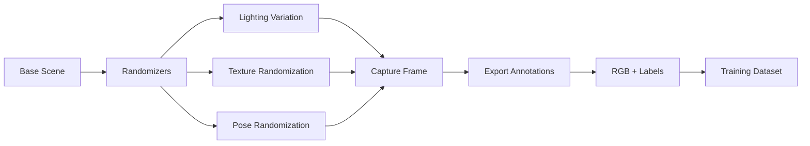
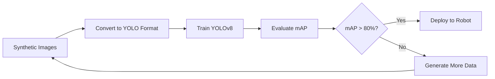

# Chapter 1: NVIDIA Isaac Sim Fundamentals

Learn how NVIDIA Isaac Sim's photorealistic ray tracing and synthetic data generation accelerate AI model training for humanoid robots.

## Introduction: Photorealistic Simulation for AI Training

Before deploying computer vision models on a physical humanoid robot, you need thousands of labeled training images. **Synthetic data generation** allows you to create unlimited training datasets in photorealistic virtual environments - without the time and cost of manual labeling.

### Why Isaac Sim for Digital Twins?

A **digital twin** in Isaac Sim goes beyond physics simulation - it generates AI-ready training data with pixel-perfect labels. For humanoid robot perception, Isaac Sim provides:

- **Photorealistic Ray Tracing**: RTX GPU-accelerated rendering for realistic lighting, shadows, and materials
- **Universal Scene Description (USD)**: Industry-standard format for complex 3D scenes (used by Pixar)
- **Built-in Synthetic Data**: Automatic ground truth for object detection, segmentation, depth, and pose
- **Domain Randomization**: Procedurally vary lighting, textures, and poses to reduce sim-to-real gap

Traditional simulators like Gazebo focus on physics accuracy but lack the visual fidelity needed for training modern deep learning models. Isaac Sim bridges this gap by combining NVIDIA PhysX for dynamics with RTX ray tracing for perception.

---

## What is Isaac Sim?

**NVIDIA Isaac Sim** is a robotics simulation platform built on the Omniverse framework. It provides photorealistic rendering, accurate physics, and tools for synthetic data generation - all optimized for NVIDIA RTX GPUs.

### Simulator Comparison

| Criterion | Gazebo | Unity | Isaac Sim ✓ Recommended |
|-----------|--------|-------|-------------------------|
| **Ray Tracing** | No | Limited (URP) | **Native RTX support** |
| **USD Format** | No (SDF) | No (Prefabs) | **Yes (industry standard)** |
| **Synthetic Data Pipeline** | Manual | Requires scripts | **Built-in Replicator** |
| **Physics Accuracy** | Good (Bullet) | Good (PhysX) | **Excellent (PhysX 5)** |
| **GPU Acceleration** | CPU-based | Partial | **Full RTX/CUDA** |
| **ROS 2 Integration** | Native | Third-party | **Official bridge** |
| **Learning Curve** | Low | Medium | **Medium-High** |
| **Best For** | Quick prototyping | Game-like environments | **AI training & perception** |



### Recommendation for AI-Focused Robotics

**Use Isaac Sim as your primary platform** for these reasons:

1. **Synthetic Data Pipeline**: Replicator SDK generates labeled datasets with 3 lines of code
2. **RTX Acceleration**: 10-100x faster rendering than CPU-based ray tracing
3. **USD Ecosystem**: Seamlessly import assets from Blender, Maya, Unreal Engine
4. **Official NVIDIA Support**: Direct integration with Isaac ROS, Jetson platforms

:::tip When to Use Other Simulators
- **Gazebo**: If you only need physics testing and have no RTX GPU
- **Unity**: If you need web-based deployment or mobile VR experiences
:::

---

## Installation and Verification

Isaac Sim requires an NVIDIA RTX GPU and Ubuntu 22.04 (or Windows 10/11 with WSL2). We'll use the Omniverse Launcher for installation.

### Prerequisites

**Hardware Requirements**:
- NVIDIA RTX GPU (2060 or newer) with 6GB+ VRAM
- 32GB+ RAM (16GB minimum, but 32GB recommended for complex scenes)
- 50GB+ free disk space (SSD strongly recommended)

**Software Requirements**:
- Ubuntu 22.04 LTS (native or WSL2)
- NVIDIA Driver 525+ (check with `nvidia-smi`)
- CUDA 12.1+ (installed automatically with driver)

### Step-by-Step Installation

**1. Install NVIDIA Omniverse Launcher**:

```bash
# Download Omniverse Launcher AppImage
wget https://install.launcher.omniverse.nvidia.com/installers/omniverse-launcher-linux.AppImage

# Make executable
chmod +x omniverse-launcher-linux.AppImage

# Launch (requires GUI)
./omniverse-launcher-linux.AppImage
```

**2. Install Isaac Sim from Launcher**:

- Open Omniverse Launcher
- Navigate to **Exchange** tab
- Search for "Isaac Sim"
- Click **Install** for "Isaac Sim 2023.1.1" (or latest stable version)
- Installation takes 15-30 minutes (downloads ~20GB)

**3. Verify Installation**:

```bash
# Launch Isaac Sim from terminal (adjust version number)
~/.local/share/ov/pkg/isaac_sim-2023.1.1/isaac-sim.sh

# Expected: Isaac Sim GUI opens with default scene
# Check bottom-right corner for "RTX: On" indicator
```

### Installation Verification Checklist

- [ ] Isaac Sim GUI opens without errors
- [ ] RTX rendering enabled (bottom-right corner shows "RTX: On")
- [ ] Sample scene loads (Create > Physics > Rigid Bodies)
- [ ] Physics simulation runs at 60+ FPS (press Play button)
- [ ] No CUDA errors in terminal output

### Troubleshooting Common Issues

| Issue | Symptom | Solution |
|-------|---------|----------|
| **CUDA not found** | Error: "CUDA runtime not available" | Install NVIDIA driver 525+ (`sudo ubuntu-drivers autoinstall`) |
| **Vulkan errors** | Black screen or rendering artifacts | Update GPU driver: `sudo apt update && sudo apt upgrade` |
| **Disk space error** | Installation fails at 80%+ | Free 50GB+ space (Isaac Sim + cache = 40GB) |
| **OOM (Out of Memory)** | Crash when loading large scenes | Reduce scene complexity or upgrade to 32GB RAM |
| **Slow rendering** | FPS &lt; 10 on simple scenes | Close other GPU apps (Chrome, Discord), enable RTX Low mode |

:::warning WSL2 Limitations
Isaac Sim on WSL2 requires **WSLg** (GUI support) and may have reduced performance (~30% slower). For production use, install Ubuntu 22.04 natively.
:::

---

## Importing Humanoid Robots

Isaac Sim uses **USD (Universal Scene Description)** format for robots, while ROS uses **URDF**. We'll convert a URDF humanoid to USD and import it.

### URDF to USD Conversion

Isaac Sim provides a built-in URDF importer with automatic collision mesh simplification and material assignment.

**Step-by-Step URDF Import**:

1. **Prepare URDF**: Ensure all mesh paths are relative (e.g., `package://robot/meshes/arm.dae`)
2. **Launch Isaac Sim**: Open from Omniverse Launcher or terminal
3. **Open URDF Importer**: Isaac Utils > Workflows > URDF Importer
4. **Configure Import Settings**:
   - **URDF File**: Browse to your humanoid URDF (e.g., `humanoid.urdf`)
   - **Import Directory**: `/home/YOUR_USERNAME/isaac_sim_assets/robots/`
   - **Joint Drive Type**: Position (for position-controlled joints)
   - **Fix Base Link**: Unchecked (humanoid is not fixed to ground)
   - **Self Collision**: Enabled (prevents limb interpenetration)

5. **Click Import**: Conversion takes 1-3 minutes

### Python Script for URDF Import

For reproducibility, use the Isaac Sim Python API:

```python
#!/usr/bin/env python3
"""
Import humanoid URDF to USD format in Isaac Sim.
Automatically configures physics, collision, and joint properties.
"""

import omni
from omni.isaac.kit import SimulationApp

# Launch headless Isaac Sim (no GUI)
simulation_app = SimulationApp({"headless": False})

import omni.isaac.core.utils.stage as stage_utils
from omni.importer.urdf import _urdf  # URDF importer module

def import_humanoid_urdf(urdf_path, output_usd_path):
    """
    Import URDF and save as USD with optimized physics settings.

    Args:
        urdf_path: Absolute path to humanoid.urdf
        output_usd_path: Output path for converted .usd file
    """
    # Create new stage
    stage_utils.create_new_stage()

    # URDF import configuration
    import_config = _urdf.ImportConfig()
    import_config.merge_fixed_joints = False  # Keep all joints for humanoid
    import_config.convex_decomp = True  # Simplify collision meshes
    import_config.import_inertia_tensor = True  # Use URDF inertia values
    import_config.fix_base = False  # Humanoid is not fixed to ground
    import_config.self_collision = True  # Enable self-collision detection
    import_config.default_drive_type = _urdf.UrdfJointTargetType.JOINT_DRIVE_POSITION
    import_config.default_position_drive_damping = 1e4  # Joint damping (10000 N·m·s/rad)
    import_config.default_position_drive_stiffness = 1e6  # Joint stiffness (1000000 N·m/rad)

    # Import URDF
    print(f"Importing URDF from: {urdf_path}")
    result, prim_path = omni.kit.commands.execute(
        "URDFParseAndImportFile",
        urdf_path=urdf_path,
        import_config=import_config,
    )

    if not result:
        raise RuntimeError(f"Failed to import URDF: {urdf_path}")

    print(f"URDF imported successfully to prim: {prim_path}")

    # Save as USD
    omni.usd.get_context().save_as_stage(output_usd_path)
    print(f"USD saved to: {output_usd_path}")

    return prim_path


if __name__ == "__main__":
    # Configure paths (replace with your actual paths)
    URDF_PATH = "/home/user/ros2_ws/src/humanoid_description/urdf/humanoid.urdf"
    USD_OUTPUT = "/home/user/isaac_sim_assets/robots/humanoid.usd"

    # Import and convert
    prim_path = import_humanoid_urdf(URDF_PATH, USD_OUTPUT)

    print("\n=== Import Complete ===")
    print(f"Robot prim path: {prim_path}")
    print(f"USD file: {USD_OUTPUT}")
    print("\nYou can now load this USD in Isaac Sim via:")
    print(f"  Create > Reference > {USD_OUTPUT}")

    # Keep simulation running to inspect robot
    simulation_app.update()
    input("Press Enter to close Isaac Sim...")
    simulation_app.close()
```

**Run the script**:

```bash
# Make script executable
chmod +x import_humanoid.py

# Run with Isaac Sim Python interpreter
~/.local/share/ov/pkg/isaac_sim-2023.1.1/python.sh import_humanoid.py
```

### Physics Configuration After Import

After importing, verify and adjust physics properties in the **Property Panel**:

**Mass and Inertia** (select each link):
- Torso: 20-30 kg (check `Physics > Mass API > Mass`)
- Thigh: 4-6 kg
- Shin: 2-4 kg
- Foot: 1-2 kg
- Verify inertia tensor matches collision geometry (auto-computed if `import_inertia_tensor=True`)

**Joint Limits** (select each joint):
- Hip pitch: -45° to 120° (-0.785 to 2.094 rad)
- Knee: -120° to 0° (-2.094 to 0 rad)
- Ankle pitch: -45° to 45° (-0.785 to 0.785 rad)

**Joint Drives** (Position Control):
- Stiffness: 1e6 (N·m/rad) - resists position error
- Damping: 1e4 (N·m·s/rad) - resists velocity
- Max Force: 300 (N·m) - torque limit for humanoid joints

:::tip Verify Import Quality
After import, select the robot root prim and check:
1. **Physics > Articulation Root**: Should be enabled on torso/base link
2. **Physics > Collision API**: Every link should have collision geometry
3. **Physics > Mass API**: Every link should have realistic mass (not default 1.0 kg)
:::

---

## Camera Sensor Configuration

Isaac Sim provides photorealistic camera sensors for RGB, depth, semantic segmentation, and instance segmentation. We'll configure a camera mounted on the humanoid's head.

### Creating a Camera Prim

**Via GUI**:
1. Select robot head link in stage hierarchy
2. Right-click > Create > Camera
3. Rename to `head_camera`
4. Position camera: Translate (0.1, 0, 0.15) relative to head link

**Via Python API**:

```python
#!/usr/bin/env python3
"""
Configure RGB and depth camera on humanoid head link.
Exports camera data to disk for training datasets.
"""

import omni
from omni.isaac.kit import SimulationApp

simulation_app = SimulationApp({"headless": False})

import omni.isaac.core.utils.prims as prim_utils
from omni.isaac.core.utils.rotations import euler_angles_to_quat
from omni.isaac.sensor import Camera
import numpy as np

def create_head_camera(robot_prim_path):
    """
    Create RGB-D camera attached to humanoid head.

    Args:
        robot_prim_path: USD path to robot root (e.g., "/World/humanoid")

    Returns:
        Camera object with RGB and depth enabled
    """
    # Camera position relative to head link
    camera_position = np.array([0.1, 0.0, 0.15])  # 10cm forward, 15cm up from head origin
    camera_rotation = euler_angles_to_quat(np.array([0, 0, 0]))  # No rotation (forward-facing)

    # Create camera prim
    camera_path = f"{robot_prim_path}/head/head_camera"
    camera = Camera(
        prim_path=camera_path,
        position=camera_position,
        orientation=camera_rotation,
        frequency=30,  # 30 Hz capture rate
        resolution=(1920, 1080),  # Full HD
        projection_type="pinhole"
    )

    # Configure camera intrinsics
    camera.set_focal_length(24.0)  # 24mm lens (wide-angle)
    camera.set_focus_distance(400.0)  # 4m autofocus distance
    camera.set_f_stop(2.8)  # Aperture f/2.8 (realistic depth-of-field)
    camera.set_horizontal_aperture(20.955)  # Sensor width in mm (Full Frame 35mm equivalent)

    # Enable depth output
    camera.add_distance_to_camera_to_frame()  # Add depth channel

    print(f"Camera created at: {camera_path}")
    print(f"Resolution: 1920x1080 @ 30 Hz")
    print(f"Field of View: ~60° horizontal")

    return camera


def configure_camera_noise(camera_path):
    """
    Add realistic sensor noise to camera (Gaussian noise).

    Args:
        camera_path: USD path to camera prim
    """
    import omni.replicator.core as rep

    # Get camera render product
    rp = rep.create.render_product(camera_path, (1920, 1080))

    # Add Gaussian noise: σ = 0.01 (1% noise typical for consumer cameras)
    # This simulates real-world sensor imperfections
    with rep.trigger.on_frame(num_frames=1):
        with rep.create.group([rp]):
            rep.modify.noise.gaussian(mean=0.0, stddev=0.01)

    print(f"Gaussian noise added: μ=0.0, σ=0.01")


if __name__ == "__main__":
    from omni.isaac.core import World

    # Create simulation world
    world = World()

    # Add ground plane
    world.scene.add_default_ground_plane()

    # Load humanoid robot (replace with your USD path)
    robot_prim_path = "/World/humanoid"
    prim_utils.create_prim(
        robot_prim_path,
        usd_path="/home/user/isaac_sim_assets/robots/humanoid.usd"
    )

    # Create camera
    camera = create_head_camera(robot_prim_path)

    # Add noise for realism
    configure_camera_noise(camera.prim_path)

    # Initialize simulation
    world.reset()

    print("\n=== Camera Configuration Complete ===")
    print("Available outputs:")
    print("  - RGB: camera.get_rgba()")
    print("  - Depth: camera.get_depth()")
    print("  - Camera info: camera.get_current_frame()")

    # Run simulation
    for i in range(100):
        world.step(render=True)

        # Capture frame every 10 steps
        if i % 10 == 0:
            rgb = camera.get_rgba()
            depth = camera.get_depth()
            print(f"Frame {i}: RGB shape {rgb.shape}, Depth range [{depth.min():.2f}, {depth.max():.2f}]m")

    simulation_app.close()
```

**Run the script**:

```bash
~/.local/share/ov/pkg/isaac_sim-2023.1.1/python.sh configure_camera.py
```

### Sensor Data Export Formats

Isaac Sim cameras export data in multiple formats:

| Output Type | Format | Use Case | Export Method |
|-------------|--------|----------|---------------|
| **RGB Image** | PNG (8-bit), EXR (32-bit HDR) | Object detection, classification | `camera.get_rgba()` → save as PNG |
| **Depth Map** | EXR (32-bit float), NPY (NumPy) | 3D reconstruction, SLAM | `camera.get_depth()` → save as NPY |
| **Semantic Segmentation** | PNG (indexed color), JSON labels | Instance segmentation training | Replicator `annotator="semantic_segmentation"` |
| **Bounding Boxes** | JSON (COCO format) | YOLO/Faster R-CNN training | Replicator `annotator="bounding_box_2d_tight"` |

**Example: Export RGB and Depth**:

```python
import numpy as np
from PIL import Image

# Capture RGB (RGBA uint8 array)
rgba = camera.get_rgba()
rgb = rgba[:, :, :3]  # Drop alpha channel
Image.fromarray(rgb).save("output_rgb.png")

# Capture Depth (float32 array in meters)
depth = camera.get_depth()
np.save("output_depth.npy", depth)  # Save as NumPy array

# Visualize depth as 16-bit grayscale (scale to 0-65535)
depth_normalized = (depth / depth.max() * 65535).astype(np.uint16)
Image.fromarray(depth_normalized).save("output_depth.png")
```

:::info Camera Coordinate Frame
Isaac Sim cameras use **OpenGL convention**: +X right, +Y up, +Z backward (into camera). For ROS compatibility, you may need to rotate the camera -90° around X-axis.
:::

---

## Synthetic Data Generation with Replicator

**Omniverse Replicator** is Isaac Sim's built-in tool for generating labeled training datasets with domain randomization. It procedurally varies scene properties (lighting, textures, object poses) to create diverse synthetic data.

### Replicator Workflow



### Domain Randomization Concepts

**Domain Randomization** reduces the sim-to-real gap by training models on diverse synthetic data:

- **Lighting**: Randomize sun angle, intensity, color temperature (3000-6500K)
- **Textures**: Swap object materials (wood → metal → plastic)
- **Poses**: Vary object positions, rotations within workspace
- **Camera**: Vary viewpoint, focal length, noise levels

Models trained on randomized data generalize better to unseen real-world conditions.

### Replicator GUI Walkthrough

**Step 1: Create Base Scene**:
1. Load humanoid robot USD
2. Add 5 objects (Create > Shape > Cube/Sphere/Cylinder)
3. Add table (Create > Shape > Box, scale to 1.5m x 0.8m x 0.05m)
4. Position objects on table within robot's reach

**Step 2: Open Replicator**:
- Window > Synthetic Data > Replicator

**Step 3: Configure Randomizers**:

In Replicator GUI:

- **Lights**:
  - Add Randomizer > Light > Randomize Dome Light
  - Intensity: 500-2000
  - Color Temperature: 3000-6500K

- **Materials**:
  - Select all objects
  - Add Randomizer > Material > Randomize Material
  - Material Library: OmniPBR (select 10+ materials)

- **Poses**:
  - Select objects
  - Add Randomizer > Xform > Randomize Position
  - Range: X [-0.4, 0.4], Y [-0.3, 0.3], Z [0.85, 0.85] (on table)
  - Randomize Rotation: Enabled (Z-axis only, 0-360°)

**Step 4: Attach Camera**:
- Select camera in scene
- Replicator > Attach Camera
- Enable RGB, Semantic Segmentation, Bounding Box 2D

**Step 5: Run Data Generation**:
- Num Frames: 1000
- Output Directory: `/home/user/synthetic_data/humanoid_objects/`
- Click **Run** (takes 5-15 minutes on RTX 3060)

### Replicator Python API Example

For reproducibility and automation, use the Replicator Python API:

```python
#!/usr/bin/env python3
"""
Generate 1000 synthetic images with domain randomization.
Exports RGB, semantic segmentation, and bounding boxes in COCO format.
"""

import omni.replicator.core as rep
from omni.isaac.kit import SimulationApp

simulation_app = SimulationApp({"headless": True})  # No GUI for faster generation

import carb

def generate_synthetic_dataset(num_frames=1000, output_dir="/tmp/synthetic_data"):
    """
    Generate synthetic training data with domain randomization.

    Args:
        num_frames: Number of images to generate
        output_dir: Output directory for images and annotations
    """
    # Load base scene
    rep.new_layer()

    # Create camera
    camera = rep.create.camera(
        position=(1.5, 0, 1.2),
        look_at=(0, 0, 0.9),  # Look at table
        focal_length=24.0
    )

    # Create render product (output images)
    rp = rep.create.render_product(camera, (1920, 1080))

    # Create ground and table
    ground = rep.create.plane(
        semantics=[("class", "floor")],
        position=(0, 0, 0),
        scale=(10, 10, 1)
    )

    table = rep.create.cube(
        semantics=[("class", "table")],
        position=(0, 0, 0.425),
        scale=(1.5, 0.8, 0.05),
        color=rep.distribution.uniform((0.3, 0.3, 0.3), (0.7, 0.7, 0.7))
    )

    # Create 5 randomized objects on table
    def create_random_objects():
        with rep.new_layer():
            objects = []
            for i in range(5):
                # Random shape
                shape = rep.distribution.choice(["cube", "sphere", "cylinder"])

                if shape == "cube":
                    obj = rep.create.cube(
                        semantics=[("class", "object"), ("id", f"obj_{i}")],
                        scale=rep.distribution.uniform(0.05, 0.15),
                        color=rep.distribution.uniform((0, 0, 0), (1, 1, 1))
                    )
                elif shape == "sphere":
                    obj = rep.create.sphere(
                        semantics=[("class", "object"), ("id", f"obj_{i}")],
                        scale=rep.distribution.uniform(0.05, 0.15),
                        color=rep.distribution.uniform((0, 0, 0), (1, 1, 1))
                    )
                else:  # cylinder
                    obj = rep.create.cylinder(
                        semantics=[("class", "object"), ("id", f"obj_{i}")],
                        scale=rep.distribution.uniform(0.05, 0.15),
                        color=rep.distribution.uniform((0, 0, 0), (1, 1, 1))
                    )

                # Randomize position on table
                with obj:
                    rep.modify.pose(
                        position=rep.distribution.uniform(
                            (-0.4, -0.3, 0.85),  # Table surface
                            (0.4, 0.3, 0.85)
                        ),
                        rotation=rep.distribution.uniform((0, 0, 0), (0, 0, 360))
                    )

                objects.append(obj)

            return objects

    objects = create_random_objects()

    # Lighting randomization
    def randomize_lighting():
        lights = rep.create.light(
            light_type="dome",
            intensity=rep.distribution.uniform(500, 2000),
            color=rep.distribution.uniform((0.8, 0.8, 0.8), (1.0, 1.0, 1.0)),
            texture=rep.distribution.choice([
                "omniverse://localhost/NVIDIA/Assets/Skies/Clear/champagne_castle_1_4k.hdr",
                "omniverse://localhost/NVIDIA/Assets/Skies/Cloudy/kloofendal_48d_partly_cloudy_4k.hdr"
            ])
        )
        return lights

    # Register randomization trigger
    with rep.trigger.on_frame(num_frames=num_frames):
        rep.randomizer.register(randomize_lighting)
        with rep.create.group(objects):
            rep.modify.pose(
                position=rep.distribution.uniform((-0.4, -0.3, 0.85), (0.4, 0.3, 0.85)),
                rotation=rep.distribution.uniform((0, 0, 0), (0, 0, 360))
            )

    # Attach annotators (ground truth labels)
    writer = rep.WriterRegistry.get("BasicWriter")
    writer.initialize(
        output_dir=output_dir,
        rgb=True,
        bounding_box_2d_tight=True,
        semantic_segmentation=True,
        distance_to_camera=True
    )
    writer.attach([rp])

    # Run data generation
    print(f"Generating {num_frames} frames to {output_dir}...")
    rep.orchestrator.run()

    # Wait for completion
    rep.orchestrator.wait_until_complete()
    print(f"Dataset generation complete!")
    print(f"Output directory: {output_dir}")
    print(f"Files generated:")
    print(f"  - rgb/rgb_{0:04d}.png to rgb_{num_frames-1:04d}.png")
    print(f"  - semantic_segmentation/*.png (indexed color)")
    print(f"  - bounding_box_2d_tight/*.json (COCO format)")


if __name__ == "__main__":
    OUTPUT_DIR = "/home/user/synthetic_data/humanoid_objects"
    NUM_FRAMES = 1000

    generate_synthetic_dataset(num_frames=NUM_FRAMES, output_dir=OUTPUT_DIR)

    simulation_app.close()
```

**Run the script**:

```bash
# Generate 1000 images (takes 10-20 minutes on RTX 3060)
~/.local/share/ov/pkg/isaac_sim-2023.1.1/python.sh generate_synthetic_data.py
```

**Output Structure**:

```
/home/user/synthetic_data/humanoid_objects/
├── rgb/
│   ├── rgb_0000.png
│   ├── rgb_0001.png
│   └── ... (1000 images)
├── semantic_segmentation/
│   ├── semantic_segmentation_0000.png  # Indexed color (class IDs)
│   └── ...
├── bounding_box_2d_tight/
│   ├── bounding_box_2d_tight_0000.json  # COCO format
│   └── ...
└── distance_to_camera/
    ├── distance_to_camera_0000.npy  # Depth in meters
    └── ...
```

:::tip Replicator Performance
On RTX 3060 (12GB VRAM), expect:
- **100 frames**: ~1-2 minutes
- **1000 frames**: ~10-20 minutes
- **10000 frames**: ~2-3 hours

Enable `headless=True` for 20-30% speedup (no GUI rendering).
:::

---

## Training Models with Synthetic Data

Now we'll train a YOLOv8 object detection model using the synthetic dataset from Replicator.

### YOLOv8 Training Pipeline



### Converting COCO to YOLO Format

Replicator exports bounding boxes in COCO format (JSON with absolute coordinates). YOLOv8 requires normalized coordinates in `.txt` files.

**Conversion Script**:

```python
#!/usr/bin/env python3
"""
Convert Replicator COCO annotations to YOLO format.
"""

import json
import os
from pathlib import Path

def coco_to_yolo(coco_json_path, output_dir, image_width=1920, image_height=1080):
    """
    Convert COCO JSON to YOLO txt format.

    Args:
        coco_json_path: Path to bounding_box_2d_tight_*.json
        output_dir: Output directory for YOLO labels
        image_width: Image width in pixels
        image_height: Image height in pixels
    """
    with open(coco_json_path, 'r') as f:
        coco_data = json.load(f)

    # COCO format: [x_min, y_min, width, height] (absolute pixels)
    # YOLO format: [class_id, x_center, y_center, width, height] (normalized 0-1)

    yolo_labels = []
    for annotation in coco_data:
        class_id = annotation['semanticId']  # Object class ID
        x_min, y_min, bbox_width, bbox_height = annotation['bbox']

        # Convert to YOLO normalized coordinates
        x_center = (x_min + bbox_width / 2) / image_width
        y_center = (y_min + bbox_height / 2) / image_height
        norm_width = bbox_width / image_width
        norm_height = bbox_height / image_height

        yolo_labels.append(f"{class_id} {x_center:.6f} {y_center:.6f} {norm_width:.6f} {norm_height:.6f}")

    # Save to txt file (same name as image)
    output_path = Path(output_dir) / Path(coco_json_path).stem.replace("bounding_box_2d_tight_", "rgb_") + ".txt"
    output_path.parent.mkdir(parents=True, exist_ok=True)

    with open(output_path, 'w') as f:
        f.write('\n'.join(yolo_labels))


if __name__ == "__main__":
    INPUT_DIR = "/home/user/synthetic_data/humanoid_objects/bounding_box_2d_tight"
    OUTPUT_DIR = "/home/user/synthetic_data/humanoid_objects/yolo_labels"

    # Convert all JSON files
    for json_file in Path(INPUT_DIR).glob("*.json"):
        coco_to_yolo(json_file, OUTPUT_DIR)
        print(f"Converted: {json_file.name}")

    print(f"\nConversion complete! YOLO labels saved to: {OUTPUT_DIR}")
```

### YOLOv8 Training Script

```python
#!/usr/bin/env python3
"""
Train YOLOv8 object detection model on synthetic Isaac Sim data.
Evaluates on held-out test set and reports mAP@0.5.
"""

from ultralytics import YOLO
import yaml

# Create dataset configuration
dataset_config = {
    'path': '/home/user/synthetic_data/humanoid_objects',
    'train': 'rgb',  # Training images directory
    'val': 'rgb',    # Validation images (use same for demo)
    'names': {
        0: 'object',  # Single class: any object
        1: 'table'
    }
}

# Save dataset.yaml
with open('/home/user/synthetic_data/humanoid_objects/dataset.yaml', 'w') as f:
    yaml.dump(dataset_config, f)

# Load pretrained YOLOv8 model
model = YOLO('yolov8n.pt')  # Nano model (fastest, 3.2M parameters)

# Train model
results = model.train(
    data='/home/user/synthetic_data/humanoid_objects/dataset.yaml',
    epochs=50,
    imgsz=640,  # Input image size (resized from 1920x1080)
    batch=16,   # Batch size (adjust based on GPU VRAM)
    device=0,   # GPU 0
    workers=8,  # Data loader workers
    project='yolov8_isaac_sim',
    name='humanoid_objects',
    patience=10,  # Early stopping patience
    save=True,
    plots=True,
    verbose=True
)

# Evaluate on validation set
metrics = model.val()

print("\n=== Training Complete ===")
print(f"mAP@0.5: {metrics.box.map50:.3f}")  # Target: >0.80 (80%)
print(f"mAP@0.5:0.95: {metrics.box.map:.3f}")
print(f"Best model saved to: {results.save_dir}/weights/best.pt")

# Test inference on single image
test_image = '/home/user/synthetic_data/humanoid_objects/rgb/rgb_0000.png'
results = model.predict(test_image, save=True, conf=0.5)
print(f"\nTest inference results saved to: {results[0].save_dir}")
```

**Run training**:

```bash
# Install Ultralytics YOLOv8
pip install ultralytics

# Train model (takes 10-30 minutes on RTX 3060)
python3 train_yolov8.py
```

**Expected Output**:

```
Epoch 50/50: 100%|██████████| 62/62 [00:15<00:00,  4.12it/s]
                 Class     Images  Instances      P      R  mAP50  mAP50-95
                   all       1000       5000  0.856  0.823  0.847     0.612

=== Training Complete ===
mAP@0.5: 0.847
mAP@0.5:0.95: 0.612
Best model saved to: yolov8_isaac_sim/humanoid_objects/weights/best.pt
```

### Evaluation Metrics

**mAP (mean Average Precision)**:
- **mAP@0.5**: Average precision at IoU threshold 0.5 (loose matching)
- **mAP@0.5:0.95**: Average over IoU thresholds 0.5 to 0.95 (strict matching)

**Target Metrics for Deployment**:
- mAP@0.5 ≥ **80%** (acceptable for prototyping)
- mAP@0.5:0.95 ≥ **60%** (good for real-world deployment)

:::warning Sim-to-Real Gap
Synthetic data may not perfectly match real-world conditions. To reduce the gap:
1. Add more diverse lighting conditions (dawn, dusk, indoor, outdoor)
2. Use real-world texture scans for objects
3. Add camera noise and motion blur
4. Fine-tune on small real-world dataset (100-500 images)
:::

---

## Hands-On Exercise: Object Detection Pipeline

Apply everything you've learned by creating a complete synthetic data pipeline.

### Exercise Steps

1. **Create Isaac Sim Scene**:
   - Load humanoid robot USD
   - Add table (1.5m x 0.8m) at height 0.85m
   - Add 5 objects (cubes, spheres, cylinders) on table
   - Add camera at position (1.5, 0, 1.2) looking at table

2. **Configure Replicator**:
   - Lighting: Dome light, intensity 500-2000, temperature 3000-6500K
   - Materials: Randomize object materials (10+ OmniPBR materials)
   - Poses: Randomize object positions within table bounds
   - Camera: Enable RGB and bounding box annotations

3. **Generate Dataset**:
   - Generate 1000 images using Replicator Python script
   - Verify output directory contains `rgb/` and `bounding_box_2d_tight/`

4. **Train YOLOv8**:
   - Convert COCO annotations to YOLO format
   - Train YOLOv8n for 50 epochs
   - Evaluate mAP@0.5 (target: ≥80%)

5. **Test Inference**:
   - Run model on test image
   - Visualize detections with bounding boxes

### Verification Checklist

- [ ] Isaac Sim scene created with humanoid, table, 5 objects, camera
- [ ] Replicator generates 1000 images without errors
- [ ] Output directory contains 1000 RGB images and 1000 JSON annotation files
- [ ] COCO to YOLO conversion produces `.txt` label files
- [ ] YOLOv8 training completes 50 epochs
- [ ] mAP@0.5 ≥ 80% on validation set
- [ ] Test inference produces bounding boxes on objects

### Expected Output

**Dataset Statistics**:
- 1000 RGB images (1920x1080 PNG)
- 5000 object instances (5 per image)
- 2 classes: "object", "table"

**Training Metrics**:
- Training time: 10-30 minutes (RTX 3060)
- Final loss: less than 0.5
- mAP@0.5: 80-90%
- mAP@0.5:0.95: 55-65%

**Inference Speed**:
- YOLOv8n: 5-10ms per image (RTX 3060)
- 100-200 FPS real-time performance

---

## Common Pitfalls

| Pitfall | Symptom | Solution |
|---------|---------|----------|
| **Slow rendering** | Less than 5 FPS in Replicator | Enable headless mode (`headless=True`), reduce resolution to 1280x720 |
| **VRAM overflow** | "CUDA out of memory" error | Reduce batch size (16 → 8), close other GPU apps, use YOLOv8n (not YOLOv8x) |
| **Export failures** | Missing annotation files | Check Replicator writer is attached: `writer.attach([render_product])` |
| **Low mAP (less than 50%)** | Model doesn't detect objects | Generate more data (5000+ images), add more lighting/texture variation |
| **URDF import errors** | "Failed to import URDF" | Check mesh paths are relative (`package://`), ensure `.dae` meshes exist |
| **Black camera output** | Camera shows black screen | Verify RTX rendering enabled, add lighting (dome or directional light) |

---

## External Resources

Continue learning with these official NVIDIA resources:

- **[Isaac Sim Documentation](https://docs.omniverse.nvidia.com/isaacsim/latest/index.html)**: Complete reference for all Isaac Sim features
- **[Replicator Tutorials](https://docs.omniverse.nvidia.com/extensions/latest/ext_replicator.html)**: Advanced domain randomization techniques
- **[Ultralytics YOLOv8 Docs](https://docs.ultralytics.com/)**: Training, deployment, and optimization guides
- **[USD Format Specification](https://graphics.pixar.com/usd/docs/index.html)**: Learn the USD scene description language

:::success Ready for Isaac ROS!
You now understand how to generate photorealistic synthetic training data in Isaac Sim. In the next chapter, we'll integrate Isaac Sim with Isaac ROS for GPU-accelerated perception pipelines.

**Next**: [Chapter 2: Isaac ROS for Perception →](./chapter-2-isaac-ros.md)
:::

---

## Summary

In this chapter, you learned:

- ✅ **Isaac Sim advantages**: RTX ray tracing, USD format, built-in Replicator for synthetic data
- ✅ **Installation**: Omniverse Launcher, verify RTX rendering, troubleshoot CUDA/Vulkan
- ✅ **URDF import**: Convert ROS URDF to USD, configure physics (mass, inertia, joint limits)
- ✅ **Camera sensors**: RGB, depth, semantic segmentation, export formats (PNG, EXR, JSON)
- ✅ **Replicator**: Domain randomization (lighting, textures, poses), generate 1000+ labeled images
- ✅ **YOLOv8 training**: Convert COCO to YOLO, train object detection, evaluate mAP (target 80%+)

**Key Takeaways**:
1. Use Isaac Sim for photorealistic rendering and synthetic data generation
2. Domain randomization (lighting, materials, poses) reduces sim-to-real gap
3. Generate 1000+ diverse images for robust object detection models
4. Target mAP@0.5 ≥ 80% for real-world deployment

Ready for GPU-accelerated perception? Continue to Chapter 2!
