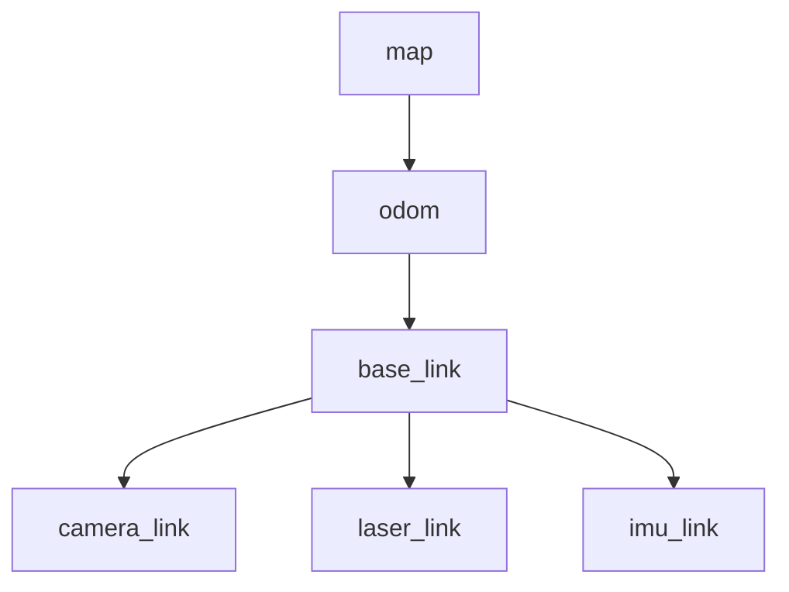
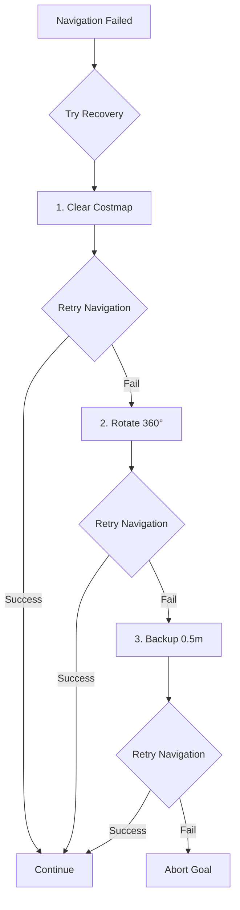
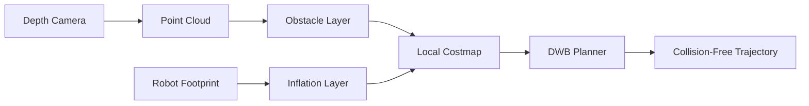

# Chapter 3: Navigation with Nav2

Learn how the ROS 2 Nav2 stack enables autonomous navigation for humanoid robots using SLAM maps, dynamic obstacle avoidance, and behavior trees.

## Introduction: Autonomous Navigation Fundamentals

After building a map with SLAM (Chapter 2), your humanoid robot needs to **autonomously navigate** to goal poses while avoiding obstacles. The **Nav2 (Navigation 2)** stack provides path planning, trajectory control, and recovery behaviors for robust autonomous navigation.

### Why Nav2 for Humanoid Robots?

**Nav2** is the standard ROS 2 navigation framework, supporting differential drive, omnidirectional, and bipedal robots. For humanoid digital twins, Nav2 provides:

- **Global Planning**: Compute collision-free paths from current pose to goal using A* or Dijkstra
- **Local Planning**: Generate kinematically-feasible trajectories with dynamic obstacle avoidance
- **Recovery Behaviors**: Handle stuck situations (rotate in place, backup, clear obstacles)
- **Behavior Trees**: Coordinate complex navigation tasks (waypoint following, docking, exploration)

Unlike simple point-to-point motion, Nav2 handles real-world complexities: dynamic obstacles (people walking), sensor noise, localization drift, and narrow passages.

---

## What is Nav2?

**Nav2 (Navigation 2)** is a collection of ROS 2 packages for autonomous mobile robot navigation. It combines path planning, trajectory control, and recovery behaviors into a modular, behavior-tree-driven architecture.

### Nav2 Architecture

```mermaid
graph TD
    A[Goal Pose] --> B[Behavior Tree]
    B --> C[Global Planner]
    C --> D[Path /plan]
    D --> E[Local Planner]
    F[/map] --> C
    G[/odom] --> E
    H[Sensor Data] --> I[Costmap]
    I --> C
    I --> E
    E --> J[Controller]
    J --> K[/cmd_vel]
    K --> L[Robot Base]
    L --> M[Recovery Behaviors]
    M --> B
```

**Core Components**:

1. **Global Planner**: Computes optimal path on static map (A*, Smac Planner, Theta*)
2. **Local Planner**: Generates collision-free trajectories accounting for dynamics (DWB, TEB, MPPI)
3. **Controller**: Tracks planned trajectory and outputs velocity commands (DWB, RPP, MPPI)
4. **Recovery Behaviors**: Handle failures (rotate, backup, wait, clear costmap)
5. **Behavior Tree**: Coordinate navigation actions (navigate to pose, follow waypoints)
6. **Costmaps**: 2D occupancy grids with inflation for safe navigation (global and local)

### Nav2 vs Traditional Navigation

| Feature | move_base (ROS 1) | Nav2 (ROS 2) ✓ |
|---------|------------------|----------------|
| **Architecture** | Monolithic | **Modular behavior trees** |
| **Planners** | 2 (DWA, TEB) | **6+ (Smac, MPPI, RPP, DWB, TEB, Theta*)** |
| **Recovery** | Fixed sequence | **Configurable behavior tree** |
| **Lifecycle Management** | None | **ROS 2 lifecycle nodes** |
| **Multi-robot** | Difficult | **Native support** |
| **Learning Curve** | Low | **Medium** |

:::tip When to Use Nav2
Use Nav2 when:
1. You need autonomous navigation (not just teleoperation)
2. You have a map from SLAM (e.g., nvblox_ros output)
3. You want dynamic obstacle avoidance
4. You need waypoint following or complex navigation tasks
:::

---

## Installation and Verification

Nav2 is available via apt on ROS 2 Humble. We'll install the full navigation stack and verify it works with a sample robot.

### Prerequisites

- ROS 2 Humble Desktop installed
- Isaac ROS SLAM from Chapter 2 (nvblox_ros or alternative)
- Simulated or physical robot with `/cmd_vel` interface

### Step-by-Step Installation

**Install Nav2 via apt**:

```bash
# Update package index
sudo apt update

# Install Nav2 and dependencies
sudo apt install -y ros-humble-navigation2 ros-humble-nav2-bringup

# Install additional useful packages
sudo apt install -y \
  ros-humble-turtlebot3-gazebo \
  ros-humble-turtlebot3-navigation2 \
  ros-humble-tf-transformations

# Source ROS 2
source /opt/ros/humble/setup.bash

# Verify Nav2 installed
ros2 pkg list | grep nav2
# Expected: nav2_bringup, nav2_bt_navigator, nav2_controller, ...
```

### Verification with TurtleBot3 Simulation

Test Nav2 with the TurtleBot3 sample robot:

```bash
# Set TurtleBot3 model
export TURTLEBOT3_MODEL=waffle

# Terminal 1: Launch Gazebo simulation
ros2 launch turtlebot3_gazebo turtlebot3_world.launch.py

# Terminal 2: Launch SLAM (cartographer)
ros2 launch turtlebot3_navigation2 navigation2.launch.py use_sim_time:=True

# Terminal 3: Launch RViz
rviz2 -d $(ros2 pkg prefix nav2_bringup)/share/nav2_bringup/rviz/nav2_default_view.rviz
```

**Verify Nav2 is Running**:

```bash
# Check Nav2 lifecycle nodes
ros2 lifecycle list
# Expected:
#   /bt_navigator
#   /controller_server
#   /planner_server
#   /recoveries_server
#   /waypoint_follower

# Check all nodes are ACTIVE
ros2 lifecycle get /bt_navigator
# Expected: active [3]
```

**Send a Test Goal**:

In RViz:
1. Click **"2D Nav Goal"** button in toolbar
2. Click and drag on map to set goal pose
3. Verify robot plans path (green line) and moves to goal

### Installation Verification Checklist

- [ ] Nav2 packages installed (`ros2 pkg list | grep nav2`)
- [ ] TurtleBot3 simulation launches without errors
- [ ] Nav2 lifecycle nodes are ACTIVE
- [ ] RViz shows map, robot, and costmaps
- [ ] Sending 2D Nav Goal causes robot to plan and move

---

## Integrating Nav2 with Isaac ROS SLAM

Now let's integrate Nav2 with nvblox_ros (from Chapter 2) for humanoid robot navigation.

### Required Topics and Frames

Nav2 requires specific ROS 2 topics and TF frames:

**Required Topics**:
- `/map` (nav_msgs/OccupancyGrid) - from nvblox_ros
- `/odom` (nav_msgs/Odometry) - from nvblox_ros or wheel odometry
- `/scan` or `/camera/depth/points` - for local costmap obstacle detection
- `/cmd_vel` (geometry_msgs/Twist) - output velocity commands to robot

**Required TF Frames**:



- **map → odom**: Published by SLAM (nvblox_ros)
- **odom → base_link**: Published by odometry source (wheel encoders or visual odometry)
- **base_link → sensor_link**: Published by robot URDF or static transform

### Nav2 + SLAM Launch File

Create a launch file combining nvblox_ros and Nav2:

```python
#!/usr/bin/env python3
"""
Launch Nav2 with nvblox_ros SLAM for humanoid robot.
Integrates GPU-accelerated SLAM with autonomous navigation.
"""

import os
from launch import LaunchDescription
from launch.actions import DeclareLaunchArgument, IncludeLaunchDescription
from launch.launch_description_sources import PythonLaunchDescriptionSource
from launch.substitutions import LaunchConfiguration
from launch_ros.actions import Node
from ament_index_python.packages import get_package_share_directory

def generate_launch_description():
    # Launch arguments
    use_sim_time = LaunchConfiguration('use_sim_time', default='true')
    map_yaml_file = LaunchConfiguration('map', default='')  # Leave empty for SLAM mode
    params_file = LaunchConfiguration('params_file')

    # Get Nav2 bringup directory
    nav2_bringup_dir = get_package_share_directory('nav2_bringup')

    # Launch nvblox_ros for SLAM
    nvblox_launch = IncludeLaunchDescription(
        PythonLaunchDescriptionSource(
            os.path.join(get_package_share_directory('nvblox_ros'), 'launch', 'nvblox.launch.py')
        ),
        launch_arguments={
            'use_sim_time': use_sim_time,
        }.items()
    )

    # Launch Nav2 stack (without AMCL, using SLAM localization)
    nav2_launch = IncludeLaunchDescription(
        PythonLaunchDescriptionSource(
            os.path.join(nav2_bringup_dir, 'launch', 'navigation_launch.py')
        ),
        launch_arguments={
            'use_sim_time': use_sim_time,
            'params_file': params_file,
            'autostart': 'true',
        }.items()
    )

    # RViz with Nav2 + SLAM view
    rviz_config = os.path.join(nav2_bringup_dir, 'rviz', 'nav2_default_view.rviz')
    rviz_node = Node(
        package='rviz2',
        executable='rviz2',
        name='rviz2',
        arguments=['-d', rviz_config],
        parameters=[{'use_sim_time': use_sim_time}],
        output='screen'
    )

    return LaunchDescription([
        DeclareLaunchArgument(
            'use_sim_time',
            default_value='true',
            description='Use simulation (Gazebo/Isaac Sim) clock'
        ),
        DeclareLaunchArgument(
            'params_file',
            default_value=os.path.join(
                get_package_share_directory('nav2_bringup'),
                'params',
                'nav2_params.yaml'
            ),
            description='Full path to Nav2 parameters file'
        ),
        nvblox_launch,
        nav2_launch,
        rviz_node,
    ])
```

**Save as**: `~/isaac_ros_ws/src/nav2_with_slam.launch.py`

### Nav2 Configuration YAML

Create a YAML file with Nav2 parameters optimized for humanoid robots:

```yaml
# nav2_params.yaml
# Nav2 configuration for humanoid robot with nvblox_ros SLAM

bt_navigator:
  ros__parameters:
    use_sim_time: True
    global_frame: map
    robot_base_frame: base_link
    odom_topic: /odom
    bt_loop_duration: 10  # Behavior tree loop rate (ms)
    default_server_timeout: 20  # Action server timeout (s)
    enable_groot_monitoring: True  # Enable BT visualization
    groot_zmq_publisher_port: 1666
    groot_zmq_server_port: 1667

    # Default behavior tree (navigate to pose)
    default_nav_to_pose_bt_xml: ""  # Use default XML
    plugin_lib_names:
      - nav2_compute_path_to_pose_action_bt_node
      - nav2_follow_path_action_bt_node
      - nav2_back_up_action_bt_node
      - nav2_spin_action_bt_node
      - nav2_wait_action_bt_node
      - nav2_clear_costmap_service_bt_node
      - nav2_is_stuck_condition_bt_node
      - nav2_goal_reached_condition_bt_node
      - nav2_distance_controller_bt_node

planner_server:
  ros__parameters:
    use_sim_time: True
    planner_plugins: ["GridBased"]
    GridBased:
      plugin: "nav2_navfn_planner/NavfnPlanner"  # Dijkstra's algorithm
      tolerance: 0.5  # Goal tolerance (meters)
      use_astar: true  # Use A* instead of Dijkstra (faster)
      allow_unknown: true  # Allow planning through unknown space

controller_server:
  ros__parameters:
    use_sim_time: True
    controller_frequency: 20.0  # Control loop rate (Hz)
    min_x_velocity_threshold: 0.001  # Stop threshold (m/s)
    min_y_velocity_threshold: 0.001
    min_theta_velocity_threshold: 0.001
    failure_tolerance: 0.3  # Tolerance before switching to recovery

    progress_checker_plugin: "progress_checker"
    goal_checker_plugins: ["goal_checker"]
    controller_plugins: ["FollowPath"]

    # Progress checker (detects stuck robot)
    progress_checker:
      plugin: "nav2_controller::SimpleProgressChecker"
      required_movement_radius: 0.5  # Must move 0.5m in required_movement_time
      movement_time_allowance: 10.0  # Seconds

    # Goal checker (when to consider goal reached)
    goal_checker:
      plugin: "nav2_controller::SimpleGoalChecker"
      xy_goal_tolerance: 0.1  # Position tolerance (10cm)
      yaw_goal_tolerance: 0.15  # Orientation tolerance (radians, ~8.6 degrees)
      stateful: True

    # DWB controller (Dynamic Window Approach - see next section)
    FollowPath:
      plugin: "dwb_core::DWBLocalPlanner"
      # See DWB configuration section below

recoveries_server:
  ros__parameters:
    use_sim_time: True
    costmap_topic: local_costmap/costmap_raw
    footprint_topic: local_costmap/published_footprint
    cycle_frequency: 10.0  # Recovery behavior rate (Hz)
    recovery_plugins: ["spin", "backup", "wait"]

    # Rotate in place recovery
    spin:
      plugin: "nav2_recoveries/Spin"
      simulate_ahead_time: 2.0  # Seconds to simulate

    # Backup recovery
    backup:
      plugin: "nav2_recoveries/BackUp"
      simulate_ahead_time: 2.0

    # Wait recovery
    wait:
      plugin: "nav2_recoveries/Wait"

local_costmap:
  local_costmap:
    ros__parameters:
      use_sim_time: True
      global_frame: odom
      robot_base_frame: base_link
      update_frequency: 5.0  # Costmap update rate (Hz)
      publish_frequency: 2.0  # Publish rate (Hz)
      width: 5  # Costmap width (meters)
      height: 5  # Costmap height (meters)
      resolution: 0.05  # Cell size (5cm)
      robot_radius: 0.25  # Humanoid footprint radius (meters)
      plugins: ["obstacle_layer", "inflation_layer"]

      # Obstacle layer (from depth camera or laser scan)
      obstacle_layer:
        plugin: "nav2_costmap_2d::ObstacleLayer"
        enabled: True
        observation_sources: depth_camera
        depth_camera:
          topic: /camera/depth/points  # From Isaac Sim or RealSense
          max_obstacle_height: 2.0  # Humanoid height
          min_obstacle_height: 0.0
          obstacle_max_range: 4.0  # Consider obstacles up to 4m
          obstacle_min_range: 0.0
          raytrace_max_range: 5.0  # Clear space up to 5m
          raytrace_min_range: 0.0
          clearing: True
          marking: True

      # Inflation layer (safety margin around obstacles)
      inflation_layer:
        plugin: "nav2_costmap_2d::InflationLayer"
        enabled: True
        cost_scaling_factor: 3.0  # Exponential cost decay
        inflation_radius: 0.5  # Inflate obstacles by 0.5m (humanoid safety)

global_costmap:
  global_costmap:
    ros__parameters:
      use_sim_time: True
      global_frame: map
      robot_base_frame: base_link
      update_frequency: 1.0  # Update every second
      publish_frequency: 1.0
      width: 50  # Large map (50m x 50m)
      height: 50
      resolution: 0.05  # 5cm cells (match nvblox_ros)
      robot_radius: 0.25
      plugins: ["static_layer", "inflation_layer"]

      # Static layer (from SLAM map)
      static_layer:
        plugin: "nav2_costmap_2d::StaticLayer"
        enabled: True
        map_topic: /map  # From nvblox_ros

      inflation_layer:
        plugin: "nav2_costmap_2d::InflationLayer"
        enabled: True
        cost_scaling_factor: 3.0
        inflation_radius: 0.5
```

**Save as**: `~/isaac_ros_ws/src/nav2_params.yaml`

### Coordinate Frames and TF Tree

Nav2 requires a specific TF tree structure:

```
map (from nvblox_ros)
 └─ odom (from nvblox_ros or wheel odometry)
     └─ base_link (robot base)
         ├─ camera_link (camera sensor)
         ├─ laser_link (if using LiDAR)
         └─ imu_link (IMU sensor)
```

**Verify TF Tree**:

```bash
# Install tf2_tools
sudo apt install ros-humble-tf2-tools

# View TF tree
ros2 run tf2_tools view_frames

# Open generated frames.pdf to see tree structure
evince frames.pdf

# Expected:
# map -> odom -> base_link -> camera_link
#                          \-> imu_link
```

**Common TF Issues**:

| Issue | Symptom | Solution |
|-------|---------|----------|
| **Missing map→odom** | Nav2 error: "Timed out waiting for transform" | Verify nvblox_ros is running and publishing /map |
| **Missing odom→base_link** | No odometry in RViz | Publish from robot base controller or use visual odometry |
| **Inverted frame** | Robot appears upside down | Check URDF joint origins and axis directions |
| **Static frames** | Robot doesn't move in RViz | Verify /odom topic is publishing and updating |

:::warning SLAM Mode vs Localization Mode
- **SLAM Mode**: nvblox_ros publishes map→odom (builds map while navigating)
- **Localization Mode**: AMCL publishes map→odom (uses pre-built map)

For this tutorial, we use **SLAM mode** to simultaneously map and navigate. For production with a known map, switch to AMCL localization.
:::

---

## Configuring DWB Planner for Humanoids

The **DWB (Dynamic Window Approach)** planner generates kinematically-feasible trajectories for local navigation. We'll configure it for bipedal humanoid constraints.

### DWB vs Other Planners

| Planner | Algorithm | Best For | Humanoid Suitability |
|---------|-----------|----------|---------------------|
| **DWB** | Dynamic Window | General-purpose, good defaults | **Excellent (recommended)** |
| TEB | Timed Elastic Band | Time-optimal paths, narrow passages | Good (requires tuning) |
| MPPI | Model Predictive Path Integral | Complex dynamics, GPU-accelerated | Experimental (cutting-edge) |
| RPP | Regulated Pure Pursuit | Simple path following | Poor (wheeled robots only) |

**DWB Advantages for Humanoids**:
1. Respects velocity and acceleration limits (bipedal stability)
2. Forward simulation of trajectories (predicts falls)
3. Configurable footprint (humanoid shape)
4. Proven reliability in production systems

### Wheeled Robot vs Humanoid Configuration

Humanoid robots require different parameters than wheeled robots:

| Parameter | Wheeled Robot | Bipedal Humanoid | Reason |
|-----------|--------------|------------------|--------|
| **max_vel_x** | 1.0 m/s | **0.5 m/s** | Humanoid gait slower, balance limited |
| **max_vel_theta** | 2.0 rad/s | **0.3 rad/s** | Bipedal turning requires weight shift |
| **acc_lim_x** | 2.5 m/s² | **0.5 m/s²** | Humanoid acceleration limited by ZMP |
| **acc_lim_theta** | 3.2 rad/s² | **0.8 rad/s²** | Angular acceleration affects balance |
| **footprint** | Circular | **Rectangular 0.5x0.3m** | Human-like body shape |
| **sim_time** | 1.5 s | **2.0 s** | Humanoid needs longer look-ahead |

### DWB Humanoid Configuration

Add this to `nav2_params.yaml` under `controller_server > FollowPath`:

```yaml
FollowPath:
  plugin: "dwb_core::DWBLocalPlanner"
  debug_trajectory_details: True
  min_vel_x: 0.0  # Can stop completely
  min_vel_y: 0.0
  max_vel_x: 0.5  # Maximum forward velocity (m/s) - humanoid walking speed
  max_vel_y: 0.0  # No lateral movement (non-holonomic humanoid)
  max_vel_theta: 0.3  # Maximum angular velocity (rad/s) - ~17 deg/s

  min_speed_xy: 0.0  # Minimum translational speed
  max_speed_xy: 0.5  # Maximum speed in any direction
  min_speed_theta: 0.0

  # Acceleration limits (m/s² and rad/s²)
  acc_lim_x: 0.5  # Forward acceleration (humanoid gait constraint)
  acc_lim_y: 0.0
  acc_lim_theta: 0.8  # Angular acceleration (balance constraint)
  decel_lim_x: -0.5  # Deceleration (negative = braking)
  decel_lim_y: 0.0
  decel_lim_theta: -0.8

  # Trajectory simulation
  vx_samples: 20  # Forward velocity samples (higher = smoother, slower)
  vy_samples: 0  # Lateral samples (0 for non-holonomic)
  vtheta_samples: 20  # Angular velocity samples
  sim_time: 2.0  # Trajectory simulation time (seconds) - longer for humanoid stability
  discretize_by_time: false  # Discretize by linear distance instead
  time_granularity: 0.5  # Time step for simulation (seconds)
  linear_granularity: 0.05  # Linear distance between trajectory points (5cm)
  angular_granularity: 0.025  # Angular distance (radians, ~1.4 degrees)

  # Safety
  transform_tolerance: 0.2  # TF lookup tolerance (seconds)
  trans_stopped_velocity: 0.05  # Velocity below which robot is considered stopped
  short_circuit_trajectory_evaluation: True  # Stop evaluating if trajectory in collision

  # Trajectory scoring critics (weights determine importance)
  critics: [
    "RotateToGoal",      # Rotate to face goal when close
    "Oscillation",       # Penalize back-and-forth motion
    "BaseObstacle",      # Avoid obstacles
    "GoalAlign",         # Align with goal orientation
    "PathAlign",         # Follow global path
    "PathDist",          # Progress toward goal
    "GoalDist"           # Distance to goal
  ]

  # Critic weights (higher = more important)
  BaseObstacle.scale: 0.02  # Obstacle avoidance (critical!)
  PathAlign.scale: 32.0  # Follow global path closely
  PathAlign.forward_point_distance: 0.3  # Look-ahead distance (30cm)
  GoalAlign.scale: 24.0  # Align orientation with goal
  GoalAlign.forward_point_distance: 0.3
  PathDist.scale: 32.0  # Stay close to global path
  GoalDist.scale: 24.0  # Progress toward goal
  RotateToGoal.scale: 32.0  # Rotate to goal when near
  RotateToGoal.slowing_factor: 5.0
  RotateToGoal.lookahead_time: -1.0  # Use default

  # Oscillation detection (prevents jittering)
  Oscillation.scale: 1.0
  Oscillation.oscillation_reset_dist: 0.05  # Reset if robot moves 5cm
  Oscillation.oscillation_reset_angle: 0.2  # Reset if rotates 0.2 rad (~11 deg)
  Oscillation.oscillation_reset_time: -1.0  # Disable time-based reset

  # Footprint model (humanoid body shape)
  # Option 1: Circular footprint (simple)
  # robot_radius: 0.25  # 25cm radius

  # Option 2: Rectangular footprint (more accurate for humanoid)
  footprint: "[[0.25, 0.15], [0.25, -0.15], [-0.25, -0.15], [-0.25, 0.15]]"
  # Footprint corners (x, y) in base_link frame:
  # Front-right: (0.25, 0.15)
  # Front-left: (0.25, -0.15)
  # Back-left: (-0.25, -0.15)
  # Back-right: (-0.25, 0.15)
  # Result: 0.5m long (front-back), 0.3m wide (left-right)
```

**Save to**: `~/isaac_ros_ws/src/nav2_params.yaml` (merge with earlier config)

### Critical Parameters Explained

**1. max_vel_x: 0.5 m/s**
- Humanoid walking speed is typically 0.3-0.8 m/s (vs 1.0-2.0 m/s for wheeled robots)
- Too fast → loss of balance, falls
- Too slow → inefficient navigation

**2. max_vel_theta: 0.3 rad/s (~17 deg/s)**
- Humanoid turning requires weight shift between feet
- Faster turning → higher risk of tipping
- Compare: wheeled robot can turn at 2.0 rad/s (~115 deg/s)

**3. acc_lim_x: 0.5 m/s²**
- Humanoid acceleration limited by Zero Moment Point (ZMP) stability
- Too high → robot falls forward
- Rule of thumb: 0.3-0.8 m/s² for bipedal robots

**4. sim_time: 2.0 s**
- Longer simulation time allows humanoid to "see" obstacles earlier
- Wheeled robots use 1.0-1.5s (faster reaction)
- Humanoids need 2.0-3.0s (slower gait, need more look-ahead)

**5. Footprint: 0.5m x 0.3m**
- Human-like proportions (shoulder width ~0.3m, front-to-back ~0.5m)
- Must include arms if extended
- Conservative footprint → safer but may reject valid paths in narrow spaces

### Parameter Tuning Guide for Different Humanoids

| Robot Type | Height | max_vel_x | max_vel_theta | acc_lim_x | Footprint |
|------------|--------|-----------|---------------|-----------|-----------|
| **Small Humanoid** (NAO, 0.6m) | 0.6m | 0.3 m/s | 0.4 rad/s | 0.4 m/s² | 0.35 x 0.25 m |
| **Medium Humanoid** (Pepper, 1.2m) | 1.2m | 0.5 m/s | 0.3 rad/s | 0.5 m/s² | 0.5 x 0.3 m |
| **Large Humanoid** (Atlas, 1.8m) | 1.8m | 0.8 m/s | 0.2 rad/s | 0.6 m/s² | 0.6 x 0.4 m |
| **Wheeled Robot** (TurtleBot3) | 0.2m | 1.0 m/s | 2.0 rad/s | 2.5 m/s² | 0.2 radius |

---

## Recovery Behaviors

**Recovery behaviors** handle situations where the robot gets stuck, oscillates, or fails to make progress toward the goal.

### Trigger Conditions

Nav2 executes recovery behaviors when:

1. **Local Minimum**: Robot oscillates without making progress (detected by `progress_checker`)
2. **Stuck**: Robot cannot move (no valid trajectory found for 5+ seconds)
3. **Path Blocked**: Global path blocked by new obstacle

### Default Recovery Sequence

The behavior tree executes recoveries in this order:



### Recovery Behavior Configuration

```yaml
# recovery_behaviors.yaml
# Add to nav2_params.yaml under recoveries_server

recoveries_server:
  ros__parameters:
    use_sim_time: True
    costmap_topic: local_costmap/costmap_raw
    footprint_topic: local_costmap/published_footprint
    cycle_frequency: 10.0  # Hz
    recovery_plugins: ["spin", "backup", "wait", "clear_costmap_global", "clear_costmap_local"]

    # Spin recovery (rotate in place)
    spin:
      plugin: "nav2_recoveries/Spin"
      simulate_ahead_time: 2.0  # Simulate 2s ahead for collision checking
      max_rotational_vel: 0.3  # Match max_vel_theta (rad/s)
      min_rotational_vel: 0.1  # Minimum rotation speed
      rotational_acc_lim: 0.8  # Match acc_lim_theta (rad/s²)

    # Backup recovery (move backward)
    backup:
      plugin: "nav2_recoveries/BackUp"
      simulate_ahead_time: 2.0
      backup_dist: 0.5  # Backup distance (meters)
      backup_speed: 0.15  # Backup speed (m/s) - slower than forward
      time_allowance: 10.0  # Maximum time to execute (seconds)

    # Wait recovery (pause and replan)
    wait:
      plugin: "nav2_recoveries/Wait"
      wait_duration: 5.0  # Wait 5 seconds for dynamic obstacles to move

    # Clear global costmap (remove old obstacle markings)
    clear_costmap_global:
      plugin: "nav2_recoveries/ClearEntireCostmap"
      reset_distance: 3.0  # Clear obstacles beyond 3m from robot

    # Clear local costmap
    clear_costmap_local:
      plugin: "nav2_recoveries/ClearEntireCostmap"
      reset_distance: 1.5  # Clear obstacles beyond 1.5m
```

**Trigger Example**:

```bash
# Monitor recovery behaviors
ros2 topic echo /recoveries_server/transition_event

# When stuck, you'll see:
# transition:
#   label: "spin"
#   start_state: "inactive"
#   goal_state: "active"
# Interpretation: Robot started spin recovery
```

:::tip Recovery Behavior Best Practices
1. **Conservative speeds**: Use 50-70% of max velocities during recovery
2. **Short backup distance**: 0.3-0.5m is enough to escape local minima
3. **Wait before aborting**: Give dynamic obstacles 5-10s to move
4. **Log recovery events**: Monitor `/recoveries_server/transition_event` for debugging
:::

---

## Sending Navigation Goals

There are three ways to send navigation goals to Nav2: RViz GUI, command-line, and Python API.

### Method 1: RViz 2D Nav Goal Tool

**Step-by-Step**:

1. Launch Nav2 and RViz:
   ```bash
   ros2 launch nav2_with_slam.launch.py
   ```

2. In RViz, click **"2D Nav Goal"** button in toolbar

3. Click and drag on map:
   - **Click location**: Goal position (x, y)
   - **Drag direction**: Goal orientation (yaw angle)

4. Observe:
   - **Green line**: Global path (from planner_server)
   - **Yellow line**: Local trajectory (from controller_server)
   - **Robot motion**: Follows yellow trajectory to goal

**Goal Status**: Watch bottom-left corner of RViz for status messages:
- "Goal accepted"
- "Following path..."
- "Goal reached!"

### Method 2: Command-Line (ros2 topic pub)

Send goal via command line for testing:

```bash
# Send navigation goal to (x=2.0, y=1.0, yaw=0.0)
ros2 topic pub --once /goal_pose geometry_msgs/PoseStamped "{
  header: {frame_id: 'map'},
  pose: {
    position: {x: 2.0, y: 1.0, z: 0.0},
    orientation: {x: 0.0, y: 0.0, z: 0.0, w: 1.0}
  }
}"

# Monitor goal status
ros2 action send_goal /navigate_to_pose nav2_msgs/action/NavigateToPose "{
  pose: {
    header: {frame_id: 'map'},
    pose: {
      position: {x: 2.0, y: 1.0, z: 0.0},
      orientation: {x: 0.0, y: 0.0, z: 0.0, w: 1.0}
    }
  }
}" --feedback

# Expected output:
# Sending goal...
# Feedback: {current_pose: {...}, distance_remaining: 1.5}
# Goal succeeded!
```

### Method 3: Python Waypoint Navigator

Create a Python script to send multiple waypoints sequentially:

```python
#!/usr/bin/env python3
"""
Waypoint navigator: Send 5 consecutive navigation goals to Nav2.
Demonstrates autonomous navigation with goal status feedback.
"""

import rclpy
from rclpy.node import Node
from rclpy.action import ActionClient
from nav2_msgs.action import NavigateToPose
from geometry_msgs.msg import PoseStamped
import math

class WaypointNavigator(Node):
    def __init__(self):
        super().__init__('waypoint_navigator')

        # Create action client for NavigateToPose
        self._action_client = ActionClient(self, NavigateToPose, 'navigate_to_pose')

        # Define waypoints (x, y, yaw in map frame)
        self.waypoints = [
            (2.0, 1.0, 0.0),      # Waypoint 1: 2m forward, 1m right, facing 0°
            (2.0, -1.0, -1.57),   # Waypoint 2: 2m forward, 1m left, facing -90° (right)
            (0.0, -1.0, 3.14),    # Waypoint 3: origin, 1m left, facing 180° (backward)
            (0.0, 1.0, 1.57),     # Waypoint 4: origin, 1m right, facing 90° (left)
            (0.0, 0.0, 0.0),      # Waypoint 5: return to origin, facing 0°
        ]

        self.current_waypoint = 0
        self.get_logger().info('Waypoint Navigator initialized with 5 waypoints')

    def send_goal(self, x, y, yaw):
        """Send navigation goal to Nav2."""
        self.get_logger().info(f'Sending goal {self.current_waypoint + 1}/5: x={x}, y={y}, yaw={yaw:.2f}')

        # Wait for action server
        self._action_client.wait_for_server()

        # Create goal message
        goal_msg = NavigateToPose.Goal()
        goal_msg.pose.header.frame_id = 'map'
        goal_msg.pose.header.stamp = self.get_clock().now().to_msg()

        # Set position
        goal_msg.pose.pose.position.x = x
        goal_msg.pose.pose.position.y = y
        goal_msg.pose.pose.position.z = 0.0

        # Set orientation (yaw to quaternion)
        goal_msg.pose.pose.orientation.x = 0.0
        goal_msg.pose.pose.orientation.y = 0.0
        goal_msg.pose.pose.orientation.z = math.sin(yaw / 2.0)
        goal_msg.pose.pose.orientation.w = math.cos(yaw / 2.0)

        # Send goal with callbacks
        self._send_goal_future = self._action_client.send_goal_async(
            goal_msg,
            feedback_callback=self.feedback_callback
        )
        self._send_goal_future.add_done_callback(self.goal_response_callback)

    def goal_response_callback(self, future):
        """Handle goal acceptance/rejection."""
        goal_handle = future.result()

        if not goal_handle.accepted:
            self.get_logger().error('Goal rejected by Nav2!')
            return

        self.get_logger().info('Goal accepted, waiting for result...')
        self._get_result_future = goal_handle.get_result_async()
        self._get_result_future.add_done_callback(self.get_result_callback)

    def feedback_callback(self, feedback_msg):
        """Handle navigation feedback (distance remaining)."""
        feedback = feedback_msg.feedback
        self.get_logger().info(
            f'Distance remaining: {feedback.distance_remaining:.2f}m',
            throttle_duration_sec=2.0  # Log every 2 seconds
        )

    def get_result_callback(self, future):
        """Handle navigation result (success/failure)."""
        result = future.result().result
        status = future.result().status

        # Status codes: SUCCEEDED=4, ABORTED=6, CANCELED=5
        if status == 4:
            self.get_logger().info(f'Waypoint {self.current_waypoint + 1}/5 reached successfully!')
            self.current_waypoint += 1

            # Send next waypoint or finish
            if self.current_waypoint < len(self.waypoints):
                x, y, yaw = self.waypoints[self.current_waypoint]
                self.send_goal(x, y, yaw)
            else:
                self.get_logger().info('All waypoints reached! Mission complete.')
                rclpy.shutdown()
        else:
            self.get_logger().error(f'Navigation failed with status {status}. Aborting mission.')
            rclpy.shutdown()

    def start(self):
        """Start waypoint navigation."""
        x, y, yaw = self.waypoints[self.current_waypoint]
        self.send_goal(x, y, yaw)


def main(args=None):
    rclpy.init(args=args)
    navigator = WaypointNavigator()

    # Send first waypoint
    navigator.start()

    # Spin node
    rclpy.spin(navigator)


if __name__ == '__main__':
    main()
```

**Save as**: `~/isaac_ros_ws/src/waypoint_navigator.py`

**Run the script**:

```bash
# Make executable
chmod +x waypoint_navigator.py

# Run waypoint navigator
ros2 run <your_package> waypoint_navigator.py

# Expected output:
# [INFO] Sending goal 1/5: x=2.0, y=1.0, yaw=0.00
# [INFO] Goal accepted, waiting for result...
# [INFO] Distance remaining: 2.83m
# [INFO] Distance remaining: 1.45m
# [INFO] Waypoint 1/5 reached successfully!
# [INFO] Sending goal 2/5: x=2.0, y=-1.0, yaw=-1.57
# ...
# [INFO] All waypoints reached! Mission complete.
```

### Goal Status Feedback

Nav2 uses ROS 2 actions for goal management. Status values:

| Status Code | Name | Meaning |
|-------------|------|---------|
| **0** | UNKNOWN | Goal not yet processed |
| **1** | ACCEPTED | Goal accepted by Nav2 |
| **2** | EXECUTING | Robot is navigating |
| **3** | CANCELING | Goal being canceled |
| **4** | SUCCEEDED ✓ | Goal reached successfully |
| **5** | CANCELED | Goal canceled by user |
| **6** | ABORTED | Navigation failed (obstacle, timeout, no path) |

**Monitor status**:

```bash
ros2 action list
# /navigate_to_pose

ros2 action info /navigate_to_pose
# Action: nav2_msgs/action/NavigateToPose
# Action clients: 1
# Action servers: 1
```

---

## Dynamic Obstacle Avoidance

Nav2's **local costmap** dynamically updates obstacles from sensors (depth camera, LiDAR) and re-plans trajectories in real-time.

### Local Costmap Updates

**Update Pipeline**:



**Key Concepts**:

1. **Obstacle Layer**: Marks cells as occupied (100) or free (0) based on sensor data
2. **Inflation Layer**: Adds safety margin around obstacles (cost decays exponentially)
3. **Costmap Values**:
   - 0 = Free space (no obstacle)
   - 1-99 = Inflated cost (close to obstacle)
   - 100 = Occupied (obstacle detected)
   - 255 = Lethal obstacle (collision)

**Costmap Update Rate**:

```yaml
local_costmap:
  local_costmap:
    ros__parameters:
      update_frequency: 5.0  # Update costmap at 5 Hz
      publish_frequency: 2.0  # Publish for visualization at 2 Hz
```

- Higher `update_frequency` → faster reaction to dynamic obstacles, higher CPU usage
- Typical values: 3-10 Hz for local costmap, 1-2 Hz for global costmap

### Trajectory Re-planning

When a new obstacle appears:

1. **Obstacle Layer** marks cells as occupied (cost = 100)
2. **Inflation Layer** inflates obstacle by `inflation_radius` (0.5m for humanoid)
3. **DWB Planner** re-scores trajectories with new costmap
4. **Controller** selects new best trajectory (may deviate from global path)

**Re-planning Latency**:
- Costmap update: 5-20ms (5 Hz = 200ms period)
- Trajectory scoring: 10-50ms (20 candidates)
- Total latency: 15-70ms (acceptable for 0.5 m/s humanoid)

### RViz Visualization Guide

**Visualize Dynamic Obstacle Avoidance**:

1. Launch Nav2 with RViz
2. Add displays:
   - **Map** (topic: `/global_costmap/costmap`) - static obstacles
   - **Map** (topic: `/local_costmap/costmap`) - dynamic obstacles
   - **Path** (topic: `/plan`) - global path (green)
   - **Path** (topic: `/local_plan`) - local trajectory (yellow)
   - **PointCloud2** (topic: `/camera/depth/points`) - depth camera data

3. Send navigation goal (2D Nav Goal)

4. Add obstacle during navigation:
   - In Isaac Sim or Gazebo: spawn cube in robot's path
   - Observe:
     - **Red cells** appear in local costmap (obstacle detected)
     - **Yellow trajectory** curves around obstacle
     - **Robot** smoothly avoids obstacle without stopping

**Color Coding**:
- **Green path**: Global planner path (A* on static map)
- **Yellow path**: Local planner trajectory (DWB with dynamic obstacles)
- **Gray cells**: Free space (cost = 0)
- **Red cells**: Obstacles (cost = 100)
- **Orange cells**: Inflated obstacles (cost = 50-99)

:::tip Debugging Obstacle Avoidance
If robot doesn't avoid obstacles:
1. Check `/camera/depth/points` publishes data: `ros2 topic hz /camera/depth/points`
2. Verify obstacle appears in local costmap: View `/local_costmap/costmap` in RViz
3. Check inflation radius: Too small → robot gets too close, too large → robot can't pass
4. Increase `BaseObstacle.scale` in DWB config (make obstacle avoidance more important)
:::

---

## Hands-On Exercise: Autonomous Humanoid Navigation

Apply everything you've learned by implementing a complete autonomous navigation system.

### Exercise Steps

1. **Launch Isaac Sim with Humanoid**:
   - Load humanoid robot USD
   - Add obstacles (3-5 cubes) in environment
   - Enable ROS 2 bridge for depth camera and odometry

2. **Launch nvblox_ros SLAM**:
   - Start nvblox_ros with `use_sim_time:=true`
   - Verify /map and /odom topics publish
   - Build initial map by moving robot (teleoperation)

3. **Launch Nav2**:
   - Start Nav2 with `nav2_params.yaml` (humanoid configuration)
   - Verify all lifecycle nodes are ACTIVE
   - Check TF tree: `ros2 run tf2_tools view_frames`

4. **Send Single Navigation Goal**:
   - Use RViz 2D Nav Goal tool
   - Send goal 3-5 meters away
   - Observe robot plans path and navigates

5. **Navigate 5 Waypoints**:
   - Run `waypoint_navigator.py` script
   - Verify robot reaches all 5 waypoints
   - Measure waypoint success rate (target: 95%+)

### Verification Checklist

- [ ] Isaac Sim depth camera publishes at 30 Hz
- [ ] nvblox_ros publishes /map at 5+ Hz
- [ ] Nav2 lifecycle nodes all ACTIVE
- [ ] TF tree complete: map → odom → base_link
- [ ] Single goal navigation succeeds (reaches goal within 10cm)
- [ ] 5-waypoint mission completes with 95%+ success rate
- [ ] Robot avoids dynamic obstacles (spawned during navigation)

### Expected Performance

**Navigation Metrics**:
- Goal tolerance: 10cm position, 8.6° orientation (as configured)
- Path planning time: 50-200ms (global planner)
- Trajectory update rate: 20 Hz (controller_frequency)
- Obstacle avoidance latency: 15-70ms (local costmap update)

**Success Criteria**:
- Waypoint success rate: ≥95% (19/20 goals reached)
- Goal accuracy: ≤10cm position error
- No collisions with static or dynamic obstacles
- Recovery behaviors execute less than 10% of time

---

## Troubleshooting Nav2

Common Nav2 issues and solutions:

| Issue | Symptom | Solution |
|-------|---------|----------|
| **No path found** | Error: "Failed to create plan" | Check global costmap has map data, increase planner tolerance, verify goal is reachable |
| **Robot oscillates** | Robot moves back and forth | Increase `Oscillation.oscillation_reset_dist`, reduce `PathAlign.scale` |
| **Recovery loop** | Robot stuck in spin/backup loop | Reduce recovery frequency, increase `progress_checker.required_movement_radius` |
| **Costmap not updating** | Static obstacles in costmap | Check sensor topic publishes, verify `obstacle_layer` enabled, increase `update_frequency` |
| **TF timeout** | Error: "Timed out waiting for transform" | Verify TF tree complete (`view_frames`), check SLAM publishes map→odom |
| **Goal rejected** | Error: "Goal pose is in collision" | Goal inside obstacle, increase inflation_radius, send goal in free space |

**Debug Commands**:

```bash
# Check Nav2 node statuses
ros2 lifecycle list

# Manually activate node if inactive
ros2 lifecycle set /controller_server configure
ros2 lifecycle set /controller_server activate

# Monitor costmap updates
ros2 topic hz /local_costmap/costmap_updates
# Expected: 5 Hz (matches update_frequency)

# Inspect costmap data
ros2 topic echo /local_costmap/costmap --once
# Check: width, height, resolution, data (occupancy values)

# View DWB trajectory scores (debugging)
ros2 topic echo /local_plan --once
```

---

## Advanced Topics (Out of Scope)

These advanced Nav2 features are beyond this tutorial but worth mentioning:

### Behavior Trees

Nav2 uses **behavior trees** to coordinate navigation actions. The default tree executes:

```
NavigateToPose
├── ComputePathToPose (global planner)
├── FollowPath (local planner)
└── RecoveryNode
    ├── ClearCostmap
    ├── Spin
    └── BackUp
```

**Custom Behavior Trees**: Create XML files to define complex missions (patrol, docking, exploration).

### MPPI Planner (GPU-Accelerated)

**Model Predictive Path Integral (MPPI)** planner uses GPU to evaluate 10,000+ trajectories in parallel:
- 10-50x faster than DWB on RTX GPUs
- Handles complex dynamics (humanoid balance, non-holonomic constraints)
- Requires CUDA, only available in Nav2 Humble+

**Enable MPPI**:
```yaml
controller_server:
  ros__parameters:
    controller_plugins: ["FollowPath"]
    FollowPath:
      plugin: "nav2_mppi_controller::MPPIController"
      # MPPI parameters (see Nav2 docs)
```

### TEB Planner (Time-Optimal)

**Timed Elastic Band (TEB)** planner optimizes for time-optimal paths:
- Better for narrow passages and complex environments
- Requires careful tuning (20+ parameters)
- Computationally expensive (5-10 Hz update rate)

---

## External Resources

Continue learning with these official Nav2 resources:

- **[Nav2 Documentation](https://navigation.ros.org/)**: Complete Nav2 reference and tutorials
- **[DWB Planner Tuning Guide](https://navigation.ros.org/tuning/index.html)**: Parameter optimization for your robot
- **[Recovery Behavior Guide](https://navigation.ros.org/behavior_trees/index.html)**: Custom behavior tree creation
- **[Nav2 GitHub](https://github.com/ros-planning/navigation2)**: Source code, issues, and examples

:::tip Multi-Robot Navigation
Nav2 supports multiple robots in the same environment by namespacing topics:
```bash
# Robot 1
ros2 launch nav2_bringup bringup_launch.py namespace:=robot1

# Robot 2
ros2 launch nav2_bringup bringup_launch.py namespace:=robot2
```
Each robot gets independent planners and costmaps.
:::

---

## Summary

In this chapter, you learned:

- ✅ **Nav2 architecture**: Global planner, local planner, controller, recovery behaviors, behavior trees
- ✅ **Installation**: apt-based, verify with TurtleBot3 simulation
- ✅ **SLAM integration**: Connect nvblox_ros /map and /odom to Nav2, verify TF tree
- ✅ **DWB configuration**: Humanoid-specific parameters (max_vel_x: 0.5 m/s, footprint: 0.5x0.3m)
- ✅ **Recovery behaviors**: Spin, backup, wait, clear costmap (handle stuck situations)
- ✅ **Sending goals**: RViz GUI, command-line, Python API (waypoint navigator)
- ✅ **Dynamic obstacles**: Local costmap updates, trajectory re-planning, RViz visualization

**Key Takeaways**:
1. Nav2 enables autonomous navigation with path planning and obstacle avoidance
2. Humanoid robots require slower velocities (0.5 m/s) and longer look-ahead (2s sim_time)
3. Recovery behaviors handle stuck situations (rotate, backup, clear costmap)
4. Dynamic obstacles are avoided via real-time local costmap updates (5-10 Hz)

Ready for full-system integration? You now have all the tools to build a complete humanoid robot digital twin!

:::success Module 3 Complete!
You've mastered the AI-Robot Brain (NVIDIA Isaac) module:
- **Chapter 1**: Synthetic data generation in Isaac Sim
- **Chapter 2**: GPU-accelerated perception with Isaac ROS
- **Chapter 3**: Autonomous navigation with Nav2

**What's Next**: Module 4 will integrate all three modules (physics, environments, AI perception) into a complete digital twin system with real-world deployment.
:::

---

## Final Project Challenge

**Challenge**: Implement a complete humanoid robot waiter system:

1. **Environment**: Restaurant scene with tables, chairs, dynamic obstacles (people)
2. **Perception**: Detect tables with YOLOv8 (trained on Isaac Sim synthetic data)
3. **Navigation**: Navigate to 5 table waypoints, avoid people
4. **Recovery**: Handle blocked paths (people standing in aisle)

**Success Criteria**:
- Detect all tables with 80%+ mAP
- Navigate to all 5 tables with 95%+ success rate
- Avoid all dynamic obstacles (0 collisions)
- Complete mission in less than 5 minutes (simulated time)

**Bonus**: Publish delivery status to ROS 2 topic, visualize in RViz with custom markers.

Good luck! 🚀
