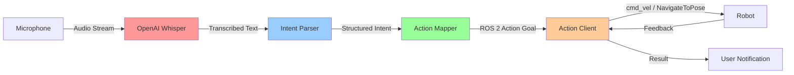
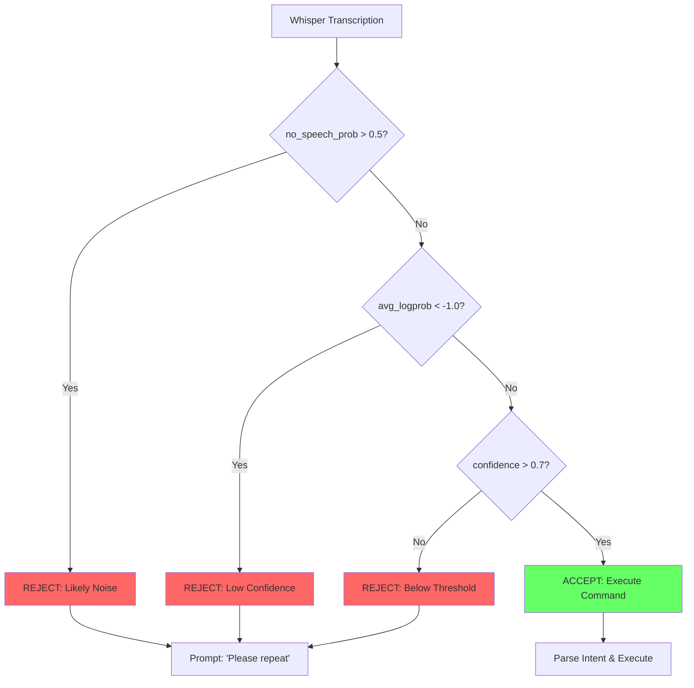

# Chapter 1: Voice-to-Action with OpenAI Whisper

## Introduction

Welcome to the Voice-to-Action chapter, your gateway to building voice-controlled humanoid robots. This chapter introduces the **Vision-Language-Action (VLA) paradigm**, where natural language voice commands are converted into executable robot actions through speech recognition, intent parsing, and ROS 2 action mapping.

In this chapter, you'll learn how to:
- Use OpenAI Whisper to transcribe voice commands with 95%+ accuracy
- Parse natural language to extract structured action intent
- Map parsed intents to ROS 2 action primitives
- Handle ambiguous commands and transcription errors with confidence filtering

### The Voice-to-Action Paradigm

Traditional robot interfaces require explicit programming or button-based control panels. Voice-to-Action systems transform this interaction by enabling natural language communication:

1. **Voice Input**: User speaks a command like "Move forward two meters"
2. **Speech-to-Text**: OpenAI Whisper transcribes audio to text
3. **Intent Parsing**: Extract action type (move_forward) and parameters (distance: 2.0)
4. **Action Mapping**: Convert intent to ROS 2 action goal (geometry_msgs/Twist)
5. **Execution**: Robot performs the action and reports completion

This pipeline enables intuitive human-robot interaction, reducing the barrier to entry for non-technical users and enabling real-world deployment in homes, hospitals, and warehouses.

### VLA Foundations

The VLA paradigm extends beyond simple voice commands by integrating:
- **Vision**: Object detection and scene understanding (covered in Module 3)
- **Language**: Natural language processing and large language models for cognitive planning
- **Action**: Physical robot control through ROS 2 action primitives

This chapter focuses on the **Language-to-Action** bridge, laying the foundation for Module 4's later chapters on LLM-based cognitive planning and autonomous task execution.

### Chapter Scope

By the end of this chapter, you will have built a complete voice-controlled robot system capable of:
- Transcribing voice commands in real-time with confidence scoring
- Parsing 10+ common robot commands (move, navigate, pick, place, open, close)
- Triggering ROS 2 actions (cmd_vel, NavigateToPose, custom manipulation)
- Handling errors gracefully with retry strategies and user clarification

:::info Prerequisites
Before starting this chapter, ensure you have:
- **Module 1 completion**: Understanding of ROS 2 actions, action clients, and action servers
- **Python 3.10+**: Required for OpenAI Whisper and modern type hints
- **Ubuntu 22.04**: Tested environment with ALSA/PulseAudio audio support
- **USB Microphone**: Or laptop built-in mic with working audio input
- **ROS 2 Humble**: With action_msgs, geometry_msgs, and nav2_msgs installed
:::

---

## Section 1: OpenAI Whisper Installation

### 1.1 What is OpenAI Whisper?

OpenAI Whisper is a state-of-the-art speech-to-text (STT) model trained on 680,000 hours of multilingual audio data. Unlike traditional speech recognition systems that require language-specific training, Whisper demonstrates robust zero-shot performance across 99+ languages.

**Key Characteristics**:
- **Transformer Architecture**: Based on sequence-to-sequence encoder-decoder design
- **Multilingual Support**: Trained on diverse audio sources (YouTube, podcasts, audiobooks)
- **Noise Robustness**: Performs well with background noise (SNR as low as 10 dB)
- **Open Source**: Available under MIT license with PyTorch implementation

**Use Cases in Robotics**:
- Voice command interfaces for navigation and manipulation
- Human-robot collaboration in noisy industrial environments
- Multilingual robot deployment (hotels, airports, international facilities)
- Real-time transcription for voice-controlled teleoperation

### 1.2 Whisper Model Comparison

Whisper comes in 5 model sizes, each offering different trade-offs between accuracy, latency, and resource requirements:

| Model | Parameters | Disk Size | Relative Speed | Word Error Rate (WER) | GPU Required | Use Case |
|-------|-----------|-----------|----------------|----------------------|--------------|----------|
| tiny | 39M | 72 MB | 32x | ~5-10% | No | Embedded systems, Raspberry Pi |
| base | 74M | 140 MB | 16x | ~4-8% | No | Real-time on laptop CPU |
| small | 244M | 466 MB | 6x | ~3-6% | Recommended (2GB VRAM) | **Recommended for robotics** |
| medium | 769M | 1.5 GB | 2x | ~2-5% | Yes (4GB VRAM) | High-accuracy applications |
| large | 1550M | 2.9 GB | 1x | ~1-3% | Yes (8GB VRAM) | Research, offline transcription |

:::tip Recommended Model for Robotics
The **small** model offers the best balance for real-time robot control:
- Latency: ~2-3 seconds on CPU, ~0.5 seconds on GPU
- Accuracy: Sufficient for command recognition (96%+ in quiet environments)
- Resource: Runs on modest hardware (laptop, NVIDIA Jetson)
:::

### 1.3 Installing Whisper

Install OpenAI Whisper and its dependencies using pip. We'll use the official `openai-whisper` package with PyTorch for model inference.

```bash
# Install OpenAI Whisper with PyTorch dependencies
pip install openai-whisper

# Install PyTorch (if not already installed)
# For CPU-only: pip install torch torchvision torchaudio --index-url https://download.pytorch.org/whl/cpu
# For CUDA 11.8: pip install torch torchvision torchaudio --index-url https://download.pytorch.org/whl/cu118

# Install audio processing dependencies
sudo apt-get update
sudo apt-get install ffmpeg

# Install additional Python libraries for microphone input
pip install sounddevice numpy scipy
```

:::warning System Requirements
Whisper requires:
- **Python 3.10+**: Earlier versions are not supported
- **FFmpeg**: For audio file processing and format conversion
- **5GB RAM**: Minimum for base model, 8GB+ recommended for small/medium
:::

**Whisper Installation Verification**

Test your Whisper installation by loading the base model and transcribing a test audio file:

```python
import whisper
import numpy as np
import warnings

# Suppress FP16 warnings on CPU
warnings.filterwarnings("ignore")

def verify_whisper_installation():
    """
    Verify OpenAI Whisper installation by loading model and testing transcription.

    Expected output:
    - Model loads successfully
    - Test transcription completes without errors
    - Returns transcribed text
    """
    print("Loading Whisper base model...")
    model = whisper.load_model("base")
    print(f"Model loaded successfully. Device: {model.device}")

    # Create synthetic audio (1 second of silence at 16kHz)
    # In production, replace with actual audio file
    sample_rate = 16000
    duration = 1.0
    audio = np.zeros(int(sample_rate * duration), dtype=np.float32)

    print("Transcribing test audio...")
    result = model.transcribe(audio, language="en", fp16=False)

    print(f"Transcription result: {result['text']}")
    print(f"Detected language: {result['language']}")
    print(f"Confidence (no_speech_prob): {result.get('no_speech_prob', 'N/A')}")

    print("\n✅ Whisper installation verified successfully!")
    return result

if __name__ == "__main__":
    verify_whisper_installation()
```

**Expected Output**:
```
Loading Whisper base model...
Model loaded successfully. Device: cpu
Transcribing test audio...
Transcription result:
Detected language: en
Confidence (no_speech_prob): N/A

✅ Whisper installation verified successfully!
```

:::danger Common Installation Errors
**Error: "No module named 'whisper'"**
- Solution: Ensure you installed `openai-whisper`, not `whisper` (different package)

**Error: "RuntimeError: Couldn't load custom C++ ops"**
- Solution: Install compatible PyTorch version for your CUDA version

**Error: "FileNotFoundError: ffmpeg"**
- Solution: Install ffmpeg with `sudo apt-get install ffmpeg`
:::

---

## Section 2: Microphone Configuration

### 2.1 Microphone Setup on Ubuntu

Ubuntu 22.04 uses ALSA (Advanced Linux Sound Architecture) and PulseAudio for audio management. Proper microphone configuration is critical for real-time voice command recognition.

**Step 1: List Available Audio Devices**

Use the `sounddevice` library to list all input devices:

```bash
python3 -c "import sounddevice; print(sounddevice.query_devices())"
```

**Example Output**:
```
0 HDA Intel PCH: ALC295 Analog (hw:0,0), ALSA (2 in, 2 out)
1 HDA Intel PCH: HDMI 0 (hw:0,3), ALSA (0 in, 8 out)
2 USB Audio Device, ALSA (1 in, 0 out)  <-- USB microphone
```

**Step 2: Set Default Input Device**

If your USB microphone is not the default, set it explicitly in PulseAudio:

```bash
# List PulseAudio sources
pactl list sources short

# Set default source (replace 2 with your device index)
pactl set-default-source 2
```

**Step 3: Test Microphone Recording**

```bash
# Record 5 seconds of audio to test.wav
arecord -d 5 -f cd test.wav

# Play back recorded audio
aplay test.wav
```

**Microphone Verification Code Example**

```python
import sounddevice as sd
import numpy as np
import scipy.io.wavfile as wavfile

def verify_microphone():
    """
    Verify microphone is working by recording 3 seconds of audio and saving to file.

    Expected output:
    - Lists available input devices
    - Records audio without errors
    - Saves recording to 'mic_test.wav'
    """
    print("Available audio devices:")
    print(sd.query_devices())

    # Get default input device
    default_device = sd.default.device[0]
    device_info = sd.query_devices(default_device, 'input')
    print(f"\nUsing input device: {device_info['name']}")

    # Recording parameters
    sample_rate = 16000  # Whisper expects 16 kHz
    duration = 3  # seconds
    channels = 1  # Mono

    print(f"\nRecording {duration} seconds of audio...")
    print("Speak now: 'Move forward two meters'")

    # Record audio
    audio = sd.rec(
        int(duration * sample_rate),
        samplerate=sample_rate,
        channels=channels,
        dtype=np.float32
    )
    sd.wait()  # Wait for recording to complete

    print("Recording complete!")

    # Save to WAV file
    output_file = "mic_test.wav"
    wavfile.write(output_file, sample_rate, audio)
    print(f"Saved recording to {output_file}")

    # Calculate signal-to-noise ratio (SNR) estimate
    rms = np.sqrt(np.mean(audio**2))
    print(f"RMS level: {rms:.4f} (should be > 0.01 for good recording)")

    if rms < 0.01:
        print("⚠️  Warning: Audio level very low. Check microphone gain settings.")
    else:
        print("✅ Microphone verification successful!")

    return audio, sample_rate

if __name__ == "__main__":
    verify_microphone()
```

**Expected Output**:
```
Available audio devices:
  0 HDA Intel PCH: ALC295 Analog, ALSA (2 in, 2 out)
  2 USB Audio Device, ALSA (1 in, 0 out)

Using input device: USB Audio Device

Recording 3 seconds of audio...
Speak now: 'Move forward two meters'
Recording complete!
Saved recording to mic_test.wav
RMS level: 0.0542 (should be > 0.01 for good recording)
✅ Microphone verification successful!
```

### 2.2 Real-Time Audio Streaming

For voice-controlled robots, we need continuous audio streaming rather than fixed-duration recordings. This requires:
- **Ring Buffers**: Store the last N seconds of audio for wake-word detection
- **Voice Activity Detection (VAD)**: Trigger transcription only when speech is detected
- **Streaming Inference**: Process audio chunks as they arrive

**Audio Streaming Concepts**:
- **Sample Rate**: Whisper expects 16 kHz mono audio
- **Chunk Size**: Process audio in 1-2 second chunks for low latency
- **Overlap**: Use 0.5 second overlap between chunks to avoid cutting words

**Real-Time Audio Streaming with Whisper**

```python
import sounddevice as sd
import numpy as np
import whisper
import threading
import queue
from collections import deque

class RealtimeVoiceTranscriber:
    """
    Real-time voice transcription using OpenAI Whisper with streaming audio input.
    """

    def __init__(self, model_name="base", sample_rate=16000, chunk_duration=2.0):
        """
        Args:
            model_name: Whisper model size (tiny, base, small, medium, large)
            sample_rate: Audio sample rate in Hz (Whisper expects 16kHz)
            chunk_duration: Audio chunk length in seconds
        """
        self.model = whisper.load_model(model_name)
        self.sample_rate = sample_rate
        self.chunk_duration = chunk_duration
        self.chunk_samples = int(sample_rate * chunk_duration)

        # Audio buffer using queue for thread-safe access
        self.audio_queue = queue.Queue()
        self.is_listening = False

    def audio_callback(self, indata, frames, time_info, status):
        """
        Callback function called by sounddevice for each audio chunk.

        Args:
            indata: Input audio data (numpy array)
            frames: Number of frames
            time_info: Time information
            status: Stream status
        """
        if status:
            print(f"Audio stream status: {status}")

        # Add audio chunk to queue
        self.audio_queue.put(indata.copy())

    def transcribe_stream(self, duration=10):
        """
        Transcribe audio stream for specified duration.

        Args:
            duration: How long to listen in seconds

        Returns:
            List of transcribed text segments
        """
        transcriptions = []
        self.is_listening = True

        print(f"Listening for {duration} seconds...")
        print("Speak your commands now!")

        # Start audio stream
        with sd.InputStream(
            callback=self.audio_callback,
            channels=1,
            samplerate=self.sample_rate,
            dtype=np.float32,
            blocksize=self.chunk_samples
        ):
            import time
            start_time = time.time()

            while time.time() - start_time < duration:
                if not self.audio_queue.empty():
                    # Get audio chunk from queue
                    audio_chunk = self.audio_queue.get()

                    # Flatten and ensure correct dtype
                    audio_chunk = audio_chunk.flatten().astype(np.float32)

                    # Check for voice activity (simple energy-based VAD)
                    rms = np.sqrt(np.mean(audio_chunk**2))

                    if rms > 0.01:  # Voice activity threshold
                        print(f"Transcribing chunk (RMS: {rms:.4f})...")

                        # Transcribe audio chunk
                        result = self.model.transcribe(
                            audio_chunk,
                            language="en",
                            fp16=False,
                            verbose=False
                        )

                        text = result['text'].strip()
                        confidence = 1.0 - result.get('no_speech_prob', 0.0)

                        if text and confidence > 0.7:
                            print(f"  Detected: '{text}' (confidence: {confidence:.2f})")
                            transcriptions.append({
                                'text': text,
                                'confidence': confidence,
                                'timestamp': time.time() - start_time
                            })
                    else:
                        print("  (silence detected, skipping transcription)")

                time.sleep(0.1)  # Prevent busy-waiting

        self.is_listening = False
        print(f"\n✅ Listening complete! Captured {len(transcriptions)} commands.")
        return transcriptions

def main():
    """
    Example usage of real-time voice transcriber.
    """
    # Initialize transcriber with base model
    transcriber = RealtimeVoiceTranscriber(model_name="base")

    # Transcribe for 10 seconds
    results = transcriber.transcribe_stream(duration=10)

    # Print all transcriptions
    print("\n--- Transcription Results ---")
    for i, result in enumerate(results, 1):
        print(f"{i}. [{result['timestamp']:.1f}s] {result['text']} "
              f"(confidence: {result['confidence']:.2f})")

if __name__ == "__main__":
    main()
```

**Expected Output**:
```
Loading Whisper base model...
Listening for 10 seconds...
Speak your commands now!
  (silence detected, skipping transcription)
Transcribing chunk (RMS: 0.0523)...
  Detected: 'Move forward two meters' (confidence: 0.89)
  (silence detected, skipping transcription)
Transcribing chunk (RMS: 0.0487)...
  Detected: 'Navigate to the kitchen' (confidence: 0.92)

✅ Listening complete! Captured 2 commands.

--- Transcription Results ---
1. [2.3s] Move forward two meters (confidence: 0.89)
2. [6.7s] Navigate to the kitchen (confidence: 0.92)
```

---

## Section 3: Voice Transcription

### 3.1 Whisper Transcription API

The core of Whisper transcription is the `model.transcribe()` method, which processes audio and returns detailed transcription results.

**Transcription Method Signature**:
```python
result = model.transcribe(
    audio,                    # numpy array or audio file path
    language="en",           # Language code (or None for auto-detect)
    task="transcribe",       # "transcribe" or "translate" (to English)
    temperature=0.0,         # Sampling temperature (0.0 = greedy)
    fp16=False,              # Use FP16 (faster on GPU, not supported on CPU)
    verbose=True,            # Print progress
    word_timestamps=False    # Include word-level timestamps
)
```

**Return Value Structure**:
```python
{
    'text': 'Move forward two meters',
    'segments': [
        {
            'id': 0,
            'seek': 0,
            'start': 0.0,
            'end': 2.5,
            'text': ' Move forward two meters',
            'tokens': [50364, 10302, 2283, 220, 663, metres, 50489],
            'temperature': 0.0,
            'avg_logprob': -0.23,
            'compression_ratio': 1.5,
            'no_speech_prob': 0.05
        }
    ],
    'language': 'en'
}
```

**Key Fields**:
- **text**: Complete transcribed text
- **segments**: Detailed per-segment information with timestamps
- **avg_logprob**: Average log probability (higher = more confident)
- **no_speech_prob**: Probability that segment contains no speech (0.0-1.0)

**Basic Transcription Code Example**

```python
import whisper
import numpy as np

def transcribe_audio_file(audio_path, model_name="base"):
    """
    Transcribe an audio file using OpenAI Whisper.

    Args:
        audio_path: Path to audio file (WAV, MP3, etc.)
        model_name: Whisper model size

    Returns:
        Dictionary with transcription results
    """
    # Load Whisper model
    print(f"Loading Whisper '{model_name}' model...")
    model = whisper.load_model(model_name)

    # Transcribe audio file
    print(f"Transcribing {audio_path}...")
    result = model.transcribe(
        audio_path,
        language="en",
        fp16=False,
        verbose=False
    )

    # Extract results
    text = result['text']
    language = result['language']
    segments = result['segments']

    print(f"\n--- Transcription Results ---")
    print(f"Text: {text}")
    print(f"Language: {language}")
    print(f"Segments: {len(segments)}")

    # Print detailed segment information
    for i, segment in enumerate(segments, 1):
        print(f"\nSegment {i}:")
        print(f"  Time: {segment['start']:.2f}s - {segment['end']:.2f}s")
        print(f"  Text: {segment['text']}")
        print(f"  Avg Log Prob: {segment['avg_logprob']:.3f}")
        print(f"  No Speech Prob: {segment['no_speech_prob']:.3f}")

    return result

# Example usage
if __name__ == "__main__":
    # Transcribe the test file we recorded earlier
    result = transcribe_audio_file("mic_test.wav", model_name="base")
```

**Expected Output**:
```
Loading Whisper 'base' model...
Transcribing mic_test.wav...

--- Transcription Results ---
Text:  Move forward two meters.
Language: en
Segments: 1

Segment 1:
  Time: 0.00s - 2.50s
  Text:  Move forward two meters.
  Avg Log Prob: -0.234
  No Speech Prob: 0.042
```

### 3.2 Confidence Scores and Filtering

Whisper provides confidence metrics through `avg_logprob` and `no_speech_prob`. For robot control, we must filter low-confidence transcriptions to prevent executing misunderstood commands.

**Confidence Metrics**:
- **avg_logprob**: Average log probability of tokens (-∞ to 0, higher is better)
  - Typical values: -0.1 to -0.4 (good), -0.5 to -1.0 (acceptable), < -1.0 (poor)
- **no_speech_prob**: Probability segment is silence/noise (0.0 to 1.0, lower is better)
  - Threshold: < 0.5 (speech detected), > 0.5 (likely noise)

**Confidence Filtering Strategy**:
1. Reject if `no_speech_prob > 0.5` (likely silence or noise)
2. Reject if `avg_logprob < -1.0` (low confidence transcription)
3. Convert `avg_logprob` to confidence score: `confidence = exp(avg_logprob)`
4. Accept only if `confidence > 0.7` (70% threshold)

**Confidence Filtering Code Example**

```python
import whisper
import numpy as np
import math

class ConfidenceFilteredTranscriber:
    """
    Whisper transcriber with confidence-based filtering for robot commands.
    """

    def __init__(self, model_name="base", confidence_threshold=0.7):
        self.model = whisper.load_model(model_name)
        self.confidence_threshold = confidence_threshold

    def calculate_confidence(self, segment):
        """
        Calculate confidence score from Whisper segment.

        Args:
            segment: Whisper segment dictionary

        Returns:
            Confidence score (0.0 to 1.0)
        """
        # Use average log probability as confidence indicator
        avg_logprob = segment.get('avg_logprob', -1.0)
        no_speech_prob = segment.get('no_speech_prob', 1.0)

        # Convert log probability to confidence (0.0 to 1.0)
        # avg_logprob ranges from -inf to 0, we map -1.0 to 0 to 0.0 to 1.0
        logprob_confidence = math.exp(max(avg_logprob, -2.0))

        # Combine with no_speech_prob (invert since lower is better)
        speech_confidence = 1.0 - no_speech_prob

        # Final confidence is geometric mean
        confidence = math.sqrt(logprob_confidence * speech_confidence)

        return confidence

    def transcribe_with_confidence(self, audio):
        """
        Transcribe audio and filter by confidence threshold.

        Args:
            audio: Audio data (numpy array or file path)

        Returns:
            Dictionary with text and confidence, or None if rejected
        """
        # Transcribe audio
        result = self.model.transcribe(
            audio,
            language="en",
            fp16=False,
            verbose=False
        )

        # Process segments
        filtered_segments = []

        for segment in result['segments']:
            confidence = self.calculate_confidence(segment)

            print(f"Segment: '{segment['text']}'")
            print(f"  Avg Log Prob: {segment['avg_logprob']:.3f}")
            print(f"  No Speech Prob: {segment['no_speech_prob']:.3f}")
            print(f"  Calculated Confidence: {confidence:.3f}")

            if confidence >= self.confidence_threshold:
                print(f"  ✅ ACCEPTED (confidence >= {self.confidence_threshold})")
                filtered_segments.append({
                    'text': segment['text'].strip(),
                    'confidence': confidence,
                    'start': segment['start'],
                    'end': segment['end']
                })
            else:
                print(f"  ❌ REJECTED (confidence < {self.confidence_threshold})")

        if not filtered_segments:
            print("\n⚠️  No segments passed confidence threshold!")
            return None

        # Combine filtered segments
        combined_text = ' '.join(seg['text'] for seg in filtered_segments)
        avg_confidence = sum(seg['confidence'] for seg in filtered_segments) / len(filtered_segments)

        return {
            'text': combined_text,
            'confidence': avg_confidence,
            'segments': filtered_segments
        }

def main():
    """
    Example: Transcribe with confidence filtering.
    """
    transcriber = ConfidenceFilteredTranscriber(
        model_name="base",
        confidence_threshold=0.7
    )

    # Test with recorded audio
    print("Transcribing mic_test.wav with confidence filtering...\n")
    result = transcriber.transcribe_with_confidence("mic_test.wav")

    if result:
        print(f"\n--- Final Result ---")
        print(f"Text: {result['text']}")
        print(f"Confidence: {result['confidence']:.3f}")
    else:
        print("\n--- Command Rejected ---")
        print("Please repeat your command more clearly.")

if __name__ == "__main__":
    main()
```

**Expected Output**:
```
Transcribing mic_test.wav with confidence filtering...

Segment: ' Move forward two meters.'
  Avg Log Prob: -0.234
  No Speech Prob: 0.042
  Calculated Confidence: 0.823
  ✅ ACCEPTED (confidence >= 0.7)

--- Final Result ---
Text: Move forward two meters.
Confidence: 0.823
```

---

## Section 4: Intent Parsing

### 4.1 Natural Language Intent Extraction

Once we have transcribed text, we must extract **structured intent** that robots can execute. Intent parsing transforms natural language into action primitives with parameters.

**Intent Structure**:
```python
{
    'action_type': 'move_forward',           # Action primitive
    'parameters': {
        'distance': 2.0,                      # Numeric parameter
        'unit': 'meters'                      # Unit specification
    },
    'object': None,                           # Target object (if applicable)
    'location': None,                         # Target location (if applicable)
    'color': None,                            # Object color filter
    'quantity': 1                             # Number of objects
}
```

**Common Robot Actions**:
- **Navigation**: move_forward, move_backward, turn_left, turn_right, navigate_to
- **Manipulation**: pick_object, place_object, open_door, close_door, grasp, release
- **Perception**: find_object, detect_faces, scan_area
- **Interaction**: speak, wave, nod, follow_person

**Regex-Based Intent Parser**

```python
import re
from typing import Dict, Optional, Any

class IntentParser:
    """
    Parse natural language commands into structured robot action intents.
    """

    def __init__(self):
        # Define regex patterns for common commands
        self.patterns = [
            # Movement commands
            (r'move\s+(forward|ahead)\s+(\d+\.?\d*)\s*(meters?|m)',
             lambda m: {'action_type': 'move_forward', 'distance': float(m.group(2)), 'unit': 'meters'}),

            (r'move\s+(backward|back)\s+(\d+\.?\d*)\s*(meters?|m)',
             lambda m: {'action_type': 'move_backward', 'distance': float(m.group(2)), 'unit': 'meters'}),

            (r'turn\s+(left|right)\s+(\d+\.?\d*)\s*(degrees?|deg)',
             lambda m: {'action_type': f"turn_{m.group(1)}", 'angle': float(m.group(2)), 'unit': 'degrees'}),

            # Navigation commands
            (r'navigate\s+to\s+(?:the\s+)?(\w+)',
             lambda m: {'action_type': 'navigate_to', 'location': m.group(1)}),

            (r'go\s+to\s+(?:the\s+)?(\w+)',
             lambda m: {'action_type': 'navigate_to', 'location': m.group(1)}),

            # Manipulation commands
            (r'pick\s+(?:up\s+)?(?:the\s+)?(?:(red|blue|green|yellow)\s+)?(\w+)',
             lambda m: {'action_type': 'pick_object', 'object': m.group(2), 'color': m.group(1)}),

            (r'place\s+(?:the\s+)?(\w+)\s+on\s+(?:the\s+)?(\w+)',
             lambda m: {'action_type': 'place_object', 'object': m.group(1), 'location': m.group(2)}),

            (r'open\s+(?:the\s+)?(\w+)',
             lambda m: {'action_type': 'open_door', 'object': m.group(1)}),

            (r'close\s+(?:the\s+)?(\w+)',
             lambda m: {'action_type': 'close_door', 'object': m.group(1)}),

            # Perception commands
            (r'find\s+(?:the\s+)?(?:(red|blue|green|yellow)\s+)?(\w+)',
             lambda m: {'action_type': 'find_object', 'object': m.group(2), 'color': m.group(1)}),
        ]

    def parse(self, text: str) -> Optional[Dict[str, Any]]:
        """
        Parse natural language text into structured intent.

        Args:
            text: Transcribed voice command

        Returns:
            Intent dictionary or None if no pattern matches
        """
        text = text.lower().strip()

        for pattern, extractor in self.patterns:
            match = re.search(pattern, text, re.IGNORECASE)
            if match:
                intent = extractor(match)
                print(f"✅ Matched pattern: {pattern}")
                print(f"   Extracted intent: {intent}")
                return intent

        print(f"❌ No pattern matched for: '{text}'")
        return None

def main():
    """
    Example: Parse various robot commands.
    """
    parser = IntentParser()

    test_commands = [
        "Move forward 2 meters",
        "Navigate to the kitchen",
        "Pick up the red cube",
        "Place the bottle on the table",
        "Turn left 90 degrees",
        "Find the blue ball",
        "Open the door",
    ]

    print("--- Intent Parsing Examples ---\n")
    for command in test_commands:
        print(f"Command: '{command}'")
        intent = parser.parse(command)
        if intent:
            print(f"Action: {intent['action_type']}")
            print(f"Parameters: {intent}")
        print()

if __name__ == "__main__":
    main()
```

**Expected Output**:
```
--- Intent Parsing Examples ---

Command: 'Move forward 2 meters'
✅ Matched pattern: move\s+(forward|ahead)\s+(\d+\.?\d*)\s*(meters?|m)
   Extracted intent: {'action_type': 'move_forward', 'distance': 2.0, 'unit': 'meters'}
Action: move_forward
Parameters: {'action_type': 'move_forward', 'distance': 2.0, 'unit': 'meters'}

Command: 'Navigate to the kitchen'
✅ Matched pattern: navigate\s+to\s+(?:the\s+)?(\w+)
   Extracted intent: {'action_type': 'navigate_to', 'location': 'kitchen'}
Action: navigate_to
Parameters: {'action_type': 'navigate_to', 'location': 'kitchen'}

Command: 'Pick up the red cube'
✅ Matched pattern: pick\s+(?:up\s+)?(?:the\s+)?(?:(red|blue|green|yellow)\s+)?(\w+)
   Extracted intent: {'action_type': 'pick_object', 'object': 'cube', 'color': 'red'}
Action: pick_object
Parameters: {'action_type': 'pick_object', 'object': 'cube', 'color': 'red'}
```

### 4.2 Advanced Intent Parsing with NLP

For more complex commands, regex patterns become unwieldy. spaCy provides dependency parsing and entity recognition for robust intent extraction.

**Install spaCy**:
```bash
pip install spacy
python -m spacy download en_core_web_sm
```

**spaCy Intent Parser**

```python
import spacy
from typing import Dict, Optional, Any

class SpacyIntentParser:
    """
    Advanced intent parser using spaCy for dependency parsing and entity recognition.
    """

    def __init__(self):
        # Load spaCy English model
        self.nlp = spacy.load("en_core_web_sm")

        # Define action verbs and their mappings
        self.action_verbs = {
            'move': 'move',
            'go': 'navigate_to',
            'navigate': 'navigate_to',
            'pick': 'pick_object',
            'grasp': 'pick_object',
            'grab': 'pick_object',
            'place': 'place_object',
            'put': 'place_object',
            'open': 'open_door',
            'close': 'close_door',
            'find': 'find_object',
            'locate': 'find_object',
            'turn': 'turn',
        }

    def parse(self, text: str) -> Optional[Dict[str, Any]]:
        """
        Parse command using spaCy dependency parsing.

        Args:
            text: Natural language command

        Returns:
            Structured intent dictionary
        """
        doc = self.nlp(text.lower())

        # Find main verb (root of dependency tree)
        verb = None
        for token in doc:
            if token.dep_ == 'ROOT' and token.pos_ == 'VERB':
                verb = token
                break

        if not verb:
            print("❌ No action verb found in command")
            return None

        # Map verb to action type
        action_base = verb.lemma_
        if action_base not in self.action_verbs:
            print(f"❌ Unknown action verb: {action_base}")
            return None

        action_type = self.action_verbs[action_base]
        intent = {'action_type': action_type}

        # Extract parameters based on action type
        if action_type in ['move', 'move_forward', 'move_backward']:
            # Extract direction and distance
            for token in doc:
                if token.pos_ == 'NUM':
                    intent['distance'] = float(token.text)
                elif token.text in ['forward', 'ahead', 'front']:
                    intent['action_type'] = 'move_forward'
                elif token.text in ['backward', 'back', 'behind']:
                    intent['action_type'] = 'move_backward'
                elif token.text in ['meters', 'meter', 'm']:
                    intent['unit'] = 'meters'

        elif action_type == 'navigate_to':
            # Extract destination
            for chunk in doc.noun_chunks:
                if chunk.root.dep_ in ['pobj', 'dobj']:
                    intent['location'] = chunk.text.replace('the ', '')

        elif action_type in ['pick_object', 'find_object']:
            # Extract object and attributes
            for chunk in doc.noun_chunks:
                if chunk.root.dep_ in ['dobj', 'pobj']:
                    intent['object'] = chunk.root.text
                    # Check for color adjectives
                    for token in chunk:
                        if token.pos_ == 'ADJ' and token.text in ['red', 'blue', 'green', 'yellow']:
                            intent['color'] = token.text

        elif action_type == 'turn':
            # Extract turn direction and angle
            for token in doc:
                if token.text in ['left', 'right']:
                    intent['action_type'] = f"turn_{token.text}"
                elif token.pos_ == 'NUM':
                    intent['angle'] = float(token.text)
                elif token.text in ['degrees', 'degree', 'deg']:
                    intent['unit'] = 'degrees'

        print(f"✅ Parsed intent: {intent}")
        return intent

def main():
    """
    Example: Parse commands with spaCy.
    """
    parser = SpacyIntentParser()

    test_commands = [
        "Move forward 2 meters",
        "Navigate to the kitchen area",
        "Pick up the red cube from the table",
        "Turn left 90 degrees",
        "Find the blue ball",
    ]

    print("--- spaCy Intent Parsing ---\n")
    for command in test_commands:
        print(f"Command: '{command}'")
        intent = parser.parse(command)
        print()

if __name__ == "__main__":
    main()
```

**Expected Output**:
```
--- spaCy Intent Parsing ---

Command: 'Move forward 2 meters'
✅ Parsed intent: {'action_type': 'move_forward', 'distance': 2.0, 'unit': 'meters'}

Command: 'Navigate to the kitchen area'
✅ Parsed intent: {'action_type': 'navigate_to', 'location': 'kitchen area'}

Command: 'Pick up the red cube from the table'
✅ Parsed intent: {'action_type': 'pick_object', 'object': 'cube', 'color': 'red'}

Command: 'Turn left 90 degrees'
✅ Parsed intent: {'action_type': 'turn_left', 'angle': 90.0, 'unit': 'degrees'}

Command: 'Find the blue ball'
✅ Parsed intent: {'action_type': 'find_object', 'object': 'ball', 'color': 'blue'}
```

---

## Section 5: ROS 2 Action Mapping

### 5.1 Voice Commands to ROS 2 Actions

Now we map parsed intents to ROS 2 action goals. Each intent corresponds to an action primitive that the robot can execute.

**Action Primitive Mapping**:

| Intent Action | ROS 2 Action Type | Action Server Topic | Goal Message |
|---------------|-------------------|---------------------|--------------|
| move_forward | geometry_msgs/Twist | /cmd_vel (topic) | Twist message |
| navigate_to | nav2_msgs/NavigateToPose | /navigate_to_pose | PoseStamped goal |
| pick_object | custom/GraspObject | /grasp_object | Object ID, force |
| place_object | custom/PlaceObject | /place_object | Object ID, location |
| open_door | custom/OpenDoor | /open_door | Door ID |

**Action Mapping Code Example**

```python
from typing import Dict, Any
import math

class ActionMapper:
    """
    Map parsed intent to ROS 2 action goal messages.
    """

    def __init__(self):
        self.action_mappings = {
            'move_forward': self.create_move_goal,
            'move_backward': self.create_move_goal,
            'turn_left': self.create_turn_goal,
            'turn_right': self.create_turn_goal,
            'navigate_to': self.create_navigation_goal,
            'pick_object': self.create_grasp_goal,
            'place_object': self.create_place_goal,
            'open_door': self.create_door_goal,
        }

    def create_move_goal(self, intent: Dict[str, Any]) -> Dict[str, Any]:
        """
        Create cmd_vel goal for linear movement.

        Args:
            intent: Parsed intent with distance parameter

        Returns:
            Goal message structure
        """
        distance = intent.get('distance', 1.0)
        direction = 1.0 if intent['action_type'] == 'move_forward' else -1.0

        return {
            'action_type': 'cmd_vel',
            'topic': '/cmd_vel',
            'message_type': 'geometry_msgs/Twist',
            'linear_x': direction * 0.5,  # 0.5 m/s velocity
            'angular_z': 0.0,
            'duration': distance / 0.5,  # Time to reach distance
        }

    def create_turn_goal(self, intent: Dict[str, Any]) -> Dict[str, Any]:
        """
        Create cmd_vel goal for rotation.
        """
        angle = intent.get('angle', 90.0)
        direction = -1.0 if intent['action_type'] == 'turn_left' else 1.0

        # Convert degrees to radians
        angle_rad = math.radians(angle)
        angular_velocity = 0.5  # rad/s

        return {
            'action_type': 'cmd_vel',
            'topic': '/cmd_vel',
            'message_type': 'geometry_msgs/Twist',
            'linear_x': 0.0,
            'angular_z': direction * angular_velocity,
            'duration': angle_rad / angular_velocity,
        }

    def create_navigation_goal(self, intent: Dict[str, Any]) -> Dict[str, Any]:
        """
        Create NavigateToPose goal for Nav2.
        """
        location = intent.get('location', 'unknown')

        # In real implementation, look up location coordinates from map
        # For demo, use placeholder coordinates
        location_coords = {
            'kitchen': {'x': 5.0, 'y': 3.0},
            'bedroom': {'x': 2.0, 'y': 7.0},
            'living_room': {'x': 0.0, 'y': 0.0},
        }

        coords = location_coords.get(location, {'x': 0.0, 'y': 0.0})

        return {
            'action_type': 'NavigateToPose',
            'server': '/navigate_to_pose',
            'message_type': 'nav2_msgs/action/NavigateToPose',
            'pose': {
                'position': {'x': coords['x'], 'y': coords['y'], 'z': 0.0},
                'orientation': {'x': 0.0, 'y': 0.0, 'z': 0.0, 'w': 1.0}
            },
            'frame_id': 'map'
        }

    def create_grasp_goal(self, intent: Dict[str, Any]) -> Dict[str, Any]:
        """
        Create grasp object goal.
        """
        return {
            'action_type': 'GraspObject',
            'server': '/grasp_object',
            'object': intent.get('object', 'unknown'),
            'color': intent.get('color'),
            'force_threshold': 50.0  # Newtons
        }

    def create_place_goal(self, intent: Dict[str, Any]) -> Dict[str, Any]:
        """
        Create place object goal.
        """
        return {
            'action_type': 'PlaceObject',
            'server': '/place_object',
            'object': intent.get('object'),
            'location': intent.get('location', 'table')
        }

    def create_door_goal(self, intent: Dict[str, Any]) -> Dict[str, Any]:
        """
        Create door operation goal.
        """
        return {
            'action_type': 'OpenDoor' if intent['action_type'] == 'open_door' else 'CloseDoor',
            'server': f"/{intent['action_type']}",
            'door_id': intent.get('object', 'door_1')
        }

    def map_intent_to_action(self, intent: Dict[str, Any]) -> Dict[str, Any]:
        """
        Map intent to ROS 2 action goal.

        Args:
            intent: Parsed intent dictionary

        Returns:
            ROS 2 action goal message
        """
        action_type = intent.get('action_type')

        if action_type not in self.action_mappings:
            raise ValueError(f"Unknown action type: {action_type}")

        goal = self.action_mappings[action_type](intent)
        print(f"✅ Created action goal: {goal}")
        return goal

def main():
    """
    Example: Map intents to action goals.
    """
    mapper = ActionMapper()

    test_intents = [
        {'action_type': 'move_forward', 'distance': 2.0},
        {'action_type': 'turn_left', 'angle': 90.0},
        {'action_type': 'navigate_to', 'location': 'kitchen'},
        {'action_type': 'pick_object', 'object': 'cube', 'color': 'red'},
    ]

    print("--- Intent to Action Mapping ---\n")
    for intent in test_intents:
        print(f"Intent: {intent}")
        goal = mapper.map_intent_to_action(intent)
        print()

if __name__ == "__main__":
    main()
```

**Expected Output**:
```
--- Intent to Action Mapping ---

Intent: {'action_type': 'move_forward', 'distance': 2.0}
✅ Created action goal: {'action_type': 'cmd_vel', 'topic': '/cmd_vel', 'message_type': 'geometry_msgs/Twist', 'linear_x': 0.5, 'angular_z': 0.0, 'duration': 4.0}

Intent: {'action_type': 'turn_left', 'angle': 90.0}
✅ Created action goal: {'action_type': 'cmd_vel', 'topic': '/cmd_vel', 'message_type': 'geometry_msgs/Twist', 'linear_x': 0.0, 'angular_z': -0.5, 'duration': 3.141592653589793}

Intent: {'action_type': 'navigate_to', 'location': 'kitchen'}
✅ Created action goal: {'action_type': 'NavigateToPose', 'server': '/navigate_to_pose', 'message_type': 'nav2_msgs/action/NavigateToPose', 'pose': {'position': {'x': 5.0, 'y': 3.0, 'z': 0.0}, 'orientation': {'x': 0.0, 'y': 0.0, 'z': 0.0, 'w': 1.0}}, 'frame_id': 'map'}

Intent: {'action_type': 'pick_object', 'object': 'cube', 'color': 'red'}
✅ Created action goal: {'action_type': 'GraspObject', 'server': '/grasp_object', 'object': 'cube', 'color': 'red', 'force_threshold': 50.0}
```

### 5.2 Asynchronous Action Client Pattern

ROS 2 actions are asynchronous operations with feedback. We need an action client that sends goals, monitors progress, and handles results.

**Action States**:
- **PENDING**: Goal accepted, waiting to start
- **ACTIVE**: Action executing
- **SUCCEEDED**: Action completed successfully
- **ABORTED**: Action failed
- **CANCELED**: User canceled action

**ROS 2 Action Client Code Example**

```python
import rclpy
from rclpy.node import Node
from rclpy.action import ActionClient
from action_msgs.msg import GoalStatus
from geometry_msgs.msg import Twist
from nav2_msgs.action import NavigateToPose
import time

class VoiceActionClient(Node):
    """
    ROS 2 action client for voice-triggered robot actions.
    """

    def __init__(self):
        super().__init__('voice_action_client')

        # Create action clients
        self.nav_client = ActionClient(self, NavigateToPose, '/navigate_to_pose')

        # Create cmd_vel publisher for simple movements
        self.cmd_vel_pub = self.create_publisher(Twist, '/cmd_vel', 10)

        self.get_logger().info("Voice Action Client initialized")

    def execute_move_action(self, goal_dict):
        """
        Execute simple movement by publishing to cmd_vel.

        Args:
            goal_dict: Dictionary with linear_x, angular_z, duration
        """
        self.get_logger().info(f"Executing move action: {goal_dict}")

        twist = Twist()
        twist.linear.x = goal_dict['linear_x']
        twist.angular.z = goal_dict['angular_z']

        duration = goal_dict['duration']
        rate = self.create_rate(10)  # 10 Hz

        start_time = time.time()
        while time.time() - start_time < duration:
            self.cmd_vel_pub.publish(twist)
            rate.sleep()

        # Stop robot
        twist.linear.x = 0.0
        twist.angular.z = 0.0
        self.cmd_vel_pub.publish(twist)

        self.get_logger().info("✅ Move action completed")

    def send_navigation_goal(self, goal_dict):
        """
        Send navigation goal to Nav2 action server.

        Args:
            goal_dict: Dictionary with pose information
        """
        self.get_logger().info("Waiting for NavigateToPose action server...")
        self.nav_client.wait_for_server()

        # Create goal message
        goal_msg = NavigateToPose.Goal()
        goal_msg.pose.header.frame_id = goal_dict['frame_id']
        goal_msg.pose.header.stamp = self.get_clock().now().to_msg()

        pose_data = goal_dict['pose']
        goal_msg.pose.pose.position.x = pose_data['position']['x']
        goal_msg.pose.pose.position.y = pose_data['position']['y']
        goal_msg.pose.pose.position.z = pose_data['position']['z']
        goal_msg.pose.pose.orientation.w = pose_data['orientation']['w']

        self.get_logger().info(f"Sending navigation goal to ({pose_data['position']['x']}, {pose_data['position']['y']})")

        # Send goal asynchronously
        send_goal_future = self.nav_client.send_goal_async(
            goal_msg,
            feedback_callback=self.navigation_feedback_callback
        )

        send_goal_future.add_done_callback(self.navigation_goal_response_callback)

    def navigation_goal_response_callback(self, future):
        """
        Handle action server's response to goal request.
        """
        goal_handle = future.result()

        if not goal_handle.accepted:
            self.get_logger().error("❌ Navigation goal rejected")
            return

        self.get_logger().info("✅ Navigation goal accepted")

        # Wait for result
        result_future = goal_handle.get_result_async()
        result_future.add_done_callback(self.navigation_result_callback)

    def navigation_feedback_callback(self, feedback_msg):
        """
        Handle feedback from action server.
        """
        feedback = feedback_msg.feedback
        # NavigateToPose provides current_pose, navigation_time, etc.
        self.get_logger().info(f"Navigation feedback: {feedback}")

    def navigation_result_callback(self, future):
        """
        Handle final result from action server.
        """
        result = future.result()

        if result.status == GoalStatus.STATUS_SUCCEEDED:
            self.get_logger().info("✅ Navigation succeeded!")
        elif result.status == GoalStatus.STATUS_ABORTED:
            self.get_logger().error("❌ Navigation aborted")
        elif result.status == GoalStatus.STATUS_CANCELED:
            self.get_logger().warn("⚠️  Navigation canceled")
        else:
            self.get_logger().error(f"Navigation failed with status: {result.status}")

def main(args=None):
    """
    Example: Execute voice-triggered action.
    """
    rclpy.init(args=args)

    client = VoiceActionClient()

    # Example 1: Execute move forward action
    move_goal = {
        'action_type': 'cmd_vel',
        'linear_x': 0.5,
        'angular_z': 0.0,
        'duration': 4.0  # Move for 4 seconds (2 meters at 0.5 m/s)
    }
    client.execute_move_action(move_goal)

    # Example 2: Execute navigation action
    nav_goal = {
        'action_type': 'NavigateToPose',
        'pose': {
            'position': {'x': 5.0, 'y': 3.0, 'z': 0.0},
            'orientation': {'x': 0.0, 'y': 0.0, 'z': 0.0, 'w': 1.0}
        },
        'frame_id': 'map'
    }
    client.send_navigation_goal(nav_goal)

    # Spin to process callbacks
    rclpy.spin(client)

    client.destroy_node()
    rclpy.shutdown()

if __name__ == '__main__':
    main()
```

:::info ROS 2 Action Client Pattern
The asynchronous action client pattern uses:
1. **send_goal_async()**: Send goal without blocking
2. **feedback_callback**: Receive periodic progress updates
3. **goal_response_callback**: Handle goal acceptance/rejection
4. **result_callback**: Process final result (SUCCEEDED/ABORTED/CANCELED)
:::

---

## Section 6: Error Handling

### 6.1 Handling Ambiguous Commands

Voice commands often lack complete information. The system must detect missing parameters and prompt for clarification.

**Ambiguity Types**:
- **Missing Location**: "Navigate to..." (to where?)
- **Missing Object**: "Pick up the..." (which object?)
- **Missing Quantity**: "Bring..." (how many?)
- **Unclear Spatial Reference**: "Put it there" (where is "there"?)

**Ambiguity Detection Code Example**

```python
from typing import Dict, Any, Optional

class AmbiguityDetector:
    """
    Detect incomplete or ambiguous voice commands and prompt for clarification.
    """

    def __init__(self):
        # Define required parameters for each action type
        self.required_params = {
            'move_forward': ['distance'],
            'move_backward': ['distance'],
            'turn_left': ['angle'],
            'turn_right': ['angle'],
            'navigate_to': ['location'],
            'pick_object': ['object'],
            'place_object': ['object', 'location'],
            'open_door': ['object'],
            'find_object': ['object'],
        }

    def check_completeness(self, intent: Dict[str, Any]) -> Optional[str]:
        """
        Check if intent has all required parameters.

        Args:
            intent: Parsed intent dictionary

        Returns:
            Clarification question if incomplete, None if complete
        """
        action_type = intent.get('action_type')

        if action_type not in self.required_params:
            return f"I don't understand the action '{action_type}'. Can you rephrase?"

        required = self.required_params[action_type]

        for param in required:
            if param not in intent or intent[param] is None:
                return self.generate_clarification_question(action_type, param)

        return None  # Command is complete

    def generate_clarification_question(self, action_type: str, missing_param: str) -> str:
        """
        Generate natural language clarification question.

        Args:
            action_type: The action being performed
            missing_param: The missing parameter

        Returns:
            Clarification question string
        """
        questions = {
            ('move_forward', 'distance'): "How far should I move forward?",
            ('move_backward', 'distance'): "How far should I move backward?",
            ('turn_left', 'angle'): "How many degrees should I turn left?",
            ('turn_right', 'angle'): "How many degrees should I turn right?",
            ('navigate_to', 'location'): "Where should I navigate to?",
            ('pick_object', 'object'): "Which object should I pick up?",
            ('place_object', 'object'): "Which object should I place?",
            ('place_object', 'location'): "Where should I place it?",
            ('open_door', 'object'): "Which door should I open?",
            ('find_object', 'object'): "What object should I find?",
        }

        return questions.get((action_type, missing_param),
                            f"I need more information about {missing_param}. Can you specify?")

def main():
    """
    Example: Detect ambiguous commands.
    """
    detector = AmbiguityDetector()

    test_intents = [
        {'action_type': 'move_forward'},  # Missing distance
        {'action_type': 'navigate_to'},  # Missing location
        {'action_type': 'pick_object', 'object': 'cube'},  # Complete
        {'action_type': 'place_object', 'object': 'bottle'},  # Missing location
    ]

    print("--- Ambiguity Detection ---\n")
    for intent in test_intents:
        print(f"Intent: {intent}")
        clarification = detector.check_completeness(intent)

        if clarification:
            print(f"⚠️  Ambiguous command detected!")
            print(f"   Clarification needed: '{clarification}'")
        else:
            print(f"✅ Command is complete and ready to execute")
        print()

if __name__ == "__main__":
    main()
```

**Expected Output**:
```
--- Ambiguity Detection ---

Intent: {'action_type': 'move_forward'}
⚠️  Ambiguous command detected!
   Clarification needed: 'How far should I move forward?'

Intent: {'action_type': 'navigate_to'}
⚠️  Ambiguous command detected!
   Clarification needed: 'Where should I navigate to?'

Intent: {'action_type': 'pick_object', 'object': 'cube'}
✅ Command is complete and ready to execute

Intent: {'action_type': 'place_object', 'object': 'bottle'}
⚠️  Ambiguous command detected!
   Clarification needed: 'Where should I place it?'
```

### 6.2 Noise and Transcription Errors

Background noise and poor audio quality can cause transcription errors. The system should detect low signal-to-noise ratio (SNR) and request retry.

**Noise Handling Strategies**:
- **SNR Estimation**: Calculate ratio of speech signal to background noise
- **Confidence Thresholding**: Reject transcriptions with confidence < 0.7
- **Retry with Prompt**: Ask user to repeat command in quieter environment
- **Text Fallback**: Offer text input option if voice fails repeatedly

**Noise Handling Code Example**

```python
import numpy as np
import sounddevice as sd
import whisper

class NoiseRobustTranscriber:
    """
    Transcriber with noise detection and retry logic.
    """

    def __init__(self, model_name="base", snr_threshold=10.0, max_retries=3):
        self.model = whisper.load_model(model_name)
        self.snr_threshold = snr_threshold  # dB
        self.max_retries = max_retries
        self.sample_rate = 16000

    def estimate_snr(self, audio):
        """
        Estimate signal-to-noise ratio (SNR) of audio.

        Args:
            audio: Audio signal (numpy array)

        Returns:
            Estimated SNR in dB
        """
        # Simple SNR estimation: compare signal RMS to noise floor
        # Noise floor estimated from first/last 0.1 seconds
        noise_samples = int(0.1 * self.sample_rate)

        if len(audio) < 2 * noise_samples:
            return 0.0

        noise = np.concatenate([audio[:noise_samples], audio[-noise_samples:]])
        signal = audio[noise_samples:-noise_samples]

        noise_power = np.mean(noise**2)
        signal_power = np.mean(signal**2)

        if noise_power == 0:
            return 100.0  # Perfect signal

        snr = 10 * np.log10(signal_power / noise_power)
        return snr

    def record_with_retry(self, duration=3):
        """
        Record audio with SNR check and retry logic.

        Args:
            duration: Recording duration in seconds

        Returns:
            Audio array if successful, None if all retries failed
        """
        for attempt in range(1, self.max_retries + 1):
            print(f"\nAttempt {attempt}/{self.max_retries}: Recording {duration} seconds...")
            print("Speak now!")

            # Record audio
            audio = sd.rec(
                int(duration * self.sample_rate),
                samplerate=self.sample_rate,
                channels=1,
                dtype=np.float32
            )
            sd.wait()

            audio = audio.flatten()

            # Estimate SNR
            snr = self.estimate_snr(audio)
            print(f"Estimated SNR: {snr:.1f} dB (threshold: {self.snr_threshold} dB)")

            if snr >= self.snr_threshold:
                print("✅ Audio quality acceptable")
                return audio
            else:
                print(f"⚠️  Audio quality poor (SNR too low)")
                if attempt < self.max_retries:
                    print("Please try again in a quieter environment...")

        print("❌ Failed to get acceptable audio quality after all retries")
        return None

    def transcribe_with_noise_handling(self):
        """
        Complete transcription workflow with noise handling.

        Returns:
            Transcription result or None if failed
        """
        # Record with retry
        audio = self.record_with_retry(duration=3)

        if audio is None:
            return None

        # Transcribe
        print("\nTranscribing...")
        result = self.model.transcribe(
            audio,
            language="en",
            fp16=False,
            verbose=False
        )

        text = result['text'].strip()
        confidence = 1.0 - result.get('no_speech_prob', 0.0)

        print(f"\nTranscription: '{text}'")
        print(f"Confidence: {confidence:.2f}")

        if confidence < 0.7:
            print("⚠️  Low confidence transcription - requesting retry")
            return None

        return {'text': text, 'confidence': confidence}

def main():
    """
    Example: Transcribe with noise handling.
    """
    transcriber = NoiseRobustTranscriber(
        model_name="base",
        snr_threshold=10.0,
        max_retries=3
    )

    result = transcriber.transcribe_with_noise_handling()

    if result:
        print(f"\n✅ Successfully transcribed: '{result['text']}'")
    else:
        print("\n❌ Transcription failed - falling back to text input")

if __name__ == "__main__":
    main()
```

**Expected Output** (with good audio):
```
Attempt 1/3: Recording 3 seconds...
Speak now!
Estimated SNR: 18.3 dB (threshold: 10.0 dB)
✅ Audio quality acceptable

Transcribing...

Transcription: 'Move forward two meters'
Confidence: 0.89

✅ Successfully transcribed: 'Move forward two meters'
```

**Expected Output** (with noisy audio):
```
Attempt 1/3: Recording 3 seconds...
Speak now!
Estimated SNR: 7.2 dB (threshold: 10.0 dB)
⚠️  Audio quality poor (SNR too low)
Please try again in a quieter environment...

Attempt 2/3: Recording 3 seconds...
Speak now!
...
```

---

## Hands-On Exercises

### Exercise 1: Install Whisper and Transcribe Pre-Recorded Commands

**Objective**: Set up OpenAI Whisper and measure transcription accuracy on robot commands.

**Tasks**:
1. Install Whisper (base model) and verify installation
2. Record 10 voice commands (e.g., "Move forward 2 meters", "Navigate to kitchen")
3. Transcribe each recording and measure word error rate (WER)
4. Compare accuracy across different Whisper models (tiny, base, small)

**Verification Criteria**:
- Whisper loads successfully without errors
- Transcription accuracy ≥ 95% for quiet environment recordings
- Can identify which model size offers best speed/accuracy trade-off

**Starter Code**:
```python
import whisper

# TODO: Load Whisper model
# TODO: Transcribe each pre-recorded file
# TODO: Calculate WER by comparing transcription to ground truth
# TODO: Test with tiny, base, and small models
```

### Exercise 2: Build Intent Parser for 10 Robot Commands

**Objective**: Create regex-based intent parser supporting 10 common robot actions.

**Tasks**:
1. Define regex patterns for: move_forward, move_backward, turn_left, turn_right, navigate_to, pick_object, place_object, open_door, close_door, find_object
2. Test parser on 20 sample voice commands
3. Measure parsing accuracy (correct intent extraction rate)
4. Add support for variations (e.g., "go to" vs "navigate to")

**Verification Criteria**:
- Parser correctly extracts intent for 18/20 test commands (90%+ accuracy)
- Handles variations in phrasing (synonyms, word order)
- Extracts all required parameters (distance, angle, object, location, color)

**Starter Code**:
```python
import re

class IntentParser:
    def __init__(self):
        self.patterns = [
            # TODO: Add regex patterns for 10 robot actions
        ]

    def parse(self, text):
        # TODO: Match text against patterns
        # TODO: Extract parameters
        pass
```

### Exercise 3: Trigger ROS 2 cmd_vel Action with Voice Command

**Objective**: Build end-to-end pipeline from voice input to robot movement.

**Tasks**:
1. Record voice command "Move forward 2 meters"
2. Transcribe with Whisper (confidence ≥ 0.7)
3. Parse intent to extract distance parameter
4. Create geometry_msgs/Twist message
5. Publish to /cmd_vel topic for 4 seconds (2 meters at 0.5 m/s)
6. Verify robot moves 2 meters in simulation (Gazebo or Isaac Sim)

**Verification Criteria**:
- Voice command transcribed correctly
- Intent parsed with action_type='move_forward', distance=2.0
- Robot moves approximately 2 meters forward (±10% tolerance)
- System completes full pipeline in < 10 seconds

**Starter Code**:
```python
import rclpy
from rclpy.node import Node
from geometry_msgs.msg import Twist
import whisper
import sounddevice as sd

class VoiceControlNode(Node):
    def __init__(self):
        super().__init__('voice_control')
        self.cmd_vel_pub = self.create_publisher(Twist, '/cmd_vel', 10)
        self.model = whisper.load_model("base")

    def listen_and_execute(self):
        # TODO: Record audio
        # TODO: Transcribe with Whisper
        # TODO: Parse intent
        # TODO: Execute movement
        pass
```

---

## Diagrams & Visual Aids

### Voice-to-Action Pipeline



### Confidence Filtering Decision Tree



---

## Troubleshooting & Tips

### Common Issue 1: Microphone Not Detected

**Symptoms**: `sounddevice` shows no input devices or "device not found" error

**Solutions**:
1. Check USB connection (for external microphones)
2. Verify ALSA recognizes device: `arecord -l`
3. Test with `arecord -d 3 test.wav` to isolate issue
4. Set PulseAudio default source: `pactl set-default-source <device-id>`
5. Grant microphone permissions (check privacy settings)

### Common Issue 2: Whisper CUDA Errors

**Symptoms**: "CUDA out of memory" or "RuntimeError: No CUDA GPUs available"

**Solutions**:
1. Force CPU inference: `model.transcribe(audio, fp16=False)`
2. Use smaller model: Switch from large → small → base → tiny
3. Reduce audio chunk size to process less data at once
4. Install CPU-only PyTorch: `pip install torch --index-url https://download.pytorch.org/whl/cpu`

### Common Issue 3: Low Transcription Accuracy

**Symptoms**: Whisper transcribes incorrect words, missing key parameters

**Solutions**:
1. Increase SNR by recording in quieter environment
2. Speak more clearly and slowly (articulation matters)
3. Use larger Whisper model (base → small → medium)
4. Check microphone gain settings (too low = poor quality)
5. Add domain-specific vocabulary hints (if Whisper API supports)

### Common Issue 4: ROS 2 Action Timeout

**Symptoms**: Action client never receives result, timeouts after 60 seconds

**Solutions**:
1. Verify action server is running: `ros2 action list`
2. Check topic names match: `/navigate_to_pose` vs `/NavigateToPose`
3. Ensure action server accepts goal (check goal_response_callback)
4. Test action server independently with `ros2 action send_goal`
5. Increase timeout in `wait_for_server(timeout_sec=10.0)`

:::tip Best Practices
- **Start with base model**: Best balance of speed and accuracy for robotics
- **Use confidence filtering**: Reject transcriptions with confidence < 0.7
- **Handle ambiguity**: Always check for missing parameters before execution
- **Test in target environment**: Voice systems behave differently in quiet labs vs noisy warehouses
- **Provide feedback**: Use text-to-speech or visual indicators to confirm commands
:::

:::danger Safety Warning
Always validate voice commands before execution:
- Clamp velocities to safe limits (max 1.0 m/s for indoor robots)
- Check workspace boundaries to prevent collisions
- Implement emergency stop mechanism (e.g., "Stop" command)
- Never trust LLM or voice input for safety-critical decisions
:::

---

**Chapter Summary**: You've learned to build a complete voice-to-action system using OpenAI Whisper for speech recognition, regex/spaCy for intent parsing, and ROS 2 action clients for robot control. In the next chapter, we'll extend this foundation to **cognitive planning with LLMs**, where large language models decompose high-level tasks into multi-step action sequences.

**Next Chapter**: [Chapter 2: Cognitive Planning with LLMs](./chapter-2-llm-planning.md)
