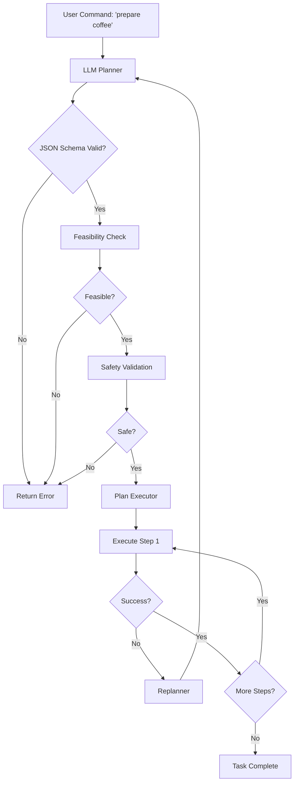
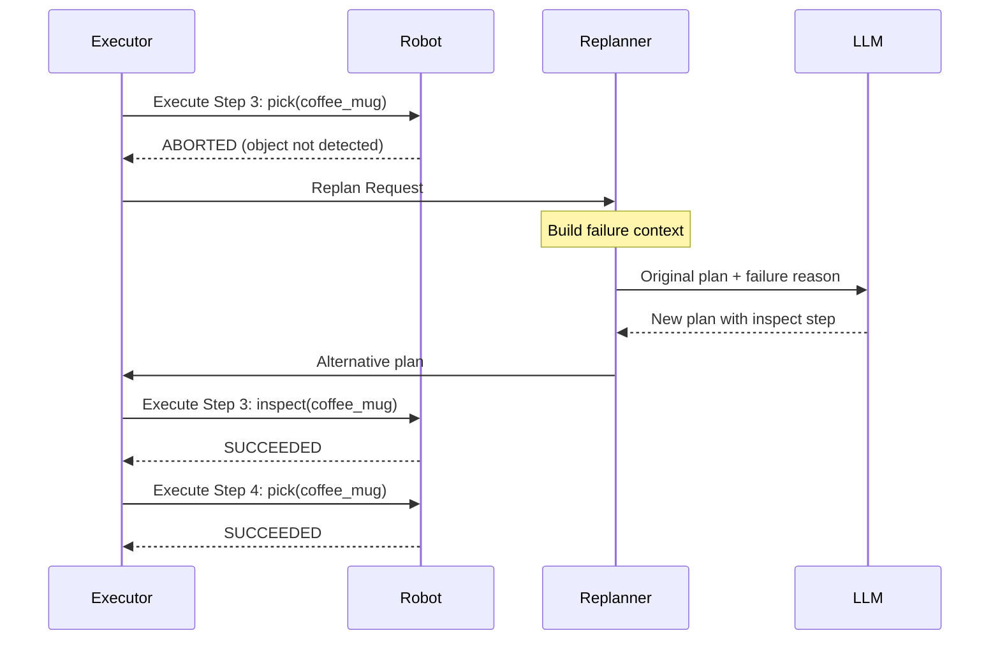
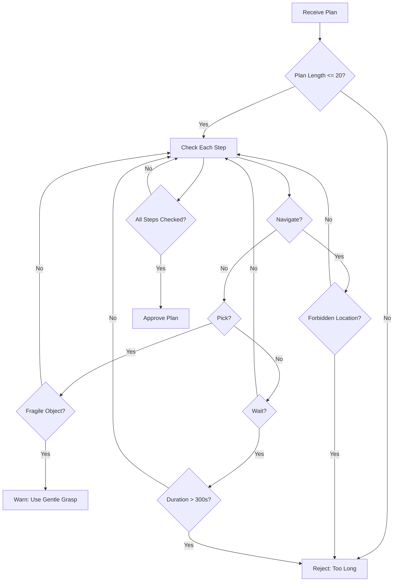

# Chapter 2: Cognitive Planning with LLMs

## Introduction

Traditional robot planning systems rely on handcrafted rules, state machines, or symbolic planners that require explicit domain modeling. While effective for well-defined tasks, these approaches struggle with open-ended, natural language instructions like "prepare coffee" or "set the table." Large Language Models (LLMs) have emerged as a powerful tool for **cognitive planning**—translating high-level human commands into structured, executable robot action sequences.

In this chapter, you'll learn how to integrate LLMs (both cloud-based and local) into your robot planning pipeline, engineer effective prompts for robot task decomposition, validate generated plans for safety and feasibility, and handle execution failures through replanning.

**What You'll Build:**
- An LLM-powered planning system that converts natural language commands to JSON action sequences
- Integration with both OpenAI GPT-4 and local LLaMA 3 via Ollama
- Plan validation and safety checking mechanisms
- Execution pipeline with Nav2 and perception integration
- Failure detection and replanning capabilities

**Prerequisites:**
- Completion of User Story 1 (Isaac Sim setup and ROS 2 integration)
- OpenAI API key OR Ollama installed (for local LLMs)
- Working knowledge of Nav2 from Module 3
- Basic understanding of ROS 2 actions and services
- Python 3.10+ environment

:::info Chapter Scope
This chapter focuses on **planning** with LLMs, not low-level control. The LLM generates high-level action sequences (navigate, pick, place), which are then executed by specialized controllers (Nav2 for navigation, motion planners for manipulation).
:::

---

## Section 1: LLM Selection for Robot Planning

### 1.1 LLM Options for Robotics

Selecting the right LLM for robot planning involves balancing cost, latency, plan quality, and deployment constraints. Here's a comparison of popular options:

| Model | Provider | Cost (per 1M tokens) | Avg Latency | Plan Quality | Context Window | Deployment |
|-------|----------|---------------------|-------------|--------------|----------------|------------|
| **GPT-4 Turbo** | OpenAI | $10 (input) / $30 (output) | 2-5s | Excellent | 128K | Cloud |
| **GPT-3.5 Turbo** | OpenAI | $0.50 / $1.50 | 1-2s | Good | 16K | Cloud |
| **Claude 3.5 Sonnet** | Anthropic | $3 / $15 | 2-4s | Excellent | 200K | Cloud |
| **Gemini 1.5 Pro** | Google | $1.25 / $5 | 2-3s | Very Good | 1M | Cloud |
| **LLaMA 3 70B** | Meta | Free (self-hosted) | 5-15s | Very Good | 8K | Local |
| **LLaMA 3 8B** | Meta | Free (self-hosted) | 1-3s | Good | 8K | Local |

**Key Considerations:**

1. **Plan Quality**: GPT-4 and Claude excel at complex multi-step reasoning and following structured output formats (JSON schemas). Smaller models like LLaMA 3 8B may struggle with long task sequences.

2. **Latency**: Critical for real-time robotics. Cloud APIs add network overhead (2-5s), while local models (Ollama) run faster but require GPU resources.

3. **Cost**: For production deployments with 1000+ plans/day, cloud API costs can exceed $100/month. Local models eliminate per-request costs but require infrastructure.

4. **Context Window**: Larger windows (128K+) allow including extensive robot capability descriptions, environment state, and few-shot examples in prompts.

:::tip Recommendation for This Chapter
- **Learning/Prototyping**: Start with GPT-4 Turbo for best plan quality
- **Production/Privacy**: Use local LLaMA 3 70B via Ollama
- **Budget-Constrained**: GPT-3.5 Turbo offers good quality at 1/20th the cost
:::

### 1.2 API Cost Estimation

Let's estimate costs for a typical robot planning workload:

**Scenario**: Mobile manipulator executing 50 tasks/day, each requiring:
- System prompt: 500 tokens (robot capabilities, action vocabulary)
- User query: 50 tokens ("prepare coffee")
- LLM output: 300 tokens (JSON plan with 5-7 steps)

**GPT-4 Turbo Calculation:**
```
Daily usage:
  Input:  50 tasks × (500 + 50) tokens = 27,500 tokens
  Output: 50 tasks × 300 tokens = 15,000 tokens

Monthly cost (30 days):
  Input:  825,000 tokens × $10/1M = $8.25
  Output: 450,000 tokens × $30/1M = $13.50
  Total: $21.75/month
```

**With Replanning** (assume 20% of plans fail and require replanning):
```
Additional 10 plans/day × 30 days = 300 replans/month
Added cost: ~$6.50
Total: $28.25/month
```

:::warning Cost Optimization Tips
- Cache system prompts when possible (reduces input tokens)
- Use GPT-3.5 for simple tasks, GPT-4 for complex ones
- Implement client-side validation to avoid unnecessary API calls
- Set `max_tokens` limits to prevent runaway generation
:::

### 1.3 Free Alternatives: Local LLMs with Ollama

For privacy-sensitive applications or high-volume deployments, local LLMs eliminate API costs:

**LLaMA 3 via Ollama**:
- Free and open-source (Meta's LLaMA 3 license)
- Runs on consumer GPUs (RTX 3090/4090) or CPU
- REST API compatible with OpenAI format
- No data sent to external servers

**Performance Expectations** (RTX 4090):
- LLaMA 3 70B: ~8-12 tokens/sec (~10s for 300-token plan)
- LLaMA 3 8B: ~50-80 tokens/sec (~3s for 300-token plan)

We'll cover Ollama setup in Section 3.

---

## Section 2: OpenAI GPT-4 API Integration

### 2.1 OpenAI API Setup

First, install the official OpenAI Python client:

```bash
# In your ROS 2 workspace (outside container if needed)
pip install openai python-dotenv jsonschema
```

**Secure API Key Storage**:

Never hardcode API keys in code. Use environment variables with a `.env` file:

```bash title=".env"
# Store in project root, add to .gitignore
OPENAI_API_KEY=sk-proj-abcdefghijklmnopqrstuvwxyz1234567890
OPENAI_MODEL=gpt-4-turbo-preview
```

**Load environment variables** in your Python code:

```python title="llm_planner/config.py"
import os
from dotenv import load_dotenv

# Load .env file from project root
load_dotenv()

class LLMConfig:
    """Configuration for LLM planning."""

    OPENAI_API_KEY = os.getenv("OPENAI_API_KEY")
    OPENAI_MODEL = os.getenv("OPENAI_MODEL", "gpt-4-turbo-preview")
    MAX_TOKENS = 1000
    TEMPERATURE = 0.1  # Low temperature for deterministic planning

    @classmethod
    def validate(cls):
        """Validate required configuration."""
        if not cls.OPENAI_API_KEY:
            raise ValueError(
                "OPENAI_API_KEY not found. Create a .env file with:\n"
                "OPENAI_API_KEY=your-key-here"
            )

# Validate on import
LLMConfig.validate()
```

:::danger Security Best Practices
- **Never commit `.env` files** to version control (add to `.gitignore`)
- Use separate API keys for development/production
- Rotate keys if accidentally exposed
- Set usage limits in OpenAI dashboard to prevent unexpected charges
:::

### 2.2 Chat Completions API

OpenAI's Chat Completions API uses a **message-based format** with roles:
- `system`: Sets behavior/context for the assistant
- `user`: The human's request
- `assistant`: The model's response (in conversation history)

**Basic GPT-4 API Call**:

```python title="llm_planner/openai_client.py"
import openai
from llm_planner.config import LLMConfig

class OpenAIPlanner:
    """GPT-4 based robot task planner."""

    def __init__(self):
        """Initialize OpenAI client."""
        openai.api_key = LLMConfig.OPENAI_API_KEY
        self.model = LLMConfig.OPENAI_MODEL
        self.temperature = LLMConfig.TEMPERATURE
        self.max_tokens = LLMConfig.MAX_TOKENS

    def generate_plan(self, user_command: str, system_prompt: str) -> dict:
        """
        Generate a robot action plan from natural language command.

        Args:
            user_command: Natural language task (e.g., "prepare coffee")
            system_prompt: Robot capabilities and output format instructions

        Returns:
            Parsed JSON plan dictionary

        Raises:
            openai.APIError: If API call fails
            json.JSONDecodeError: If response is not valid JSON
        """
        try:
            response = openai.ChatCompletion.create(
                model=self.model,
                messages=[
                    {"role": "system", "content": system_prompt},
                    {"role": "user", "content": user_command}
                ],
                temperature=self.temperature,
                max_tokens=self.max_tokens,
                response_format={"type": "json_object"}  # Force JSON output
            )

            # Extract plan from response
            plan_text = response.choices[0].message.content
            plan = json.loads(plan_text)

            # Log token usage for cost tracking
            usage = response.usage
            print(f"Tokens - Input: {usage.prompt_tokens}, "
                  f"Output: {usage.completion_tokens}, "
                  f"Total: {usage.total_tokens}")

            return plan

        except openai.APIError as e:
            print(f"OpenAI API error: {e}")
            raise
        except json.JSONDecodeError as e:
            print(f"Failed to parse LLM response as JSON: {e}")
            print(f"Raw response: {plan_text}")
            raise
```

**Expected Output**:

```json
{
  "task": "prepare coffee",
  "steps": [
    {"action": "navigate", "target": "kitchen"},
    {"action": "pick", "object": "coffee_mug"},
    {"action": "place", "object": "coffee_mug", "location": "coffee_machine"},
    {"action": "manipulate", "target": "coffee_machine_button"},
    {"action": "wait", "duration": 30.0},
    {"action": "pick", "object": "coffee_mug"},
    {"action": "navigate", "target": "user_location"}
  ]
}
```

:::info Why `response_format={"type": "json_object"}`?
This parameter (available in GPT-4 Turbo and later) forces the model to output valid JSON, reducing parsing errors. Without it, LLMs may include explanatory text before/after JSON.
:::

---

## Section 3: Local LLaMA 3 Integration

### 3.1 Installing Ollama for Local LLMs

Ollama provides a simple way to run local LLMs with an OpenAI-compatible API.

**Installation (Ubuntu 22.04)**:

```bash
# Install Ollama
curl -fsSL https://ollama.com/install.sh | sh

# Verify installation
ollama --version
# Expected: ollama version is 0.1.x

# Pull LLaMA 3 model (choose size based on GPU memory)
# 8B model: ~5GB VRAM, 70B model: ~40GB VRAM
ollama pull llama3:8b       # For RTX 3080/3090 (10-12GB VRAM)
# ollama pull llama3:70b    # For A100/H100 (40GB+ VRAM)

# Start Ollama server (runs on localhost:11434)
ollama serve
```

:::tip GPU Requirements
- **LLaMA 3 8B**: RTX 3080 (10GB) or better
- **LLaMA 3 70B**: A100 (40GB) or multiple GPUs
- **CPU-only**: Possible but slow (~60s per plan)
:::

**Verify Ollama is Running**:

```bash
# Test with curl
curl http://localhost:11434/api/generate -d '{
  "model": "llama3:8b",
  "prompt": "List 3 robot actions",
  "stream": false
}'

# Expected: JSON response with generated text
```

### 3.2 LLaMA 3 API Integration

Ollama's API is compatible with OpenAI's format, so we can reuse our client code:

```python title="llm_planner/ollama_client.py"
import json
import requests
from typing import Dict

class OllamaPlanner:
    """Local LLaMA 3 based robot task planner."""

    def __init__(self, model: str = "llama3:8b", base_url: str = "http://localhost:11434"):
        """
        Initialize Ollama client.

        Args:
            model: Ollama model name (llama3:8b or llama3:70b)
            base_url: Ollama server URL
        """
        self.model = model
        self.base_url = base_url
        self.api_url = f"{base_url}/api/chat"

    def generate_plan(self, user_command: str, system_prompt: str) -> Dict:
        """
        Generate a robot action plan using local LLaMA 3.

        Args:
            user_command: Natural language task
            system_prompt: Robot capabilities and format instructions

        Returns:
            Parsed JSON plan dictionary

        Raises:
            requests.RequestException: If API call fails
            json.JSONDecodeError: If response is not valid JSON
        """
        try:
            # Ollama chat API request
            payload = {
                "model": self.model,
                "messages": [
                    {"role": "system", "content": system_prompt},
                    {"role": "user", "content": user_command}
                ],
                "stream": False,
                "format": "json"  # Request JSON output
            }

            response = requests.post(self.api_url, json=payload, timeout=60)
            response.raise_for_status()

            # Parse response
            result = response.json()
            plan_text = result["message"]["content"]
            plan = json.loads(plan_text)

            # Log token usage (if available)
            if "prompt_eval_count" in result:
                print(f"Tokens - Input: {result['prompt_eval_count']}, "
                      f"Output: {result['eval_count']}")

            return plan

        except requests.RequestException as e:
            print(f"Ollama API error: {e}")
            raise
        except json.JSONDecodeError as e:
            print(f"Failed to parse LLM response as JSON: {e}")
            print(f"Raw response: {plan_text}")
            raise
```

**Unified Interface** (supports both OpenAI and Ollama):

```python title="llm_planner/planner_factory.py"
from llm_planner.openai_client import OpenAIPlanner
from llm_planner.ollama_client import OllamaPlanner

def create_planner(provider: str = "openai", **kwargs):
    """
    Factory function to create LLM planner.

    Args:
        provider: 'openai' or 'ollama'
        **kwargs: Provider-specific arguments

    Returns:
        Planner instance with generate_plan() method
    """
    if provider == "openai":
        return OpenAIPlanner(**kwargs)
    elif provider == "ollama":
        return OllamaPlanner(**kwargs)
    else:
        raise ValueError(f"Unknown provider: {provider}")

# Usage:
# planner = create_planner("openai")
# planner = create_planner("ollama", model="llama3:70b")
```

---

## Section 4: Prompt Engineering for Robot Planning

### 4.1 System Prompts for Robot Planning

The **system prompt** defines the LLM's role, available actions, and output format. Effective prompts include:

1. **Role definition**: "You are a robot task planner..."
2. **Action vocabulary**: List of available actions with descriptions
3. **Output schema**: JSON structure with required fields
4. **Constraints**: Safety rules, action dependencies
5. **Few-shot examples**: Sample plans for common tasks

**Complete System Prompt Template**:

```python title="llm_planner/prompts.py"
ROBOT_PLANNING_SYSTEM_PROMPT = """You are a task planner for a mobile manipulator robot operating in a home environment. Your job is to decompose high-level natural language commands into structured sequences of robot actions.

**Available Actions:**

1. **navigate** - Move the robot base to a location
   - Parameters: {"target": "location_name"}
   - Example: {"action": "navigate", "target": "kitchen"}

2. **pick** - Grasp an object with the robot arm
   - Parameters: {"object": "object_name"}
   - Prerequisites: Robot must be near the object
   - Example: {"action": "pick", "object": "coffee_mug"}

3. **place** - Release grasped object at a location
   - Parameters: {"object": "object_name", "location": "surface_name"}
   - Prerequisites: Object must be grasped
   - Example: {"action": "place", "object": "coffee_mug", "location": "table"}

4. **manipulate** - Press button, open drawer, flip switch
   - Parameters: {"target": "object_name", "action_type": "press|pull|push"}
   - Example: {"action": "manipulate", "target": "light_switch", "action_type": "press"}

5. **wait** - Pause execution for specified duration
   - Parameters: {"duration": seconds}
   - Example: {"action": "wait", "duration": 5.0}

6. **inspect** - Use cameras/sensors to detect objects
   - Parameters: {"target": "object_name" (optional)}
   - Example: {"action": "inspect", "target": "apple"}

**Output Format:**
Return a JSON object with this exact structure:
{
  "task": "original task description",
  "steps": [
    {"action": "action_name", "param1": "value1", ...},
    ...
  ]
}

**Rules:**
- Always navigate before attempting to pick/place objects
- Include inspect actions when object location is uncertain
- Use wait actions for time-dependent tasks (e.g., coffee brewing)
- Keep plans concise (3-10 steps for most tasks)
- Ensure each step is feasible with the given action vocabulary

**Example Plan for "bring me the apple":**
{
  "task": "bring me the apple",
  "steps": [
    {"action": "navigate", "target": "kitchen"},
    {"action": "inspect", "target": "apple"},
    {"action": "pick", "object": "apple"},
    {"action": "navigate", "target": "user_location"},
    {"action": "place", "object": "apple", "location": "user_hand"}
  ]
}

Now generate a plan for the following task. Return ONLY valid JSON, no additional text.
"""
```

:::tip Prompt Engineering Best Practices
- **Be explicit**: Specify exact JSON keys and types
- **Include constraints**: Mention prerequisites and ordering rules
- **Provide examples**: 2-3 few-shot examples improve quality
- **Test iteratively**: Refine prompts based on common failure modes
:::

### 4.2 JSON Schema Validation

Even with `response_format={"type": "json_object"}`, LLMs may generate JSON that doesn't match your schema (e.g., missing required fields). Use `jsonschema` for validation:

**Define Schema**:

```python title="llm_planner/schema.py"
PLAN_SCHEMA = {
    "type": "object",
    "required": ["task", "steps"],
    "properties": {
        "task": {
            "type": "string",
            "minLength": 1
        },
        "steps": {
            "type": "array",
            "minItems": 1,
            "items": {
                "type": "object",
                "required": ["action"],
                "properties": {
                    "action": {
                        "type": "string",
                        "enum": ["navigate", "pick", "place", "manipulate", "wait", "inspect"]
                    }
                },
                "additionalProperties": True  # Allow action-specific params
            }
        }
    }
}

# Action-specific parameter schemas
ACTION_PARAM_SCHEMAS = {
    "navigate": {
        "required": ["target"],
        "properties": {"target": {"type": "string"}}
    },
    "pick": {
        "required": ["object"],
        "properties": {"object": {"type": "string"}}
    },
    "place": {
        "required": ["object", "location"],
        "properties": {
            "object": {"type": "string"},
            "location": {"type": "string"}
        }
    },
    "manipulate": {
        "required": ["target"],
        "properties": {
            "target": {"type": "string"},
            "action_type": {"type": "string", "enum": ["press", "pull", "push"]}
        }
    },
    "wait": {
        "required": ["duration"],
        "properties": {"duration": {"type": "number", "minimum": 0}}
    },
    "inspect": {
        "properties": {"target": {"type": "string"}}
    }
}
```

**Validation Function**:

```python title="llm_planner/validator.py"
import jsonschema
from llm_planner.schema import PLAN_SCHEMA, ACTION_PARAM_SCHEMAS

def validate_plan_schema(plan: dict) -> tuple[bool, str]:
    """
    Validate plan against JSON schema.

    Args:
        plan: Generated plan dictionary

    Returns:
        (is_valid, error_message)
    """
    try:
        # Validate top-level schema
        jsonschema.validate(instance=plan, schema=PLAN_SCHEMA)

        # Validate action-specific parameters
        for i, step in enumerate(plan["steps"]):
            action = step["action"]
            if action in ACTION_PARAM_SCHEMAS:
                try:
                    jsonschema.validate(instance=step, schema=ACTION_PARAM_SCHEMAS[action])
                except jsonschema.ValidationError as e:
                    return False, f"Step {i} ({action}): {e.message}"

        return True, ""

    except jsonschema.ValidationError as e:
        return False, f"Schema validation failed: {e.message}"

# Usage example:
# is_valid, error = validate_plan_schema(plan)
# if not is_valid:
#     print(f"Invalid plan: {error}")
```

---

## Section 5: Plan Validation

### 5.1 Feasibility Checking

Schema validation ensures structural correctness, but plans must also be **semantically feasible**:

1. **Object existence**: Can only pick/place known objects
2. **Action prerequisites**: Can't place before picking
3. **Spatial constraints**: Can't navigate to unknown locations
4. **Action dependencies**: Sequential constraints (pick → navigate → place)

**Feasibility Validator**:

```python title="llm_planner/feasibility.py"
from typing import List, Set, Tuple

class FeasibilityChecker:
    """Validate plan feasibility against robot knowledge base."""

    def __init__(self, known_objects: Set[str], known_locations: Set[str]):
        """
        Initialize with robot's world knowledge.

        Args:
            known_objects: Set of object names the robot can detect
            known_locations: Set of valid navigation targets
        """
        self.known_objects = known_objects
        self.known_locations = known_locations

    def validate(self, plan: dict) -> Tuple[bool, List[str]]:
        """
        Check plan feasibility.

        Returns:
            (is_feasible, list_of_errors)
        """
        errors = []
        grasped_object = None  # Track what robot is holding

        for i, step in enumerate(plan["steps"]):
            action = step["action"]

            # Check navigate targets
            if action == "navigate":
                target = step.get("target")
                if target not in self.known_locations:
                    errors.append(
                        f"Step {i}: Unknown location '{target}'. "
                        f"Known locations: {self.known_locations}"
                    )

            # Check pick prerequisites
            elif action == "pick":
                obj = step.get("object")
                if obj not in self.known_objects:
                    errors.append(f"Step {i}: Unknown object '{obj}'")
                if grasped_object is not None:
                    errors.append(
                        f"Step {i}: Cannot pick '{obj}' while holding '{grasped_object}'"
                    )
                else:
                    grasped_object = obj

            # Check place prerequisites
            elif action == "place":
                obj = step.get("object")
                location = step.get("location")

                if grasped_object is None:
                    errors.append(f"Step {i}: Cannot place '{obj}' - not holding anything")
                elif grasped_object != obj:
                    errors.append(
                        f"Step {i}: Cannot place '{obj}' - currently holding '{grasped_object}'"
                    )
                else:
                    grasped_object = None  # Object released

                if location not in self.known_locations:
                    errors.append(f"Step {i}: Unknown placement location '{location}'")

            # Check manipulate targets
            elif action == "manipulate":
                target = step.get("target")
                if target not in self.known_objects:
                    errors.append(f"Step {i}: Unknown manipulation target '{target}'")

        return len(errors) == 0, errors

# Usage example:
# checker = FeasibilityChecker(
#     known_objects={"coffee_mug", "apple", "light_switch"},
#     known_locations={"kitchen", "living_room", "user_location"}
# )
# is_feasible, errors = checker.validate(plan)
```

### 5.2 Safety Constraints

Safety validation ensures plans won't damage the robot, environment, or humans:

```python title="llm_planner/safety.py"
from typing import List, Tuple

class SafetyValidator:
    """Validate plan against safety constraints."""

    # Safety limits (customize for your robot)
    MAX_CONSECUTIVE_PICKS = 3  # Prevent arm fatigue
    MAX_WAIT_DURATION = 300.0  # 5 minutes
    MAX_PLAN_LENGTH = 20  # Prevent runaway plans

    FORBIDDEN_LOCATIONS = {"stairs", "balcony", "restricted_area"}
    FRAGILE_OBJECTS = {"glass_cup", "wine_glass", "phone"}

    def validate(self, plan: dict) -> Tuple[bool, List[str]]:
        """
        Check plan safety.

        Returns:
            (is_safe, list_of_warnings)
        """
        warnings = []
        consecutive_picks = 0

        # Check plan length
        if len(plan["steps"]) > self.MAX_PLAN_LENGTH:
            warnings.append(
                f"Plan too long ({len(plan['steps'])} steps). "
                f"Max allowed: {self.MAX_PLAN_LENGTH}"
            )
            return False, warnings

        for i, step in enumerate(plan["steps"]):
            action = step["action"]

            # Check forbidden locations
            if action == "navigate":
                target = step.get("target")
                if target in self.FORBIDDEN_LOCATIONS:
                    warnings.append(
                        f"Step {i}: Navigation to forbidden location '{target}'"
                    )

            # Check wait duration
            elif action == "wait":
                duration = step.get("duration", 0)
                if duration > self.MAX_WAIT_DURATION:
                    warnings.append(
                        f"Step {i}: Wait duration {duration}s exceeds max {self.MAX_WAIT_DURATION}s"
                    )

            # Check consecutive picks (arm strain)
            elif action == "pick":
                consecutive_picks += 1
                if consecutive_picks > self.MAX_CONSECUTIVE_PICKS:
                    warnings.append(
                        f"Step {i}: Too many consecutive picks ({consecutive_picks}). "
                        f"Insert navigate/wait steps to avoid arm fatigue."
                    )

                # Warn about fragile objects
                obj = step.get("object")
                if obj in self.FRAGILE_OBJECTS:
                    warnings.append(
                        f"Step {i}: Handling fragile object '{obj}' - use gentle grasp"
                    )
            else:
                consecutive_picks = 0  # Reset counter

        return len(warnings) == 0, warnings

# Usage:
# safety = SafetyValidator()
# is_safe, warnings = safety.validate(plan)
# if not is_safe:
#     print("Safety violations:", warnings)
```

---

## Section 6: Plan Execution

### 6.1 Converting Plans to ROS 2 Actions

Now we execute validated plans by converting each step into ROS 2 action goals:

```python title="llm_planner/executor.py"
import rclpy
from rclpy.node import Node
from rclpy.action import ActionClient
from nav2_msgs.action import NavigateToPose
from geometry_msgs.msg import PoseStamped
from manipulation_msgs.action import PickPlace  # Example action interface
from typing import Dict
import time

class PlanExecutor(Node):
    """Execute LLM-generated plans via ROS 2 actions."""

    def __init__(self):
        super().__init__('plan_executor')

        # Action clients (adjust to your robot's interfaces)
        self.nav_client = ActionClient(self, NavigateToPose, '/navigate_to_pose')
        self.pick_client = ActionClient(self, PickPlace, '/pick_object')
        self.place_client = ActionClient(self, PickPlace, '/place_object')

        # Location database (in production, load from map/database)
        self.locations = {
            "kitchen": PoseStamped(
                header={"frame_id": "map"},
                pose={"position": {"x": 2.0, "y": 1.0, "z": 0.0}}
            ),
            "living_room": PoseStamped(
                header={"frame_id": "map"},
                pose={"position": {"x": 0.0, "y": 0.0, "z": 0.0}}
            )
        }

        self.get_logger().info("Plan executor initialized")

    def execute_plan(self, plan: Dict) -> bool:
        """
        Execute plan steps sequentially.

        Args:
            plan: Validated plan dictionary

        Returns:
            True if all steps succeeded, False otherwise
        """
        self.get_logger().info(f"Executing plan: {plan['task']}")

        for i, step in enumerate(plan["steps"]):
            action = step["action"]
            self.get_logger().info(f"Step {i+1}/{len(plan['steps'])}: {action}")

            try:
                if action == "navigate":
                    success = self._execute_navigate(step)
                elif action == "pick":
                    success = self._execute_pick(step)
                elif action == "place":
                    success = self._execute_place(step)
                elif action == "wait":
                    success = self._execute_wait(step)
                elif action == "inspect":
                    success = self._execute_inspect(step)
                elif action == "manipulate":
                    success = self._execute_manipulate(step)
                else:
                    self.get_logger().error(f"Unknown action: {action}")
                    return False

                if not success:
                    self.get_logger().error(f"Step {i+1} failed: {step}")
                    return False

            except Exception as e:
                self.get_logger().error(f"Exception in step {i+1}: {e}")
                return False

        self.get_logger().info("Plan execution completed successfully")
        return True

    def _execute_navigate(self, step: Dict) -> bool:
        """Navigate to target location."""
        target = step["target"]

        if target not in self.locations:
            self.get_logger().error(f"Unknown location: {target}")
            return False

        goal = NavigateToPose.Goal()
        goal.pose = self.locations[target]

        self.nav_client.wait_for_server()
        future = self.nav_client.send_goal_async(goal)
        rclpy.spin_until_future_complete(self, future)

        goal_handle = future.result()
        if not goal_handle.accepted:
            self.get_logger().error("Navigation goal rejected")
            return False

        result_future = goal_handle.get_result_async()
        rclpy.spin_until_future_complete(self, result_future)

        return result_future.result().status == 4  # SUCCEEDED

    def _execute_pick(self, step: Dict) -> bool:
        """Pick up object."""
        obj = step["object"]

        # In production: query perception system for object pose
        goal = PickPlace.Goal()
        goal.object_name = obj
        goal.action_type = "pick"

        self.pick_client.wait_for_server()
        future = self.pick_client.send_goal_async(goal)
        rclpy.spin_until_future_complete(self, future)

        goal_handle = future.result()
        if not goal_handle.accepted:
            return False

        result_future = goal_handle.get_result_async()
        rclpy.spin_until_future_complete(self, result_future)

        return result_future.result().status == 4

    def _execute_place(self, step: Dict) -> bool:
        """Place object at location."""
        # Similar to pick, but action_type = "place"
        obj = step["object"]
        location = step["location"]

        goal = PickPlace.Goal()
        goal.object_name = obj
        goal.target_location = location
        goal.action_type = "place"

        self.place_client.wait_for_server()
        future = self.place_client.send_goal_async(goal)
        rclpy.spin_until_future_complete(self, future)

        goal_handle = future.result()
        if not goal_handle.accepted:
            return False

        result_future = goal_handle.get_result_async()
        rclpy.spin_until_future_complete(self, result_future)

        return result_future.result().status == 4

    def _execute_wait(self, step: Dict) -> bool:
        """Wait for specified duration."""
        duration = step["duration"]
        self.get_logger().info(f"Waiting {duration} seconds...")
        time.sleep(duration)
        return True

    def _execute_inspect(self, step: Dict) -> bool:
        """Inspect environment (trigger perception)."""
        # In production: call YOLO detection service
        self.get_logger().info(f"Inspecting: {step.get('target', 'environment')}")
        # Placeholder: always succeed
        return True

    def _execute_manipulate(self, step: Dict) -> bool:
        """Manipulate object (press button, etc.)."""
        target = step["target"]
        action_type = step.get("action_type", "press")
        self.get_logger().info(f"Manipulating {target} ({action_type})")
        # Placeholder: call manipulation action server
        return True
```

### 6.2 Integrating with Nav2 and Perception

**Nav2 Integration** (using NavigateToPose):

```python title="llm_planner/nav2_integration.py"
from geometry_msgs.msg import PoseStamped
from nav2_msgs.action import NavigateToPose

def create_navigation_goal(x: float, y: float, theta: float = 0.0) -> NavigateToPose.Goal:
    """
    Create Nav2 navigation goal from coordinates.

    Args:
        x, y: Target position in map frame (meters)
        theta: Target orientation (radians)

    Returns:
        NavigateToPose goal
    """
    goal = NavigateToPose.Goal()
    goal.pose = PoseStamped()
    goal.pose.header.frame_id = "map"
    goal.pose.header.stamp = rclpy.time.Time().to_msg()

    goal.pose.pose.position.x = x
    goal.pose.pose.position.y = y
    goal.pose.pose.position.z = 0.0

    # Convert theta to quaternion
    from tf_transformations import quaternion_from_euler
    quat = quaternion_from_euler(0, 0, theta)
    goal.pose.pose.orientation.x = quat[0]
    goal.pose.pose.orientation.y = quat[1]
    goal.pose.pose.orientation.z = quat[2]
    goal.pose.pose.orientation.w = quat[3]

    return goal
```

**Perception Integration** (YOLO object detection):

```python title="llm_planner/perception.py"
from vision_msgs.msg import Detection2DArray
from geometry_msgs.msg import PoseStamped
import rclpy

class PerceptionInterface:
    """Interface to YOLO/Isaac ROS perception."""

    def __init__(self, node):
        self.node = node
        self.detections = []

        # Subscribe to YOLO detections
        self.detection_sub = node.create_subscription(
            Detection2DArray,
            '/detections',
            self._detection_callback,
            10
        )

    def _detection_callback(self, msg: Detection2DArray):
        """Store latest detections."""
        self.detections = msg.detections

    def find_object(self, object_name: str) -> PoseStamped:
        """
        Find object pose from latest detections.

        Returns:
            PoseStamped of object, or None if not found
        """
        for det in self.detections:
            # Match object name (assumes detection has object_name field)
            if det.results[0].id == object_name:
                # Convert 2D detection to 3D pose (requires depth)
                pose = PoseStamped()
                pose.header = det.header
                # ... (depth conversion logic)
                return pose

        self.node.get_logger().warning(f"Object '{object_name}' not detected")
        return None
```

---

## Section 7: Error Handling and Replanning

### 7.1 Detecting Action Failures

ROS 2 actions return status codes indicating success/failure:

```python title="llm_planner/failure_detection.py"
from action_msgs.msg import GoalStatus
from typing import Optional

class FailureDetector:
    """Detect and categorize action failures."""

    FAILURE_REASONS = {
        GoalStatus.STATUS_ABORTED: "Action aborted by server",
        GoalStatus.STATUS_CANCELED: "Action canceled",
        GoalStatus.STATUS_UNKNOWN: "Unknown status",
    }

    @staticmethod
    def detect_failure(result_status: int, action_name: str, step: dict) -> Optional[str]:
        """
        Detect if action failed and determine reason.

        Args:
            result_status: ROS 2 action result status code
            action_name: Name of action (navigate, pick, etc.)
            step: Plan step that was executed

        Returns:
            Failure reason string, or None if succeeded
        """
        if result_status == GoalStatus.STATUS_SUCCEEDED:
            return None

        reason = FailureDetector.FAILURE_REASONS.get(
            result_status,
            f"Unknown failure (status {result_status})"
        )

        # Add context-specific information
        if action_name == "navigate":
            return f"Navigation failed: {reason}. Target: {step.get('target')}"
        elif action_name == "pick":
            return f"Pick failed: {reason}. Object: {step.get('object')}"
        elif action_name == "place":
            return f"Place failed: {reason}. Object: {step.get('object')}"
        else:
            return f"{action_name} failed: {reason}"
```

### 7.2 Sending Failure Context to LLM

When a step fails, replan by providing failure context to the LLM:

```python title="llm_planner/replanner.py"
from llm_planner.openai_client import OpenAIPlanner
from llm_planner.prompts import ROBOT_PLANNING_SYSTEM_PROMPT

class Replanner:
    """Generate alternative plans when execution fails."""

    def __init__(self, planner: OpenAIPlanner):
        self.planner = planner

    def replan(
        self,
        original_plan: dict,
        failed_step_index: int,
        failure_reason: str
    ) -> dict:
        """
        Generate new plan accounting for failure.

        Args:
            original_plan: The plan that failed
            failed_step_index: Index of step that failed
            failure_reason: Description of why it failed

        Returns:
            New plan dictionary
        """
        # Build context-rich prompt
        replan_prompt = f"""REPLANNING REQUIRED

Original task: {original_plan['task']}

Original plan (failed at step {failed_step_index + 1}):
{self._format_plan(original_plan)}

Failure: Step {failed_step_index + 1} failed
Reason: {failure_reason}

Generate an alternative plan that:
1. Accomplishes the same goal
2. Avoids the failure condition
3. Considers that steps 1-{failed_step_index} already succeeded
4. May include workarounds (e.g., inspect before pick, try different location)

Return ONLY valid JSON in the same format as before.
"""

        # Request new plan from LLM
        new_plan = self.planner.generate_plan(
            user_command=replan_prompt,
            system_prompt=ROBOT_PLANNING_SYSTEM_PROMPT
        )

        return new_plan

    def _format_plan(self, plan: dict) -> str:
        """Format plan for human-readable display."""
        lines = []
        for i, step in enumerate(plan["steps"], 1):
            lines.append(f"  {i}. {step['action']}: {step}")
        return "\n".join(lines)

# Usage in executor:
# if not success:
#     replanner = Replanner(planner)
#     new_plan = replanner.replan(plan, step_index, failure_reason)
#     success = executor.execute_plan(new_plan)
```

**Complete Execution Loop with Replanning**:

```python title="llm_planner/robust_executor.py"
def execute_with_replanning(
    executor: PlanExecutor,
    planner: OpenAIPlanner,
    plan: dict,
    max_retries: int = 2
) -> bool:
    """
    Execute plan with automatic replanning on failure.

    Args:
        executor: Plan executor instance
        planner: LLM planner for replanning
        plan: Initial plan
        max_retries: Maximum replanning attempts

    Returns:
        True if plan succeeded (possibly after replanning)
    """
    attempt = 0
    current_plan = plan

    while attempt <= max_retries:
        if attempt > 0:
            executor.get_logger().info(f"Replan attempt {attempt}/{max_retries}")

        # Try execution
        success, failed_step, failure_reason = executor.execute_plan_detailed(current_plan)

        if success:
            return True

        if attempt == max_retries:
            executor.get_logger().error("Max replanning attempts reached")
            return False

        # Replan
        replanner = Replanner(planner)
        current_plan = replanner.replan(current_plan, failed_step, failure_reason)

        # Validate new plan
        is_valid, error = validate_plan_schema(current_plan)
        if not is_valid:
            executor.get_logger().error(f"Replanning produced invalid plan: {error}")
            return False

        attempt += 1

    return False
```

---

## Hands-On Exercises

### Exercise 1: Design LLM Prompt for "Set the Table"

**Goal**: Create a system prompt that generates a 5+ step plan for table setting.

**Requirements**:
1. Define actions: `navigate`, `pick`, `place`, `inspect`
2. Objects: plate, fork, knife, spoon, napkin
3. Locations: kitchen, dining_table
4. Expected plan: Navigate to kitchen → inspect → pick plate → navigate to table → place plate → repeat for utensils

**Starter Code**:

```python
# TODO: Modify ROBOT_PLANNING_SYSTEM_PROMPT to include table-setting examples
# TODO: Test with both GPT-4 and LLaMA 3
# TODO: Compare plan quality

planner = create_planner("openai")
plan = planner.generate_plan(
    "Set the table for one person",
    ROBOT_PLANNING_SYSTEM_PROMPT
)
print(json.dumps(plan, indent=2))
```

**Expected Output**:
```json
{
  "task": "Set the table for one person",
  "steps": [
    {"action": "navigate", "target": "kitchen"},
    {"action": "pick", "object": "plate"},
    {"action": "navigate", "target": "dining_table"},
    {"action": "place", "object": "plate", "location": "dining_table"},
    ...
  ]
}
```

### Exercise 2: Validate Plan for Infeasible Actions

**Goal**: Implement additional feasibility checks for spatial constraints.

**Task**: Extend `FeasibilityChecker` to detect:
1. Picking an object that's not in the current location (requires navigation first)
2. Placing an object on a surface that's too small
3. Exceeding robot's reach distance

**Starter Code**:

```python
class EnhancedFeasibilityChecker(FeasibilityChecker):
    def __init__(self, known_objects, known_locations, object_locations):
        super().__init__(known_objects, known_locations)
        self.object_locations = object_locations  # {"apple": "kitchen", ...}
        self.current_location = "home"  # Robot's current position

    def validate(self, plan):
        # TODO: Add location tracking
        # TODO: Check object accessibility
        # TODO: Validate placement feasibility
        pass

# Test with invalid plan:
invalid_plan = {
    "task": "test",
    "steps": [
        {"action": "pick", "object": "apple"},  # No navigation first!
        {"action": "navigate", "target": "kitchen"}
    ]
}
is_feasible, errors = checker.validate(invalid_plan)
assert not is_feasible, "Should detect missing navigation"
```

### Exercise 3: Execute "Prepare Coffee" with Failure Recovery

**Goal**: Run full pipeline in Isaac Sim with replanning.

**Scenario**: 7-step coffee preparation plan where step 4 (press coffee machine button) fails initially.

**Setup**:
1. Launch Isaac Sim with Franka robot
2. Add coffee machine, mug, and kitchen props
3. Start Nav2 and perception nodes

**Complete Code**:

```python
#!/usr/bin/env python3
import rclpy
from llm_planner.planner_factory import create_planner
from llm_planner.executor import PlanExecutor
from llm_planner.validator import validate_plan_schema
from llm_planner.robust_executor import execute_with_replanning

def main():
    rclpy.init()

    # Create planner and executor
    planner = create_planner("openai")
    executor = PlanExecutor()

    # Generate plan
    task = "Prepare coffee and bring it to me"
    plan = planner.generate_plan(task, ROBOT_PLANNING_SYSTEM_PROMPT)

    # Validate
    is_valid, error = validate_plan_schema(plan)
    if not is_valid:
        print(f"Invalid plan: {error}")
        return

    print(f"Generated plan with {len(plan['steps'])} steps")

    # Execute with replanning
    success = execute_with_replanning(executor, planner, plan, max_retries=2)

    if success:
        print("Task completed successfully!")
    else:
        print("Task failed after max retries")

    rclpy.shutdown()

if __name__ == '__main__':
    main()
```

**Expected Behavior**:
1. Robot navigates to kitchen
2. Picks coffee mug
3. Places mug under coffee machine
4. **Fails** to press button (simulated failure)
5. **Replans**: Inspect button location → retry press
6. Successfully presses button
7. Waits 30s for coffee
8. Picks mug and delivers to user

---

## Diagrams & Visual Aids

### LLM Planning Pipeline



### Replanning Flow



### Safety Validation Flowchart



---

## Troubleshooting & Tips

### Common Issues and Solutions

#### 1. OpenAI API Rate Limit (Error 429)

**Symptom**:
```
openai.error.RateLimitError: You exceeded your current quota
```

**Solutions**:
- Check your OpenAI account usage at https://platform.openai.com/usage
- Add retry logic with exponential backoff:

```python
import time
from openai import OpenAI

def generate_with_retry(client, messages, max_retries=3):
    for attempt in range(max_retries):
        try:
            return client.chat.completions.create(...)
        except openai.RateLimitError:
            if attempt == max_retries - 1:
                raise
            wait_time = 2 ** attempt  # 1s, 2s, 4s
            print(f"Rate limited, waiting {wait_time}s...")
            time.sleep(wait_time)
```

- Switch to GPT-3.5 Turbo (lower rate limits) or local LLaMA 3

#### 2. Invalid JSON from LLM

**Symptom**:
```
json.JSONDecodeError: Expecting property name enclosed in double quotes
```

**Causes**:
- LLM included explanatory text before/after JSON
- Malformed JSON (trailing commas, missing quotes)

**Solutions**:

```python
import re
import json

def extract_json(text: str) -> dict:
    """Extract JSON from LLM response that may include extra text."""
    # Try direct parse first
    try:
        return json.loads(text)
    except json.JSONDecodeError:
        pass

    # Extract JSON block with regex
    match = re.search(r'\{.*\}', text, re.DOTALL)
    if match:
        try:
            return json.loads(match.group(0))
        except json.JSONDecodeError:
            pass

    raise ValueError(f"No valid JSON found in: {text}")
```

- Use `response_format={"type": "json_object"}` in OpenAI API (GPT-4 Turbo+)
- Add explicit instruction in prompt: "Return ONLY valid JSON, no additional text"

#### 3. Timeout Exceeds 10s

**Symptom**: Slow LLM response (>10s) blocks robot execution

**Solutions**:

```python
import concurrent.futures

def generate_plan_async(planner, command, prompt, timeout=10):
    """Generate plan with timeout."""
    with concurrent.futures.ThreadPoolExecutor() as executor:
        future = executor.submit(planner.generate_plan, command, prompt)
        try:
            return future.result(timeout=timeout)
        except concurrent.futures.TimeoutError:
            print(f"LLM timeout after {timeout}s")
            return None
```

- Use faster models (GPT-3.5, LLaMA 3 8B) for time-critical tasks
- Reduce `max_tokens` to limit generation length
- Cache plans for common tasks

#### 4. Plan Validation Failures

**Symptom**: High rate of infeasible plans (50%+)

**Root Causes**:
- Insufficient prompt engineering (missing constraints)
- Outdated world knowledge (object moved, location changed)
- LLM hallucinating objects/locations

**Solutions**:

1. **Improve prompt specificity**:
```python
# Add explicit constraints to system prompt
CONSTRAINTS = """
CRITICAL CONSTRAINTS:
- ONLY use objects from this list: {known_objects}
- ONLY navigate to: {known_locations}
- ALWAYS navigate before picking objects
- NEVER pick/place the same object twice in a row
"""
```

2. **Update world state dynamically**:
```python
def build_context_aware_prompt(known_objects, known_locations):
    return f"""Available objects: {', '.join(known_objects)}
Available locations: {', '.join(known_locations)}

Generate plan using ONLY the above objects and locations.
"""
```

3. **Use few-shot examples** with valid object/location names

:::tip Performance Benchmarks
Expected plan quality metrics:
- **Schema validity**: >95% (with `response_format="json"`)
- **Feasibility**: >80% (with well-engineered prompts)
- **Safety**: >90% (safety validator should catch most issues)
- **Execution success**: >70% (first attempt), >85% (with replanning)
:::

---

## Summary

In this chapter, you learned to:

1. **Select appropriate LLMs** for robot planning (cloud vs. local, cost vs. quality tradeoffs)
2. **Integrate OpenAI GPT-4** and **local LLaMA 3** via OpenAI-compatible APIs
3. **Engineer effective prompts** with action vocabularies, JSON schemas, and few-shot examples
4. **Validate plans** for schema correctness, feasibility, and safety constraints
5. **Execute plans** by converting steps to ROS 2 action goals (Nav2, manipulation)
6. **Handle failures** through replanning with LLM-in-the-loop error recovery

**Key Takeaways**:
- LLMs excel at high-level task decomposition but require **structured prompts** and **validation**
- Always validate plans for **safety** before execution (forbidden locations, fragile objects, etc.)
- **Replanning** with failure context significantly improves task success rates
- **Local LLMs** (Ollama) eliminate API costs and privacy concerns for production deployments

**Next Steps**:
- **Chapter 3**: VLA end-to-end control (π₀, OpenVLA) for low-level manipulation
- **Chapter 4**: Multi-modal perception (vision-language models) for grounding
- **Chapter 5**: Complete mobile manipulator demo integrating all Module 4 components

:::info Additional Resources
- OpenAI Prompt Engineering Guide: https://platform.openai.com/docs/guides/prompt-engineering
- Ollama Documentation: https://ollama.com/docs
- Nav2 Action Interfaces: https://navigation.ros.org/
- ROS 2 Actions Tutorial: https://docs.ros.org/en/humble/Tutorials/Actions.html
:::
