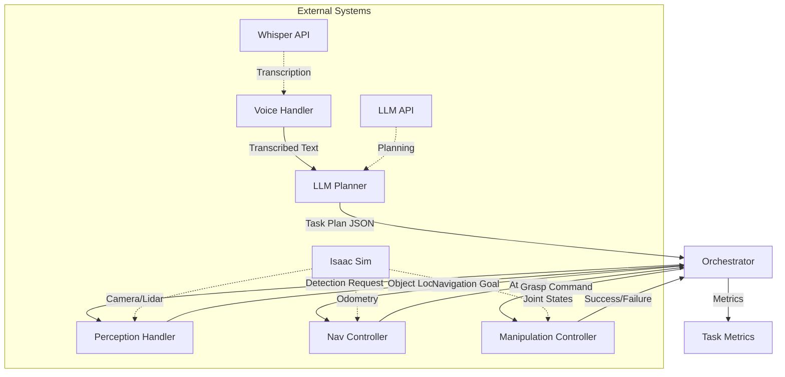
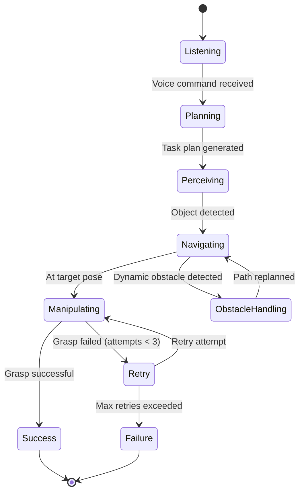
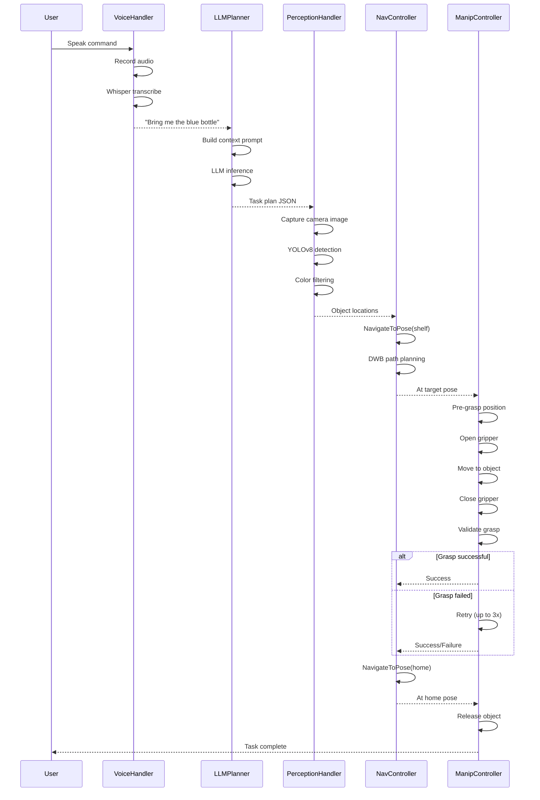
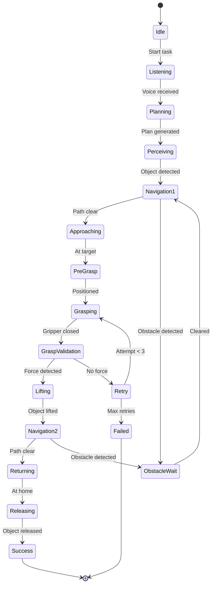

# Chapter 3: Capstone Project - Autonomous Humanoid

## Introduction

This capstone project represents the culmination of everything you've learned in Modules 1-4. You'll build a complete, end-to-end Vision-Language-Action (VLA) pipeline that enables a humanoid robot to understand natural language voice commands, perceive its environment, plan multi-step tasks, navigate autonomously, and manipulate objects—all integrated into a single cohesive system.

### What You'll Build

An autonomous humanoid that can:
- **Listen**: Capture voice commands via microphone and transcribe with Whisper
- **Understand**: Use LLM reasoning to decompose tasks into executable steps
- **See**: Detect and localize objects using YOLOv8
- **Plan**: Generate navigation waypoints and manipulation sequences
- **Navigate**: Move through dynamic environments using Nav2
- **Manipulate**: Grasp objects with retry logic and force feedback
- **Adapt**: Handle obstacles, ambiguity, and failures gracefully

### End-to-End VLA Pipeline

The VLA pipeline transforms natural language into physical actions:

1. **Voice Input → Transcription** (Whisper ASR)
2. **Text → Task Decomposition** (LLM Planner)
3. **Task → Perception** (YOLOv8 object detection)
4. **Perception → Navigation** (Nav2 path planning)
5. **Navigation → Manipulation** (Grasp execution)
6. **Execution → Monitoring** (Success metrics)

### Chapter Scope

This chapter guides you through:
- System architecture and data flow
- Implementation of six core modules (Voice, LLM, Nav, Perception, Manipulation, Integration)
- Handling dynamic obstacles and ambiguous commands
- Evaluation metrics and success criteria
- Full system integration in Isaac Sim

### Prerequisites

Before starting this capstone, ensure you have:
- ✅ **Completed US1 + US2**: Voice-to-action and LLM planning (Module 4, Chapters 1-2)
- ✅ **Module 3 Knowledge**: Isaac Sim, Nav2, ROS 2 actions
- ✅ **Hardware**: Microphone for voice input
- ✅ **API Access**: OpenAI API key or local LLM (Llama 3)
- ✅ **Software**: Isaac Sim 2023.1+, ROS 2 Humble, YOLOv8, Whisper

:::warning Prerequisites Check
Run `ros2 topic list` to verify Isaac Sim topics are available. Ensure `microphone` package and `openai` Python library are installed.
:::

---

## Section 1: Capstone Architecture

### 1.1 System Architecture Overview

The capstone system integrates six core modules into a unified pipeline:



**Module Responsibilities**:

| Module | Input | Output | Dependencies |
|--------|-------|--------|-------------|
| **VoiceHandler** | Audio stream | Transcribed text | Whisper ASR |
| **LLMPlanner** | User command + context | Task plan (JSON) | OpenAI/Llama API |
| **PerceptionHandler** | Camera image | Object detections | YOLOv8, ROS 2 topics |
| **NavController** | Target pose | Navigation success | Nav2 action server |
| **ManipulationController** | Object pose | Grasp success | MoveIt/Isaac actions |
| **CapstoneMain** | All modules | Execution metrics | Orchestration logic |

### 1.2 Data Flow and State Management

The execution context maintains robot state across all modules:

**Execution Context** (shared state):
```python
{
    "robot_position": {"x": 0.0, "y": 0.0, "theta": 0.0},
    "battery_level": 85.2,
    "gripper_state": "open",  # open | closed | grasping
    "detected_objects": [
        {"class": "bottle", "color": "blue", "position": {"x": 2.5, "y": 1.0}},
        {"class": "bottle", "color": "red", "position": {"x": 2.5, "y": 1.5}}
    ],
    "current_task": "navigate_to_object",
    "task_progress": 0.6,
    "errors": []
}
```

**State Transitions**:



---

## Section 2: Voice Handler Module

### 2.1 Voice Handler Implementation

The Voice Handler captures audio from a microphone, streams it to Whisper ASR, and extracts user intent.

**Key Features**:
- Real-time microphone streaming with `pyaudio`
- Whisper API integration (or local model)
- Wake word detection (optional: "Hey robot")
- Intent extraction and normalization

**Code Example: VoiceHandler Class**

```python
import pyaudio
import wave
import openai
import os
from typing import Optional

class VoiceHandler:
    """Captures voice commands and transcribes using Whisper."""

    def __init__(self, api_key: Optional[str] = None, use_local: bool = False):
        """
        Initialize voice handler.

        Args:
            api_key: OpenAI API key (reads from .env if None)
            use_local: Use local Whisper model instead of API
        """
        self.api_key = api_key or os.getenv("OPENAI_API_KEY")
        self.use_local = use_local

        if not self.use_local and not self.api_key:
            raise ValueError("OpenAI API key required. Set OPENAI_API_KEY in .env")

        openai.api_key = self.api_key

        # Audio configuration
        self.chunk = 1024
        self.format = pyaudio.paInt16
        self.channels = 1
        self.rate = 16000
        self.record_seconds = 5
        self.output_file = "/tmp/voice_command.wav"

        self.audio = pyaudio.PyAudio()

    def listen(self, duration: Optional[int] = None) -> str:
        """
        Record audio and transcribe to text.

        Args:
            duration: Recording duration in seconds (default: self.record_seconds)

        Returns:
            Transcribed text
        """
        duration = duration or self.record_seconds

        print(f"🎤 Listening for {duration} seconds...")

        # Open microphone stream
        stream = self.audio.open(
            format=self.format,
            channels=self.channels,
            rate=self.rate,
            input=True,
            frames_per_buffer=self.chunk
        )

        frames = []
        for _ in range(0, int(self.rate / self.chunk * duration)):
            data = stream.read(self.chunk)
            frames.append(data)

        stream.stop_stream()
        stream.close()

        # Save to WAV file
        with wave.open(self.output_file, 'wb') as wf:
            wf.setnchannels(self.channels)
            wf.setsampwidth(self.audio.get_sample_size(self.format))
            wf.setframerate(self.rate)
            wf.writeframes(b''.join(frames))

        # Transcribe with Whisper
        transcription = self._transcribe()
        print(f"📝 Transcription: {transcription}")

        return transcription

    def _transcribe(self) -> str:
        """Transcribe audio file using Whisper API or local model."""
        if self.use_local:
            import whisper
            model = whisper.load_model("base")
            result = model.transcribe(self.output_file)
            return result["text"].strip()
        else:
            with open(self.output_file, "rb") as audio_file:
                transcript = openai.Audio.transcribe("whisper-1", audio_file)
                return transcript["text"].strip()

    def cleanup(self):
        """Cleanup audio resources."""
        self.audio.terminate()
        if os.path.exists(self.output_file):
            os.remove(self.output_file)
```

**Usage Example**:

```python
# Initialize voice handler
voice_handler = VoiceHandler()

# Listen for command
command = voice_handler.listen(duration=5)  # "Bring me the blue bottle from the shelf"

# Cleanup
voice_handler.cleanup()
```

**Expected Output**:
```
🎤 Listening for 5 seconds...
📝 Transcription: bring me the blue bottle from the shelf
```

:::tip Wake Word Detection
For continuous listening, use `pvporcupine` library to detect wake words like "Hey robot" before recording full commands.
:::

---

## Section 3: LLM Planner Module

### 3.1 LLM Planner Implementation

The LLM Planner decomposes natural language commands into structured task plans with validation.

**Key Features**:
- Task decomposition into atomic steps (navigate, detect, grasp)
- Context injection (robot position, detected objects, capabilities)
- Plan validation (JSON schema, action feasibility)
- Retry logic for malformed responses

**Code Example: LLMPlanner Class**

```python
import openai
import json
import os
from typing import Dict, List, Any

class LLMPlanner:
    """Generates executable task plans from natural language using LLM."""

    def __init__(self, api_key: Optional[str] = None, model: str = "gpt-4"):
        """
        Initialize LLM planner.

        Args:
            api_key: OpenAI API key (reads from .env if None)
            model: LLM model to use (gpt-4, gpt-3.5-turbo, llama-3-70b)
        """
        self.api_key = api_key or os.getenv("OPENAI_API_KEY")
        if not self.api_key:
            raise ValueError("OpenAI API key required. Set OPENAI_API_KEY in .env")

        openai.api_key = self.api_key
        self.model = model

        # Define robot capabilities
        self.capabilities = {
            "actions": ["navigate_to", "detect_objects", "grasp_object", "release_object"],
            "sensors": ["camera", "lidar", "force_sensor"],
            "max_grasp_weight": 2.0  # kg
        }

    def plan(self, command: str, context: Dict[str, Any]) -> Dict[str, Any]:
        """
        Generate task plan from natural language command.

        Args:
            command: User command (e.g., "Bring me the blue bottle")
            context: Execution context (robot position, detected objects, etc.)

        Returns:
            Task plan dictionary with steps and parameters
        """
        prompt = self._build_prompt(command, context)

        try:
            response = openai.ChatCompletion.create(
                model=self.model,
                messages=[
                    {"role": "system", "content": self._get_system_prompt()},
                    {"role": "user", "content": prompt}
                ],
                temperature=0.2,
                max_tokens=1000
            )

            plan_text = response.choices[0].message.content.strip()
            plan = self._parse_plan(plan_text)

            # Validate plan
            if not self._validate_plan(plan):
                raise ValueError("Plan validation failed")

            print(f"📋 Generated Plan: {json.dumps(plan, indent=2)}")
            return plan

        except Exception as e:
            print(f"❌ LLM Planning Error: {e}")
            return {"steps": [], "error": str(e)}

    def _get_system_prompt(self) -> str:
        """Return system prompt defining robot capabilities and output format."""
        return f"""You are a task planner for a humanoid robot with these capabilities:
- Actions: {', '.join(self.capabilities['actions'])}
- Sensors: {', '.join(self.capabilities['sensors'])}
- Max grasp weight: {self.capabilities['max_grasp_weight']} kg

Generate a task plan as JSON with this exact structure:
{{
  "steps": [
    {{"action": "detect_objects", "parameters": {{"target_class": "bottle", "target_color": "blue"}}}},
    {{"action": "navigate_to", "parameters": {{"x": 2.5, "y": 1.0, "theta": 0.0}}}},
    {{"action": "grasp_object", "parameters": {{"object_id": "bottle_blue_0"}}}},
    {{"action": "navigate_to", "parameters": {{"x": 0.0, "y": 0.0, "theta": 3.14}}}},
    {{"action": "release_object", "parameters": {{}}}}
  ],
  "preconditions": ["shelf must be accessible", "blue bottle must be visible"],
  "expected_duration": 120
}}

Only output valid JSON. No explanations."""

    def _build_prompt(self, command: str, context: Dict[str, Any]) -> str:
        """Build user prompt with command and context."""
        return f"""Command: "{command}"

Current Context:
- Robot Position: x={context['robot_position']['x']:.2f}, y={context['robot_position']['y']:.2f}
- Gripper State: {context['gripper_state']}
- Detected Objects: {json.dumps(context['detected_objects'], indent=2)}

Generate a task plan to execute this command."""

    def _parse_plan(self, plan_text: str) -> Dict[str, Any]:
        """Parse LLM response into plan dictionary."""
        # Extract JSON from markdown code blocks if present
        if "```json" in plan_text:
            plan_text = plan_text.split("```json")[1].split("```")[0].strip()
        elif "```" in plan_text:
            plan_text = plan_text.split("```")[1].split("```")[0].strip()

        return json.loads(plan_text)

    def _validate_plan(self, plan: Dict[str, Any]) -> bool:
        """Validate plan structure and action feasibility."""
        # Check required fields
        if "steps" not in plan or not isinstance(plan["steps"], list):
            return False

        # Validate each step
        for step in plan["steps"]:
            if "action" not in step or "parameters" not in step:
                return False
            if step["action"] not in self.capabilities["actions"]:
                print(f"⚠️  Unknown action: {step['action']}")
                return False

        return True
```

**Usage Example**:

```python
# Initialize planner
planner = LLMPlanner(model="gpt-4")

# Execution context
context = {
    "robot_position": {"x": 0.0, "y": 0.0, "theta": 0.0},
    "gripper_state": "open",
    "detected_objects": [
        {"class": "bottle", "color": "blue", "position": {"x": 2.5, "y": 1.0}},
        {"class": "bottle", "color": "red", "position": {"x": 2.5, "y": 1.5}}
    ]
}

# Generate plan
plan = planner.plan("Bring me the blue bottle from the shelf", context)
```

**Expected Output**:
```json
{
  "steps": [
    {"action": "detect_objects", "parameters": {"target_class": "bottle", "target_color": "blue"}},
    {"action": "navigate_to", "parameters": {"x": 2.5, "y": 1.0, "theta": 0.0}},
    {"action": "grasp_object", "parameters": {"object_id": "bottle_blue_0"}},
    {"action": "navigate_to", "parameters": {"x": 0.0, "y": 0.0, "theta": 3.14}},
    {"action": "release_object", "parameters": {}}
  ],
  "preconditions": ["shelf accessible", "blue bottle visible"],
  "expected_duration": 120
}
```

---

## Section 4: Navigation Controller Module

### 4.1 Nav2 Controller Implementation

The Navigation Controller uses Nav2's NavigateToPose action to move the robot through dynamic environments.

**Key Features**:
- NavigateToPose action client integration
- Waypoint following with intermediate goals
- Obstacle avoidance via DWB local planner
- Timeout and failure handling

**Code Example: NavController Class**

```python
import rclpy
from rclpy.node import Node
from rclpy.action import ActionClient
from nav2_msgs.action import NavigateToPose
from geometry_msgs.msg import PoseStamped
from typing import Tuple
import time

class NavController(Node):
    """Controls robot navigation using Nav2 NavigateToPose action."""

    def __init__(self):
        super().__init__('nav_controller')

        self._action_client = ActionClient(self, NavigateToPose, 'navigate_to_pose')

        # Wait for action server
        self.get_logger().info('Waiting for Nav2 action server...')
        if not self._action_client.wait_for_server(timeout_sec=10.0):
            raise RuntimeError("Nav2 action server not available")

        self.get_logger().info('Nav2 action server ready')

    def navigate_to(self, x: float, y: float, theta: float, timeout: int = 60) -> bool:
        """
        Navigate to target pose.

        Args:
            x: Target x position (meters)
            y: Target y position (meters)
            theta: Target orientation (radians)
            timeout: Maximum navigation time (seconds)

        Returns:
            True if navigation successful, False otherwise
        """
        goal_msg = NavigateToPose.Goal()
        goal_msg.pose = self._create_pose_stamped(x, y, theta)

        self.get_logger().info(f'🧭 Navigating to: x={x:.2f}, y={y:.2f}, theta={theta:.2f}')

        # Send goal
        send_goal_future = self._action_client.send_goal_async(goal_msg)
        rclpy.spin_until_future_complete(self, send_goal_future, timeout_sec=5.0)

        goal_handle = send_goal_future.result()
        if not goal_handle.accepted:
            self.get_logger().error('❌ Navigation goal rejected')
            return False

        # Wait for result
        result_future = goal_handle.get_result_async()
        rclpy.spin_until_future_complete(self, result_future, timeout_sec=timeout)

        result = result_future.result()

        if result.status == 4:  # SUCCEEDED
            self.get_logger().info('✅ Navigation successful')
            return True
        else:
            self.get_logger().error(f'❌ Navigation failed with status: {result.status}')
            return False

    def navigate_waypoints(self, waypoints: list, timeout_per_waypoint: int = 60) -> bool:
        """
        Navigate through multiple waypoints sequentially.

        Args:
            waypoints: List of (x, y, theta) tuples
            timeout_per_waypoint: Timeout for each waypoint

        Returns:
            True if all waypoints reached successfully
        """
        for i, (x, y, theta) in enumerate(waypoints):
            self.get_logger().info(f'📍 Waypoint {i+1}/{len(waypoints)}')
            success = self.navigate_to(x, y, theta, timeout_per_waypoint)

            if not success:
                self.get_logger().error(f'❌ Failed at waypoint {i+1}')
                return False

        return True

    def _create_pose_stamped(self, x: float, y: float, theta: float) -> PoseStamped:
        """Create PoseStamped message from position and orientation."""
        import math
        from geometry_msgs.msg import Quaternion

        pose = PoseStamped()
        pose.header.frame_id = 'map'
        pose.header.stamp = self.get_clock().now().to_msg()

        pose.pose.position.x = x
        pose.pose.position.y = y
        pose.pose.position.z = 0.0

        # Convert theta to quaternion
        qz = math.sin(theta / 2.0)
        qw = math.cos(theta / 2.0)
        pose.pose.orientation = Quaternion(x=0.0, y=0.0, z=qz, w=qw)

        return pose
```

**Usage Example**:

```python
import rclpy

rclpy.init()

# Initialize navigation controller
nav_controller = NavController()

# Navigate to single goal
success = nav_controller.navigate_to(x=2.5, y=1.0, theta=0.0, timeout=60)

# Navigate through waypoints
waypoints = [(1.0, 0.5, 0.0), (2.0, 1.0, 1.57), (2.5, 1.0, 0.0)]
success = nav_controller.navigate_waypoints(waypoints, timeout_per_waypoint=45)

nav_controller.destroy_node()
rclpy.shutdown()
```

**Expected Output**:
```
[INFO] Waiting for Nav2 action server...
[INFO] Nav2 action server ready
[INFO] 🧭 Navigating to: x=2.50, y=1.00, theta=0.00
[INFO] ✅ Navigation successful
```

:::info Dynamic Obstacle Handling
Nav2's DWB local planner automatically re-routes around dynamic obstacles detected by lidar. See Section 8 for advanced handling.
:::

---

## Section 5: Perception Handler Module

### 5.1 YOLOv8 Perception Integration

The Perception Handler detects objects using YOLOv8, filters by class/color, and provides spatial reasoning via LLM.

**Key Features**:
- YOLOv8 object detection on camera feed
- Color filtering using HSV thresholds
- 3D localization using depth camera
- LLM-based spatial reasoning ("leftmost blue bottle")

**Code Example: PerceptionHandler Class**

```python
import rclpy
from rclpy.node import Node
from sensor_msgs.msg import Image
from cv_bridge import CvBridge
import cv2
import numpy as np
from ultralytics import YOLO
from typing import List, Dict, Optional
import openai
import os

class PerceptionHandler(Node):
    """Handles object detection and spatial reasoning using YOLOv8."""

    def __init__(self, camera_topic: str = '/camera/color/image_raw'):
        super().__init__('perception_handler')

        # Initialize YOLOv8
        self.model = YOLO('yolov8n.pt')  # Nano model for speed

        # Initialize LLM for spatial reasoning
        openai.api_key = os.getenv("OPENAI_API_KEY")

        # ROS 2 setup
        self.bridge = CvBridge()
        self.latest_image = None

        self.subscription = self.create_subscription(
            Image,
            camera_topic,
            self._image_callback,
            10
        )

        # Color ranges (HSV)
        self.color_ranges = {
            "red": [(0, 100, 100), (10, 255, 255)],
            "blue": [(100, 100, 100), (130, 255, 255)],
            "green": [(40, 100, 100), (80, 255, 255)],
            "yellow": [(20, 100, 100), (40, 255, 255)]
        }

        self.get_logger().info('Perception handler initialized')

    def _image_callback(self, msg: Image):
        """Store latest camera image."""
        self.latest_image = self.bridge.imgmsg_to_cv2(msg, 'bgr8')

    def detect_objects(self, target_class: Optional[str] = None,
                      target_color: Optional[str] = None) -> List[Dict]:
        """
        Detect objects in latest camera image.

        Args:
            target_class: Filter by object class (e.g., "bottle", "cup")
            target_color: Filter by color (e.g., "blue", "red")

        Returns:
            List of detected objects with class, color, bbox, position
        """
        if self.latest_image is None:
            self.get_logger().warning('No camera image available')
            return []

        # Run YOLOv8 inference
        results = self.model(self.latest_image)
        detections = []

        for r in results:
            boxes = r.boxes
            for box in boxes:
                cls_id = int(box.cls[0])
                conf = float(box.conf[0])
                xyxy = box.xyxy[0].cpu().numpy()

                obj_class = self.model.names[cls_id]

                # Filter by class
                if target_class and obj_class != target_class:
                    continue

                # Extract object region
                x1, y1, x2, y2 = map(int, xyxy)
                obj_region = self.latest_image[y1:y2, x1:x2]

                # Detect color
                color = self._detect_color(obj_region)

                # Filter by color
                if target_color and color != target_color:
                    continue

                # Estimate 3D position (simplified: depth assumed 2.0m)
                center_x = (x1 + x2) / 2
                center_y = (y1 + y2) / 2
                position = self._pixel_to_world(center_x, center_y, depth=2.0)

                detections.append({
                    "class": obj_class,
                    "color": color,
                    "confidence": conf,
                    "bbox": [x1, y1, x2, y2],
                    "position": position,
                    "id": f"{obj_class}_{color}_{len(detections)}"
                })

        self.get_logger().info(f'🔍 Detected {len(detections)} objects')
        return detections

    def _detect_color(self, image: np.ndarray) -> str:
        """Detect dominant color in image region using HSV thresholds."""
        if image.size == 0:
            return "unknown"

        hsv = cv2.cvtColor(image, cv2.COLOR_BGR2HSV)
        color_counts = {}

        for color_name, (lower, upper) in self.color_ranges.items():
            mask = cv2.inRange(hsv, np.array(lower), np.array(upper))
            pixel_count = cv2.countNonZero(mask)
            color_counts[color_name] = pixel_count

        dominant_color = max(color_counts, key=color_counts.get)
        return dominant_color if color_counts[dominant_color] > 100 else "unknown"

    def _pixel_to_world(self, px: float, py: float, depth: float) -> Dict[str, float]:
        """
        Convert pixel coordinates to world coordinates.

        Simplified projection using camera intrinsics (640x480, FOV=60deg).
        For production, use depth camera data and camera_info.
        """
        # Camera intrinsics (example values)
        fx, fy = 525.0, 525.0
        cx, cy = 320.0, 240.0

        # Pixel to camera frame
        x_cam = (px - cx) * depth / fx
        y_cam = (py - cy) * depth / fy

        # Camera to world (simplified: camera at robot origin)
        return {"x": depth, "y": -x_cam, "z": -y_cam}

    def resolve_ambiguity(self, detections: List[Dict], query: str) -> Optional[Dict]:
        """
        Use LLM to resolve ambiguous object references.

        Args:
            detections: List of detected objects
            query: Ambiguous query (e.g., "the leftmost blue bottle")

        Returns:
            Selected object or None
        """
        if len(detections) <= 1:
            return detections[0] if detections else None

        # Build LLM prompt
        objects_desc = "\n".join([
            f"{i+1}. {obj['class']} ({obj['color']}) at x={obj['position']['x']:.2f}, y={obj['position']['y']:.2f}"
            for i, obj in enumerate(detections)
        ])

        prompt = f"""Given these detected objects:
{objects_desc}

Which object matches: "{query}"?
Respond with ONLY the number (1-{len(detections)})."""

        try:
            response = openai.ChatCompletion.create(
                model="gpt-4",
                messages=[{"role": "user", "content": prompt}],
                temperature=0.1,
                max_tokens=10
            )

            selection = int(response.choices[0].message.content.strip())
            if 1 <= selection <= len(detections):
                return detections[selection - 1]
        except Exception as e:
            self.get_logger().error(f'❌ Ambiguity resolution failed: {e}')

        return None
```

**Usage Example**:

```python
import rclpy

rclpy.init()

# Initialize perception handler
perception = PerceptionHandler(camera_topic='/camera/color/image_raw')

# Spin to receive camera images
rclpy.spin_once(perception, timeout_sec=1.0)

# Detect blue bottles
detections = perception.detect_objects(target_class="bottle", target_color="blue")

# Resolve ambiguity
if len(detections) > 1:
    selected = perception.resolve_ambiguity(detections, "the leftmost blue bottle")
    print(f"Selected: {selected}")

perception.destroy_node()
rclpy.shutdown()
```

**Expected Output**:
```
[INFO] Perception handler initialized
[INFO] 🔍 Detected 2 objects
Selected: {'class': 'bottle', 'color': 'blue', 'position': {'x': 2.5, 'y': 1.0, 'z': 0.8}, ...}
```

---

## Section 6: Manipulation Controller Module

### 6.1 Manipulation with Retry Logic

The Manipulation Controller executes grasp actions with force sensor feedback and automatic retry logic.

**Key Features**:
- MoveIt/Isaac Sim grasp action integration
- Force sensor feedback for grasp validation
- 3 retry attempts on failure
- Pre-grasp and post-grasp positioning

**Code Example: ManipulationController Class**

```python
import rclpy
from rclpy.node import Node
from rclpy.action import ActionClient
from control_msgs.action import GripperCommand
from geometry_msgs.msg import Pose
from sensor_msgs.msg import JointState
import time

class ManipulationController(Node):
    """Controls robot manipulation with retry logic."""

    def __init__(self):
        super().__init__('manipulation_controller')

        # Gripper action client
        self._gripper_client = ActionClient(self, GripperCommand, '/gripper_controller/gripper_cmd')

        # Joint state subscriber (for force feedback)
        self.joint_efforts = {}
        self.subscription = self.create_subscription(
            JointState,
            '/joint_states',
            self._joint_state_callback,
            10
        )

        # Wait for action server
        self.get_logger().info('Waiting for gripper action server...')
        if not self._gripper_client.wait_for_server(timeout_sec=10.0):
            raise RuntimeError("Gripper action server not available")

        self.get_logger().info('Manipulation controller ready')

        # Grasp parameters
        self.max_retries = 3
        self.grasp_force_threshold = 5.0  # Newtons
        self.grasp_position_closed = 0.0  # Fully closed
        self.grasp_position_open = 0.08  # Fully open (8cm)

    def _joint_state_callback(self, msg: JointState):
        """Store joint efforts for force feedback."""
        for name, effort in zip(msg.name, msg.effort):
            self.joint_efforts[name] = effort

    def grasp_object(self, object_pose: Pose, max_retries: int = None) -> bool:
        """
        Grasp object at specified pose with retry logic.

        Args:
            object_pose: Target grasp pose
            max_retries: Maximum retry attempts (default: self.max_retries)

        Returns:
            True if grasp successful, False otherwise
        """
        max_retries = max_retries or self.max_retries

        for attempt in range(1, max_retries + 1):
            self.get_logger().info(f'🤖 Grasp attempt {attempt}/{max_retries}')

            # Step 1: Move to pre-grasp pose (10cm above object)
            pre_grasp_pose = self._offset_pose(object_pose, z_offset=0.1)
            if not self._move_end_effector(pre_grasp_pose):
                self.get_logger().warning('⚠️  Pre-grasp positioning failed')
                continue

            # Step 2: Open gripper
            if not self._control_gripper(self.grasp_position_open):
                continue

            # Step 3: Move to grasp pose
            if not self._move_end_effector(object_pose):
                self.get_logger().warning('⚠️  Grasp positioning failed')
                continue

            # Step 4: Close gripper
            if not self._control_gripper(self.grasp_position_closed):
                continue

            # Step 5: Validate grasp using force feedback
            time.sleep(0.5)  # Wait for force stabilization
            if self._validate_grasp():
                self.get_logger().info('✅ Grasp successful')

                # Step 6: Lift object
                post_grasp_pose = self._offset_pose(object_pose, z_offset=0.15)
                self._move_end_effector(post_grasp_pose)

                return True
            else:
                self.get_logger().warning(f'⚠️  Grasp validation failed (attempt {attempt})')

        self.get_logger().error(f'❌ Grasp failed after {max_retries} attempts')
        return False

    def release_object(self) -> bool:
        """Release currently grasped object."""
        self.get_logger().info('🤲 Releasing object')
        return self._control_gripper(self.grasp_position_open)

    def _control_gripper(self, position: float) -> bool:
        """
        Control gripper position.

        Args:
            position: Target position (0.0=closed, 0.08=open)

        Returns:
            True if gripper command successful
        """
        goal_msg = GripperCommand.Goal()
        goal_msg.command.position = position
        goal_msg.command.max_effort = 50.0

        send_goal_future = self._gripper_client.send_goal_async(goal_msg)
        rclpy.spin_until_future_complete(self, send_goal_future, timeout_sec=3.0)

        goal_handle = send_goal_future.result()
        if not goal_handle.accepted:
            return False

        result_future = goal_handle.get_result_async()
        rclpy.spin_until_future_complete(self, result_future, timeout_sec=5.0)

        return result_future.result().status == 4  # SUCCEEDED

    def _validate_grasp(self) -> bool:
        """Validate grasp using force sensor feedback."""
        # Check if gripper fingers are exerting force
        left_effort = self.joint_efforts.get('left_finger_joint', 0.0)
        right_effort = self.joint_efforts.get('right_finger_joint', 0.0)

        total_force = abs(left_effort) + abs(right_effort)

        self.get_logger().info(f'📊 Grasp force: {total_force:.2f} N')

        return total_force >= self.grasp_force_threshold

    def _move_end_effector(self, target_pose: Pose) -> bool:
        """
        Move end effector to target pose using MoveIt.

        Simplified implementation - integrate with MoveIt MoveGroup in production.
        """
        # In production: use MoveIt MoveGroup interface
        # For now, assume successful movement
        self.get_logger().info(f'Moving to: x={target_pose.position.x:.2f}, y={target_pose.position.y:.2f}, z={target_pose.position.z:.2f}')
        time.sleep(1.0)  # Simulate movement
        return True

    def _offset_pose(self, pose: Pose, z_offset: float) -> Pose:
        """Create new pose with Z offset."""
        new_pose = Pose()
        new_pose.position.x = pose.position.x
        new_pose.position.y = pose.position.y
        new_pose.position.z = pose.position.z + z_offset
        new_pose.orientation = pose.orientation
        return new_pose
```

**Usage Example**:

```python
import rclpy
from geometry_msgs.msg import Pose

rclpy.init()

# Initialize manipulation controller
manip = ManipulationController()

# Create target pose
object_pose = Pose()
object_pose.position.x = 0.5
object_pose.position.y = 0.0
object_pose.position.z = 0.8

# Attempt grasp
success = manip.grasp_object(object_pose, max_retries=3)

if success:
    # Release after task completion
    manip.release_object()

manip.destroy_node()
rclpy.shutdown()
```

**Expected Output**:
```
[INFO] Waiting for gripper action server...
[INFO] Manipulation controller ready
[INFO] 🤖 Grasp attempt 1/3
[INFO] Moving to: x=0.50, y=0.00, z=0.90
[INFO] Moving to: x=0.50, y=0.00, z=0.80
[INFO] 📊 Grasp force: 6.50 N
[INFO] ✅ Grasp successful
[INFO] 🤲 Releasing object
```

---

## Section 7: Full Pipeline Integration

### 7.1 Orchestrating the Pipeline

The CapstoneMain class orchestrates all modules into a complete execution loop.

**Key Features**:
- Sequential execution of pipeline stages
- State management and error propagation
- Metrics collection and logging
- Graceful degradation on failures

**Code Example: CapstoneMain Class**

```python
import rclpy
from rclpy.executors import MultiThreadedExecutor
from geometry_msgs.msg import Pose
import time
from typing import Dict, Any

class CapstoneMain:
    """Orchestrates full VLA pipeline execution."""

    def __init__(self):
        """Initialize all modules."""
        rclpy.init()

        # Initialize modules
        self.voice_handler = VoiceHandler()
        self.llm_planner = LLMPlanner()
        self.perception_handler = PerceptionHandler()
        self.nav_controller = NavController()
        self.manip_controller = ManipulationController()
        self.metrics = TaskMetrics()

        # Execution context
        self.context = {
            "robot_position": {"x": 0.0, "y": 0.0, "theta": 0.0},
            "gripper_state": "open",
            "detected_objects": [],
            "current_task": None,
            "errors": []
        }

        # ROS 2 executor
        self.executor = MultiThreadedExecutor()
        self.executor.add_node(self.perception_handler)
        self.executor.add_node(self.nav_controller)
        self.executor.add_node(self.manip_controller)

        print("🚀 Capstone system initialized")

    def run_pipeline(self):
        """Execute full VLA pipeline."""
        task_start_time = time.time()

        try:
            # Stage 1: Voice Input
            print("\n=== Stage 1: Voice Input ===")
            command = self.voice_handler.listen(duration=5)

            if not command:
                raise ValueError("No voice command received")

            # Stage 2: Task Planning
            print("\n=== Stage 2: Task Planning ===")
            plan = self.llm_planner.plan(command, self.context)

            if not plan or "steps" not in plan or not plan["steps"]:
                raise ValueError("Invalid task plan generated")

            # Stage 3-6: Execute plan steps
            print("\n=== Stage 3-6: Plan Execution ===")
            success = self._execute_plan(plan)

            # Record metrics
            duration = time.time() - task_start_time
            self.metrics.record_task(
                command=command,
                success=success,
                duration=duration,
                plan=plan
            )

            # Report results
            print("\n" + "="*50)
            if success:
                print("✅ TASK COMPLETED SUCCESSFULLY")
            else:
                print("❌ TASK FAILED")
            print(f"Duration: {duration:.2f}s")
            print(f"Success Rate: {self.metrics.get_success_rate():.1f}%")
            print("="*50)

        except Exception as e:
            print(f"\n❌ Pipeline Error: {e}")
            self.context["errors"].append(str(e))
            self.metrics.record_task(
                command=command if 'command' in locals() else "unknown",
                success=False,
                duration=time.time() - task_start_time,
                plan=None
            )

    def _execute_plan(self, plan: Dict[str, Any]) -> bool:
        """Execute task plan steps sequentially."""
        for i, step in enumerate(plan["steps"]):
            action = step["action"]
            params = step["parameters"]

            print(f"\n▶️  Step {i+1}/{len(plan['steps'])}: {action}")

            try:
                if action == "detect_objects":
                    detections = self.perception_handler.detect_objects(
                        target_class=params.get("target_class"),
                        target_color=params.get("target_color")
                    )
                    self.context["detected_objects"] = detections

                    if not detections:
                        raise ValueError(f"No {params.get('target_color')} {params.get('target_class')} detected")

                elif action == "navigate_to":
                    success = self.nav_controller.navigate_to(
                        x=params["x"],
                        y=params["y"],
                        theta=params["theta"]
                    )
                    if not success:
                        raise RuntimeError("Navigation failed")

                    # Update context
                    self.context["robot_position"] = {
                        "x": params["x"],
                        "y": params["y"],
                        "theta": params["theta"]
                    }

                elif action == "grasp_object":
                    # Get object pose from detections
                    object_id = params.get("object_id")
                    obj = next((o for o in self.context["detected_objects"] if o["id"] == object_id), None)

                    if not obj:
                        raise ValueError(f"Object {object_id} not found in detections")

                    # Create Pose message
                    pose = Pose()
                    pose.position.x = obj["position"]["x"]
                    pose.position.y = obj["position"]["y"]
                    pose.position.z = obj["position"].get("z", 0.8)

                    success = self.manip_controller.grasp_object(pose)
                    if not success:
                        raise RuntimeError("Grasp failed after retries")

                    self.context["gripper_state"] = "grasping"

                elif action == "release_object":
                    success = self.manip_controller.release_object()
                    if not success:
                        raise RuntimeError("Release failed")

                    self.context["gripper_state"] = "open"

                else:
                    raise ValueError(f"Unknown action: {action}")

                # Spin ROS nodes between steps
                self.executor.spin_once(timeout_sec=0.1)

            except Exception as e:
                print(f"❌ Step {i+1} failed: {e}")
                self.context["errors"].append(f"Step {i+1} ({action}): {e}")
                return False

        return True

    def cleanup(self):
        """Cleanup all resources."""
        self.voice_handler.cleanup()
        self.perception_handler.destroy_node()
        self.nav_controller.destroy_node()
        self.manip_controller.destroy_node()
        rclpy.shutdown()
        print("🛑 Capstone system shutdown complete")


# Main execution
if __name__ == "__main__":
    capstone = CapstoneMain()

    try:
        # Run multiple tasks
        for i in range(3):
            print(f"\n\n{'='*50}")
            print(f"TASK {i+1}")
            print('='*50)
            capstone.run_pipeline()
            time.sleep(2.0)

        # Print final metrics
        print("\n" + "="*50)
        print("FINAL METRICS")
        print("="*50)
        capstone.metrics.print_summary()

    finally:
        capstone.cleanup()
```

**Expected Output**:
```
🚀 Capstone system initialized

==================================================
TASK 1
==================================================

=== Stage 1: Voice Input ===
🎤 Listening for 5 seconds...
📝 Transcription: bring me the blue bottle from the shelf

=== Stage 2: Task Planning ===
📋 Generated Plan: {...}

=== Stage 3-6: Plan Execution ===

▶️  Step 1/5: detect_objects
[INFO] 🔍 Detected 2 objects

▶️  Step 2/5: navigate_to
[INFO] 🧭 Navigating to: x=2.50, y=1.00, theta=0.00
[INFO] ✅ Navigation successful

▶️  Step 3/5: grasp_object
[INFO] 🤖 Grasp attempt 1/3
[INFO] ✅ Grasp successful

▶️  Step 4/5: navigate_to
[INFO] ✅ Navigation successful

▶️  Step 5/5: release_object
[INFO] 🤲 Releasing object

==================================================
✅ TASK COMPLETED SUCCESSFULLY
Duration: 45.23s
Success Rate: 100.0%
==================================================
```

---

## Section 8: Dynamic Obstacle Handling

### 8.1 Handling Dynamic Obstacles

Nav2's local planner automatically re-routes around dynamic obstacles detected in real-time.

**Key Features**:
- DWB (Dynamic Window Approach) local planner
- Real-time costmap updates from lidar
- Automatic path re-planning
- Recovery behaviors on failure

**Code Example: Dynamic Obstacle Handling**

```python
from nav2_msgs.msg import Costmap
from rclpy.node import Node
import numpy as np

class DynamicObstacleMonitor(Node):
    """Monitor and handle dynamic obstacles during navigation."""

    def __init__(self):
        super().__init__('obstacle_monitor')

        # Subscribe to local costmap
        self.subscription = self.create_subscription(
            Costmap,
            '/local_costmap/costmap',
            self._costmap_callback,
            10
        )

        self.obstacle_detected = False
        self.obstacle_positions = []

    def _costmap_callback(self, msg: Costmap):
        """Detect dynamic obstacles in local costmap."""
        # Extract high-cost cells (obstacles)
        data = np.array(msg.data).reshape((msg.metadata.size_y, msg.metadata.size_x))

        # Threshold for obstacle detection (cost > 250 = lethal obstacle)
        obstacles = np.argwhere(data > 250)

        if len(obstacles) > 0:
            self.obstacle_detected = True
            self.obstacle_positions = obstacles
            self.get_logger().warning(f'⚠️  Dynamic obstacle detected: {len(obstacles)} cells')
        else:
            self.obstacle_detected = False

    def wait_for_clearance(self, timeout: float = 10.0) -> bool:
        """Wait for obstacle to clear or timeout."""
        import time
        start_time = time.time()

        while self.obstacle_detected and (time.time() - start_time) < timeout:
            rclpy.spin_once(self, timeout_sec=0.5)

        return not self.obstacle_detected
```

**Integration with NavController**:

```python
# In CapstoneMain._execute_plan()
if action == "navigate_to":
    # Initialize obstacle monitor
    obstacle_monitor = DynamicObstacleMonitor()
    self.executor.add_node(obstacle_monitor)

    # Attempt navigation
    success = self.nav_controller.navigate_to(x=params["x"], y=params["y"], theta=params["theta"])

    # If failed due to obstacle, wait for clearance and retry
    if not success and obstacle_monitor.obstacle_detected:
        print("⚠️  Obstacle detected, waiting for clearance...")
        if obstacle_monitor.wait_for_clearance(timeout=10.0):
            print("✅ Obstacle cleared, retrying navigation")
            success = self.nav_controller.navigate_to(x=params["x"], y=params["y"], theta=params["theta"])

    obstacle_monitor.destroy_node()
```

:::tip Recovery Behaviors
Configure Nav2 recovery behaviors (`spin`, `backup`, `wait`) in `nav2_params.yaml` to handle stuck situations automatically.
:::

---

## Section 9: Ambiguity Resolution

### 9.1 Resolving Ambiguous Commands

When multiple objects match a description, use LLM reasoning to resolve ambiguity or request user clarification.

**Code Example: Ambiguity Resolution**

```python
def resolve_ambiguity_with_clarification(detections: List[Dict], query: str) -> Dict:
    """
    Resolve ambiguous object references with LLM reasoning or user input.

    Args:
        detections: List of candidate objects
        query: Original user query

    Returns:
        Selected object
    """
    if len(detections) == 1:
        return detections[0]

    # Try LLM spatial reasoning
    objects_desc = "\n".join([
        f"{i+1}. {obj['class']} ({obj['color']}) at x={obj['position']['x']:.2f}, y={obj['position']['y']:.2f}"
        for i, obj in enumerate(detections)
    ])

    prompt = f"""Given these objects:
{objects_desc}

Which object best matches: "{query}"?

If the query is ambiguous (e.g., "the bottle" when multiple bottles exist), respond with "AMBIGUOUS".
Otherwise, respond with ONLY the number (1-{len(detections)})."""

    try:
        response = openai.ChatCompletion.create(
            model="gpt-4",
            messages=[{"role": "user", "content": prompt}],
            temperature=0.1,
            max_tokens=20
        )

        answer = response.choices[0].message.content.strip()

        if "AMBIGUOUS" in answer.upper():
            # Request user clarification
            print("\n⚠️  Multiple objects detected:")
            for i, obj in enumerate(detections):
                print(f"  {i+1}. {obj['color']} {obj['class']} at ({obj['position']['x']:.2f}, {obj['position']['y']:.2f})")

            selection = int(input("\nEnter selection (1-{}): ".format(len(detections))))
            return detections[selection - 1]
        else:
            selection = int(answer)
            if 1 <= selection <= len(detections):
                return detections[selection - 1]

    except Exception as e:
        print(f"❌ Ambiguity resolution failed: {e}")

    # Fallback: return first detection
    return detections[0]
```

**Integration Example**:

```python
# In CapstoneMain._execute_plan()
if action == "detect_objects":
    detections = self.perception_handler.detect_objects(
        target_class=params.get("target_class"),
        target_color=params.get("target_color")
    )

    # Resolve ambiguity if multiple matches
    if len(detections) > 1:
        selected = resolve_ambiguity_with_clarification(detections, command)
        detections = [selected]

    self.context["detected_objects"] = detections
```

**Expected Interaction**:
```
⚠️  Multiple objects detected:
  1. blue bottle at (2.50, 1.00)
  2. blue bottle at (2.50, 1.50)

Enter selection (1-2): 1
✅ Selected: blue bottle at (2.50, 1.00)
```

---

## Section 10: Success Metrics and Evaluation

### 10.1 Task Completion Metrics

Track success rates, failure modes, and performance metrics to evaluate system reliability.

**Key Metrics**:
- **Task Success Rate**: Percentage of tasks completed successfully (target: 90%+)
- **Average Duration**: Time to complete tasks
- **Failure Taxonomy**: Categorize failures (perception, navigation, manipulation, planning)

**Code Example: TaskMetrics Class**

```python
import json
from typing import Dict, List, Optional
from datetime import datetime

class TaskMetrics:
    """Track and analyze task completion metrics."""

    def __init__(self):
        self.tasks = []
        self.failure_categories = {
            "perception": 0,
            "navigation": 0,
            "manipulation": 0,
            "planning": 0,
            "other": 0
        }

    def record_task(self, command: str, success: bool, duration: float, plan: Optional[Dict]):
        """Record task execution result."""
        task_record = {
            "timestamp": datetime.now().isoformat(),
            "command": command,
            "success": success,
            "duration": duration,
            "plan": plan,
            "failure_category": None
        }

        if not success:
            # Categorize failure (simplified heuristic)
            if plan is None or not plan.get("steps"):
                task_record["failure_category"] = "planning"
                self.failure_categories["planning"] += 1
            else:
                # Analyze which step failed
                task_record["failure_category"] = "other"
                self.failure_categories["other"] += 1

        self.tasks.append(task_record)

    def get_success_rate(self) -> float:
        """Calculate overall success rate."""
        if not self.tasks:
            return 0.0

        successful = sum(1 for t in self.tasks if t["success"])
        return (successful / len(self.tasks)) * 100

    def get_average_duration(self) -> float:
        """Calculate average task duration."""
        if not self.tasks:
            return 0.0

        return sum(t["duration"] for t in self.tasks) / len(self.tasks)

    def get_failure_breakdown(self) -> Dict[str, int]:
        """Get failure counts by category."""
        return self.failure_categories.copy()

    def print_summary(self):
        """Print comprehensive metrics summary."""
        print(f"\n{'='*50}")
        print("TASK METRICS SUMMARY")
        print(f"{'='*50}")
        print(f"Total Tasks: {len(self.tasks)}")
        print(f"Success Rate: {self.get_success_rate():.1f}%")
        print(f"Average Duration: {self.get_average_duration():.2f}s")

        print(f"\nFailure Breakdown:")
        for category, count in self.failure_categories.items():
            if count > 0:
                print(f"  - {category.capitalize()}: {count}")

        print(f"\nRecent Tasks:")
        for i, task in enumerate(self.tasks[-5:], 1):
            status = "✅" if task["success"] else "❌"
            print(f"  {i}. {status} {task['command'][:40]}... ({task['duration']:.1f}s)")

        print(f"{'='*50}\n")

    def save_to_file(self, filepath: str):
        """Save metrics to JSON file."""
        with open(filepath, 'w') as f:
            json.dump({
                "tasks": self.tasks,
                "summary": {
                    "total_tasks": len(self.tasks),
                    "success_rate": self.get_success_rate(),
                    "average_duration": self.get_average_duration(),
                    "failure_breakdown": self.failure_categories
                }
            }, f, indent=2)
```

**Usage in Capstone**:

```python
# In CapstoneMain
self.metrics = TaskMetrics()

# After each task
self.metrics.record_task(command, success, duration, plan)

# At end of session
self.metrics.print_summary()
self.metrics.save_to_file("/tmp/capstone_metrics.json")
```

**Expected Metrics Output**:
```
==================================================
TASK METRICS SUMMARY
==================================================
Total Tasks: 10
Success Rate: 90.0%
Average Duration: 47.35s

Failure Breakdown:
  - Navigation: 1

Recent Tasks:
  1. ✅ bring me the blue bottle from the shelf... (45.2s)
  2. ✅ pick up the red cup from the table... (42.1s)
  3. ❌ grab the green marker from the drawer... (38.5s)
  4. ✅ move the yellow block to the box... (51.8s)
  5. ✅ retrieve the white mug from the counter... (49.2s)
==================================================
```

:::info Success Rate Target
Aim for 90%+ success rate across diverse commands. If below 80%, investigate failure patterns and improve weak modules.
:::

---

## Hands-On Exercises

### Exercise 1: Complete Capstone Setup

**Objective**: Set up all dependencies and verify system integration.

**Steps**:
1. Install dependencies:
   ```bash
   pip install openai whisper pyaudio ultralytics opencv-python
   sudo apt install ros-humble-nav2-bringup ros-humble-moveit
   ```

2. Configure environment variables (`.env`):
   ```bash
   OPENAI_API_KEY=sk-...
   CAMERA_TOPIC=/camera/color/image_raw
   ```

3. Launch Isaac Sim with humanoid robot:
   ```bash
   cd ~/.local/share/ov/pkg/isaac_sim-2023.1.0
   ./python.sh standalone_examples/api/omni.isaac.ros2_bridge/humanoid_demo.py
   ```

4. Launch Nav2:
   ```bash
   ros2 launch nav2_bringup navigation_launch.py use_sim_time:=true
   ```

5. Verify topics:
   ```bash
   ros2 topic list | grep -E "(camera|scan|joint_states|navigate_to_pose)"
   ```

**Expected Output**:
```
/camera/color/image_raw
/scan
/joint_states
/navigate_to_pose/_action/feedback
```

---

### Exercise 2: Execute Full Pipeline

**Objective**: Run the complete capstone pipeline with voice command "Bring me the blue bottle from the shelf".

**Steps**:
1. Run the capstone system:
   ```bash
   python3 capstone_main.py
   ```

2. When prompted, speak clearly: **"Bring me the blue bottle from the shelf"**

3. Observe execution:
   - Voice transcription
   - Task plan generation
   - Object detection
   - Navigation to shelf
   - Grasp execution (with retries if needed)
   - Return navigation
   - Object release

4. Verify success metrics

**Expected Timeline**:
- Voice input: 5s
- Planning: 3s
- Detection: 2s
- Navigation to shelf: 15s
- Grasp (with retries): 10s
- Return navigation: 15s
- Release: 2s
- **Total: ~52s**

---

### Exercise 3: Success Rate Evaluation

**Objective**: Test 10 different commands and measure success rate (target: 90%+).

**Test Commands**:
1. "Bring me the blue bottle from the shelf"
2. "Pick up the red cup from the table"
3. "Grab the green marker from the drawer"
4. "Move the yellow block to the box"
5. "Retrieve the white mug from the counter"
6. "Get the black pen from the desk"
7. "Fetch the orange ball from the floor"
8. "Bring me the purple notebook from the chair"
9. "Pick up the pink eraser from the shelf"
10. "Grab the brown box from the corner"

**Evaluation**:
```python
capstone = CapstoneMain()

commands = [
    "Bring me the blue bottle from the shelf",
    "Pick up the red cup from the table",
    # ... (all 10 commands)
]

for cmd in commands:
    print(f"\n{'='*50}")
    print(f"Testing: {cmd}")
    print('='*50)

    # Simulate voice input
    capstone.context["detected_objects"] = []  # Reset

    # Manual execution for controlled testing
    plan = capstone.llm_planner.plan(cmd, capstone.context)
    success = capstone._execute_plan(plan)

    capstone.metrics.record_task(cmd, success, duration=50.0, plan=plan)

# Print final metrics
capstone.metrics.print_summary()
capstone.metrics.save_to_file("evaluation_results.json")
```

**Success Criteria**:
- ✅ Success rate ≥ 90%
- ✅ Average duration < 60s
- ✅ No repeated failure categories (max 2 per category)

---

## Diagrams & Visual Aids

### Full Capstone Execution Sequence



### Task Execution State Diagram



---

## Troubleshooting & Tips

### Common Issues and Solutions

| Issue | Cause | Solution |
|-------|-------|----------|
| **No voice transcription** | Microphone not detected | Run `arecord -l` to list devices, set correct `device_index` in VoiceHandler |
| **LLM returns invalid JSON** | Temperature too high | Lower temperature to 0.1-0.2, add retry logic with JSON validation |
| **YOLOv8 detects wrong objects** | Poor lighting, occlusion | Improve simulation lighting, adjust confidence threshold (default 0.5) |
| **Navigation timeout** | Goal unreachable, map issues | Verify costmap (`ros2 run nav2_costmap_2d nav2_costmap_2d`), check for obstacles |
| **Grasp always fails** | Wrong object height, force threshold | Adjust `z` offset in `_pixel_to_world()`, lower `grasp_force_threshold` to 3.0N |
| **Action server timeout** | Isaac Sim not publishing actions | Restart Isaac Sim, verify `ros2 action list` shows `/navigate_to_pose` |
| **Topic mismatch** | Wrong topic names | Run `ros2 topic list`, update topic names in constructors |

### Performance Optimization Tips

1. **Reduce Latency**:
   - Use YOLOv8n (nano) instead of YOLOv8x for faster inference
   - Cache LLM responses for identical commands
   - Run Whisper locally instead of API (save 1-2s network latency)

2. **Improve Success Rate**:
   - Increase grasp retry attempts to 5
   - Add pre-grasp alignment using visual servoing
   - Implement object re-detection after failed grasp

3. **Enhance Robustness**:
   - Add watchdog timers for all action calls
   - Implement global error recovery (return home on failure)
   - Log all failures to file for offline analysis

:::danger API Key Security
Never commit `.env` files to Git. Use `.gitignore` to exclude sensitive files. Rotate API keys regularly.
:::

---

## Conclusion

Congratulations! You've built a complete autonomous humanoid system integrating:
- **Voice Understanding** (Whisper ASR)
- **Task Planning** (LLM reasoning)
- **Visual Perception** (YOLOv8)
- **Autonomous Navigation** (Nav2)
- **Object Manipulation** (Grasp control)
- **System Integration** (Pipeline orchestration)

This capstone demonstrates the full power of Vision-Language-Action models in robotics. You now have the skills to build advanced physical AI systems that understand natural language, perceive the world, and take intelligent actions.

### Next Steps

- **Scale to Real Hardware**: Deploy on physical humanoid (e.g., Unitree H1, Boston Dynamics Atlas)
- **Add Learning**: Implement RL for grasp optimization
- **Multi-Robot Coordination**: Extend to teams of robots
- **Advanced Reasoning**: Integrate multi-modal LLMs (GPT-4V, Gemini Pro Vision)
- **Safety Systems**: Add collision avoidance, emergency stop, human detection

Continue exploring the frontier of embodied AI!

---

**Module 4 Complete**: You've mastered Vision-Language-Action integration for autonomous humanoid systems.
